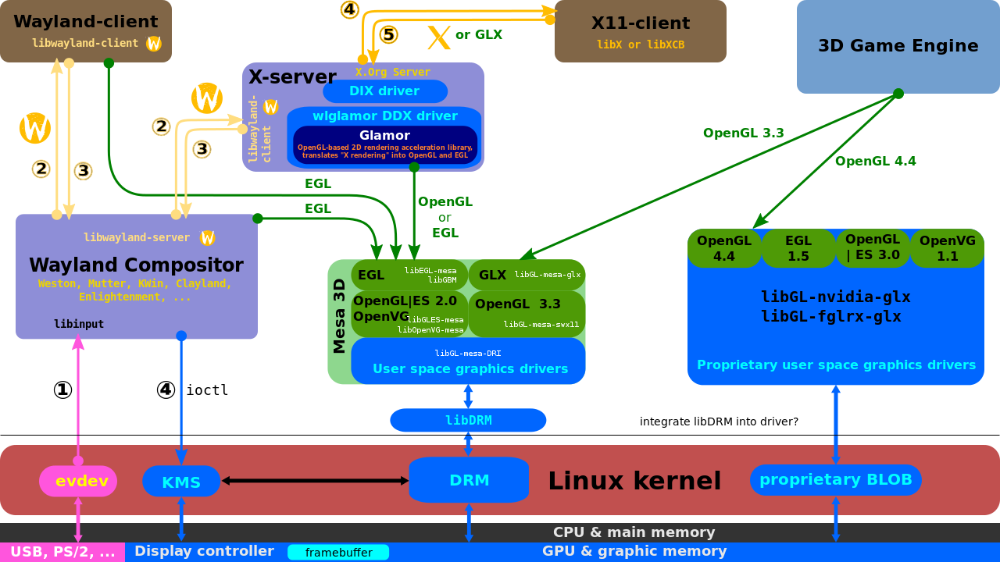

# 00. Window Managers: Sway

## Objectives

- Understand what a graphical stack is and where a Window Manager fits in it
- Understand the difference between a Desktop Environment and a Window Manager
- Understand the difference between X11 and Wayland
- Understand what a tiling window manager is and why people use one
- Install Fedora Sway in a Virtual Machine
- Learn to navigate Sway using only the keyboard: windows, containers, layouts and workspaces
- Read, understand and modify the Sway configuration file
- Control Sway from the command line using `swaymsg`
- Customize the status bar, the lock screen and other helper tools

## Resources

1. *[Razvan Deaconescu, Razvan Rughinis, Mihai Carabas, Alexandru Radovici, Utilizarea Sistemelor
de Operare, Printech 2021](https://github.com/systems-cs-pub-ro/carte-uso/releases/download/uso-ed1-2021/uso.pdf)*
2. *Brian Ward, How LINUX Works, 3rd Edition, No Starch Press, 2021* (the chapter about the Linux desktop)
3. *[Sway official website](https://swaywm.org)*
4. *[Sway Wiki on GitHub](https://github.com/swaywm/sway/wiki)* - the most useful place for Sway specific questions
5. *[Sway FAQ](https://github.com/swaywm/sway/wiki#faq)*
6. *[i3 User's Guide](https://i3wm.org/docs/userguide.html)* - Sway is compatible with i3, so almost everything in this guide applies to Sway
7. *[Arch Wiki - Sway](https://wiki.archlinux.org/title/Sway)* - excellent even if you do not use Arch Linux
8. *[Fedora Sway Spin](https://fedoraproject.org/spins/sway/)*
9. *[Wayland documentation](https://wayland.freedesktop.org/docs/html/)*
10. *[wlroots](https://gitlab.freedesktop.org/wlroots/wlroots)* - the library Sway is built on
11. *[Waybar](https://github.com/Alexays/Waybar)* and its [wiki](https://github.com/Alexays/Waybar/wiki)
12. *[Awesome Wayland](https://github.com/rcalixte/awesome-wayland)* - a curated list of Wayland tools
13. The manual pages: `man 1 sway`, `man 5 sway`, `man 5 sway-input`, `man 5 sway-output`, `man 5 sway-bar`, `man 1 swaymsg`

:::tip

The manual pages are the most accurate documentation, because they are installed together with the exact version
of Sway that you are running. Section `5` of the manual describes configuration files, so `man 5 sway` describes
the Sway configuration file, while `man 1 sway` (or just `man sway`) describes the `sway` program itself.

:::

## The Graphical Stack

The Operating System provides two main abstractions: **processes** and **files**.
None of them is graphical. The kernel does not know what a *window*, a *button* or a *mouse cursor* is. All of these
are built in **user mode**, by several programs that cooperate. Together, these programs form the **graphical stack**.

From bottom to top, a simplified graphical stack looks like this:



* **The kernel** exposes the graphics card through **DRM/KMS** (*Direct Rendering Manager / Kernel Mode Setting*) and
  the input devices through **evdev** (files in `/dev/input/`).
* **The display server** is the program that owns the screen and the input devices. Applications do not draw directly
  on the screen; they draw into their own memory buffers and give them to the display server.
* **The window manager** decides where each window is placed, how big it is, which window has the *focus*
  (receives the keyboard input) and how windows are decorated (title bars, borders).
* **The compositor** combines the buffers of all the windows into the final image that is displayed on the monitor
  (this is how transparency, shadows and animations are possible).

:::info

The **focus** is a very important concept for this lab. At any moment, exactly one window has the focus. When you
type on the keyboard, the keys are sent to the focused window. In Sway, the focused window is marked with a
colored border.

:::

### X11 and Wayland

There are two families of display servers on Linux.

**X11** (the *X Window System*, version 11) was created at MIT in 1984 and version 11 was released in 1987. On Linux,
the implementation used is **Xorg**. In X11, the display server, the window manager and the compositor are
**separate programs**. This is why, in the X11 world, you can choose any window manager (for example `i3`, `openbox`
or `dwm`) and run it on top of Xorg. The X11 protocol is very old and has several problems: any application can read
the keyboard input of other applications (a keylogger does not need special privileges) and can capture the content of
other windows. Also, many features that modern computers need (multiple monitors with different refresh rates,
HiDPI scaling, tear-free rendering) were added later as extensions.

**Wayland** is a newer protocol, started in 2008 by Kristian Høgsberg. In Wayland, the display server, the window
manager and the compositor are **one single program**, called a **Wayland compositor**. Applications (called
**clients**) are isolated from each other: a client cannot see the windows or the keyboard input of another client.
GNOME (Mutter), KDE Plasma (KWin) and Sway are all Wayland compositors.

| Feature | X11 (Xorg) | Wayland |
|-|-|-|
| First released | 1987 | 2008 (protocol), stable desktops around 2016+ |
| Architecture | Display server, window manager and compositor are separate programs | One program (the *compositor*) does everything |
| Security between applications | None, any client can read other clients' input and windows | Clients are isolated |
| Network transparency | Built-in (`ssh -X`) | Not built-in (tools like `waypipe` exist) |
| Running old X11 apps | Native | Through **XWayland**, a compatibility X server |
| Screenshots / screen sharing | Any application can do it | Done through special protocols and portals |
| Examples of window managers | i3, dwm, awesome, bspwm, xmonad, Openbox | Sway, Hyprland, river, niri, labwc |

:::note

Some applications still only know how to talk X11. For them, Wayland compositors start **XWayland**, a small X
server that runs as a Wayland client. You usually do not notice it. Later in this lab you will see how to find out
whether an application runs natively on Wayland or through XWayland.

:::

## Desktop Environments vs Window Managers

A **Desktop Environment (DE)** is a complete, integrated graphical experience. It contains a window manager, but also
a panel, a settings application, a file manager, a notification system, a lock screen, a network manager applet,
default applications and a consistent look for all of them. **GNOME** (the default for Fedora Workstation),
**KDE Plasma**, **Xfce** and **Cinnamon** are desktop environments.

A **Window Manager (WM)** is just the part that manages the windows. When you use a standalone window manager, you
choose every other component yourself: which bar, which launcher, which notification daemon, which lock screen.
This gives you a lot of freedom and a very light system, at the cost of having to configure things by yourself.

| | Desktop Environment | Standalone Window Manager |
|-|-|-|
| Examples | GNOME, KDE Plasma, Xfce | Sway, i3, Hyprland, dwm |
| Configuration | Graphical settings application | Mostly a text configuration file |
| Components | All included and integrated | You choose and assemble them |
| Resource usage | Higher | Very low |
| Learning curve | Low | Higher at the beginning |
| Main input device | Mouse and keyboard | Mostly keyboard |

### Types of Window Managers

Window managers are classified by the way they arrange windows on the screen:

* **Stacking (floating) window managers** work like Windows or macOS: windows are placed on top of each other, and
  you move and resize them with the mouse. Examples: Openbox, Fluxbox, labwc.
* **Tiling window managers** arrange windows automatically so that they **never overlap** and together they cover
  the whole screen, like tiles on a floor. When you open a new window, the existing ones shrink to make room for it.
  Examples: i3, Sway, bspwm, river.
* **Dynamic window managers** can switch between tiling and floating layouts, often using predefined layouts
  (a *master* window and a *stack* of other windows). Examples: dwm, awesome, xmonad, Hyprland.
* **Scrollable tiling window managers** place windows on an infinite horizontal strip that you scroll through.
  Example: niri.

:::info

Why would anyone use a tiling window manager? Because you never waste time moving and resizing windows with the
mouse, every action has a keyboard shortcut, the screen space is always fully used, and the whole setup is a text file
that you can copy to any computer (or keep in a Git repository, together with your other *dotfiles*).

:::

## Sway

**Sway** (short for *SirCmpwn's Wayland compositor*) is a tiling Wayland compositor and a **drop-in replacement for
i3**. The project was started in 2015 by Drew DeVault, reached version 1.0 in March 2019 and is currently maintained
by Simon Ser and the community. While building Sway, its developers created **wlroots**, a library that implements
the hard parts of a Wayland compositor (talking to the GPU, handling input, implementing protocols). Today, wlroots is
used by many other compositors, like river, labwc and (in the past) Hyprland.

**i3** is a tiling window manager for X11 created by Michael Stapelberg in 2009. It became very popular because of its
simple configuration file and excellent documentation. Sway was designed so that **an i3 configuration file works in
Sway with few or no changes**. This means that almost all i3 tutorials apply to Sway too.

Sway is **not** a desktop environment. It gives you a window manager and a very simple bar. Everything else is done
by separate small programs:

| Task | Tool usually used with Sway | Documentation |
|-|-|-|
| Terminal | `foot` | [foot](https://codeberg.org/dnkl/foot) |
| Application launcher | `rofi`, `wofi`, `fuzzel`, `wmenu` | [rofi-wayland](https://github.com/lbonn/rofi) |
| Status bar | `swaybar` (built-in) or `waybar` | `man 5 sway-bar`, [Waybar](https://github.com/Alexays/Waybar) |
| Wallpaper | `swaybg` | `man swaybg` |
| Lock screen | `swaylock` | `man swaylock` |
| Idle management | `swayidle` | `man swayidle` |
| Notifications | `mako`, `dunst` | [mako](https://github.com/emersion/mako) |
| Screenshots | `grim` + `slurp` | [grim](https://sr.ht/~emersion/grim/) |
| Clipboard from the terminal | `wl-copy`, `wl-paste` | [wl-clipboard](https://github.com/bugaevc/wl-clipboard) |
| Monitor profiles | `kanshi` | `man kanshi` |

### Fedora Sway

Fedora offers Sway as an official **Spin** (an alternative edition of Fedora with a different desktop) since Fedora 38.
The spin comes preconfigured with Sway, Waybar, a launcher, a terminal, a lock screen and a set of Fedora specific
default settings, so you get a usable system right after the installation. There is also an *atomic* (immutable)
variant called **Fedora Sway Atomic** (formerly *Fedora Sericea*).

* [Fedora Sway Spin download](https://fedoraproject.org/spins/sway/)
* [Fedora Sway Atomic](https://fedoraproject.org/atomic-desktops/sway/)
* [Fedora Sway SIG (Special Interest Group)](https://gitlab.com/fedora/sigs/sway)

If you already have Fedora Workstation, you can also install Sway next to GNOME and choose
it on the login screen:

```bash
sudo dnf install sway
# or the full set of packages used by the spin; find the exact group name with:
dnf group list --hidden | grep -i sway
```

## First Steps in Sway

### The Mod Key

Almost every Sway shortcut starts with a special key called the **modifier** or **`$mod`**. By default it is the
<kbd>Super</kbd> key (the key with the Windows logo, called `Mod4` in the configuration). Some people prefer
<kbd>Alt</kbd> (called `Mod1`).

:::caution

When Sway runs inside a Virtual Machine, the host operating system might "steal" the <kbd>Super</kbd> key (for
example, GNOME on the host opens its Activities overview). Click inside the VM window so that VirtualBox captures the
keyboard. If it still does not work, you can change `$mod` to <kbd>Alt</kbd> in the configuration file (see the
exercises). Remember that the VirtualBox **Host key** (by default the right <kbd>Ctrl</kbd>) releases the keyboard and
mouse from the VM.

:::

### Default Keybindings

The table below contains the default keybindings from the upstream Sway configuration. Fedora may add a few extra ones.
You do not have to memorize them now, you will learn them during the exercises.

| Keybinding | Action |
|-|-|
| <kbd>$mod</kbd> + <kbd>Enter</kbd> | Open a terminal |
| <kbd>$mod</kbd> + <kbd>d</kbd> | Open the application launcher |
| <kbd>$mod</kbd> + <kbd>Shift</kbd> + <kbd>q</kbd> | Close (kill) the focused window |
| <kbd>$mod</kbd> + <kbd>h</kbd> / <kbd>j</kbd> / <kbd>k</kbd> / <kbd>l</kbd> (or arrows) | Move the focus left / down / up / right |
| <kbd>$mod</kbd> + <kbd>Shift</kbd> + <kbd>h</kbd> / <kbd>j</kbd> / <kbd>k</kbd> / <kbd>l</kbd> (or arrows) | Move the focused window left / down / up / right |
| <kbd>$mod</kbd> + <kbd>1</kbd> ... <kbd>0</kbd> | Switch to workspace 1 ... 10 |
| <kbd>$mod</kbd> + <kbd>Shift</kbd> + <kbd>1</kbd> ... <kbd>0</kbd> | Move the focused window to workspace 1 ... 10 |
| <kbd>$mod</kbd> + <kbd>b</kbd> | Next window will be placed to the right (horizontal split) |
| <kbd>$mod</kbd> + <kbd>v</kbd> | Next window will be placed below (vertical split) |
| <kbd>$mod</kbd> + <kbd>e</kbd> | Toggle the split direction of the current container |
| <kbd>$mod</kbd> + <kbd>s</kbd> | Stacking layout |
| <kbd>$mod</kbd> + <kbd>w</kbd> | Tabbed layout |
| <kbd>$mod</kbd> + <kbd>f</kbd> | Toggle fullscreen |
| <kbd>$mod</kbd> + <kbd>Shift</kbd> + <kbd>Space</kbd> | Toggle floating for the focused window |
| <kbd>$mod</kbd> + <kbd>Space</kbd> | Switch the focus between tiled and floating windows |
| <kbd>$mod</kbd> + <kbd>a</kbd> | Focus the parent container |
| <kbd>$mod</kbd> + <kbd>r</kbd> | Enter *resize mode* (use <kbd>h</kbd> <kbd>j</kbd> <kbd>k</kbd> <kbd>l</kbd>, exit with <kbd>Esc</kbd>) |
| <kbd>$mod</kbd> + <kbd>Shift</kbd> + <kbd>-</kbd> | Move the focused window to the *scratchpad* |
| <kbd>$mod</kbd> + <kbd>-</kbd> | Show / hide the scratchpad window |
| <kbd>$mod</kbd> + <kbd>Shift</kbd> + <kbd>c</kbd> | Reload the configuration file |
| <kbd>$mod</kbd> + <kbd>Shift</kbd> + <kbd>e</kbd> | Exit Sway (log out) |
| <kbd>$mod</kbd> + left mouse drag | Move a floating window |
| <kbd>$mod</kbd> + right mouse drag | Resize a window |

:::info

Why <kbd>h</kbd> <kbd>j</kbd> <kbd>k</kbd> <kbd>l</kbd>? These keys come from the `vi` text editor, where they move
the cursor left, down, up and right. Your right hand stays on the home row of the keyboard, so you do not need to
reach for the arrow keys. Many Linux tools (`vim`, `less`, `man`) use the same keys.

:::

The keybindings you will need to discover on your own are all written in the configuration file. When you forget a
shortcut, just read it:

```bash
grep bindsym /etc/sway/config
```

## Core Concepts

### The Tree

Sway organizes everything in a **tree**. Understanding
the tree is the key to understanding Sway.

```text
root
└── output (a monitor, e.g. Virtual-1 or HDMI-A-1)
    ├── workspace 1
    │   └── container (split horizontal)
    │       ├── window: foot (terminal)
    │       └── container (split vertical)
    │           ├── window: firefox
    │           └── window: foot
    └── workspace 2
        └── window: file manager
```

* **Output**: a physical (or virtual) monitor.
* **Workspace**: a virtual desktop. Each output shows exactly one workspace at a time. Workspaces are created when you
  switch to them and destroyed automatically when they are empty and you leave them.
* **Container**: a node that holds other containers or windows and has a **layout**.
* **Window** (also called a *view*): a leaf of the tree, the actual application.

You can see the real tree of your running session at any moment with:

```bash
swaymsg -t get_tree
```

### Layouts

Each container has one of four layouts:

| Layout | Keybinding | Description |
|-|-|-|
| `splith` | <kbd>$mod</kbd> + <kbd>e</kbd> (toggle) | Children are placed side by side, left to right |
| `splitv` | <kbd>$mod</kbd> + <kbd>e</kbd> (toggle) | Children are placed one above another |
| `stacking` | <kbd>$mod</kbd> + <kbd>s</kbd> | Only the focused child is visible, the others are shown as a list of title bars |
| `tabbed` | <kbd>$mod</kbd> + <kbd>w</kbd> | Only the focused child is visible, the others are shown as tabs, like in a web browser |

:::tip

A common confusion for beginners: <kbd>$mod</kbd> + <kbd>b</kbd> and <kbd>$mod</kbd> + <kbd>v</kbd> **do not move
anything immediately**. They tell Sway *where the next window you open will go*, relative to the focused one, by
creating a new container around it. Open a new terminal right after pressing them to see the effect.

:::

### Floating Windows

Not every window works well when tiled: dialogs, small popups, the volume control, a calculator. Sway can make any
window **floating**, so it stays on top of the tiled windows and can be moved freely. Sway automatically makes dialog
windows float. You can toggle floating with <kbd>$mod</kbd> + <kbd>Shift</kbd> + <kbd>Space</kbd>, or create rules
in the configuration that make certain applications always float.

### The Scratchpad

The **scratchpad** is a hidden place where you can keep windows you need from time to time (a music player, a notes
application, a calculator). Send a window there with <kbd>$mod</kbd> + <kbd>Shift</kbd> + <kbd>-</kbd>, and bring it
back as a floating window, on any workspace, with <kbd>$mod</kbd> + <kbd>-</kbd>.

### Modes

A **mode** is a set of keybindings that is active only for a while. The default configuration has a `resize` mode:
after pressing <kbd>$mod</kbd> + <kbd>r</kbd>, the keys <kbd>h</kbd> <kbd>j</kbd> <kbd>k</kbd> <kbd>l</kbd> resize
the focused window instead of typing letters. Pressing <kbd>Esc</kbd> or <kbd>Enter</kbd> returns to the `default`
mode. You can create your own modes (you will do this in the exercises).

## The Configuration File

Sway reads its configuration from the first file it finds in this list:

1. `~/.config/sway/config`
2. `/etc/sway/config` (the system-wide default)

:::caution

Your personal configuration file **replaces** the system one completely, it does not add to it. If you create an
empty `~/.config/sway/config`, you will get a Sway without any keybinding (and you will not even be able to open a
terminal). Always start by **copying** the default file:

```bash
mkdir -p ~/.config/sway
cp /etc/sway/config ~/.config/sway/config
```

On Fedora, the default file also includes extra files, using the `include` command. Look for lines starting with
`include` at the end of `/etc/sway/config` and explore those directories (for example `/etc/sway/config.d/` and
`/usr/share/sway/config.d/`).

:::

The configuration file is a list of **commands**, one per line. Lines that start with `#` are comments. The same
commands can also be sent at runtime with `swaymsg`. The most important commands are:

| Command | Meaning | Example |
|-|-|-|
| `set` | Define a variable | `set $mod Mod4` |
| `bindsym` | Bind a key combination to a command | `bindsym $mod+Return exec $term` |
| `exec` | Run a program once, when Sway starts | `exec mako` |
| `exec_always` | Run a program at start **and** at every reload | `exec_always kanshi` |
| `input` | Configure keyboards, mice, touchpads | `input type:keyboard xkb_layout "us,ro"` |
| `output` | Configure monitors and wallpaper | `output * bg ~/wall.png fill` |
| `for_window` | Apply a command to windows matching a criteria | `for_window [app_id="pavucontrol"] floating enable` |
| `assign` | Always open an application on a certain workspace | `assign [app_id="firefox"] workspace 2` |
| `mode` | Define a mode | `mode "resize" { ... }` |
| `bar` | Configure the status bar | `bar { swaybar_command waybar }` |
| `include` | Include other configuration files | `include /etc/sway/config.d/*` |

Below is a small annotated example:

```bash title="~/.config/sway/config (fragment)"
# Variables: make the rest of the file easier to read and change
set $mod Mod4          # Super key. Use Mod1 for Alt
set $term foot
set $left h
set $down j
set $up k
set $right l

# Open a terminal
bindsym $mod+Return exec $term

# Keyboard: US and Romanian layouts, switch with Alt+Shift
input type:keyboard {
    xkb_layout "us,ro"
    xkb_variant ",std"
    xkb_options "grp:alt_shift_toggle"
}

# Touchpad: tap to click and natural scrolling
input type:touchpad {
    tap enabled
    natural_scroll enabled
}

# Wallpaper on every output
output * bg /usr/share/backgrounds/default.png fill

# The volume control should always float
for_window [app_id="pavucontrol"] floating enable

# Thin borders, no title bars on tiled windows
default_border pixel 2
gaps inner 5
```

After you edit the file, reload it with <kbd>$mod</kbd> + <kbd>Shift</kbd> + <kbd>c</kbd>. If there is a mistake,
Sway shows a red error bar at the top of the screen.

:::tip

You can check your configuration for errors **before** reloading it:

```bash
sway -C
```

Keep a working copy of your configuration (`cp ~/.config/sway/config ~/.config/sway/config.bak`) or, even better,
keep it in a Git repository. This is a good habit for all your *dotfiles*.

:::

### Criteria: `app_id` and `class`

Commands such as `for_window` and `assign` use **criteria** written between square brackets to select windows.
Native Wayland applications are identified by an **`app_id`**, while X11 applications running through XWayland are
identified by a **`class`**. To find them, open the application and run:

```bash
swaymsg -t get_tree | grep -E '"(app_id|class|shell)"'
```

The `shell` field tells you if the application runs natively (`xdg_shell`) or through XWayland (`xwayland`). If you
have `jq` installed, you can get a cleaner output:

```bash
swaymsg -t get_tree | jq '.. | select(.pid?) | {name, app_id, shell}'
```

All available criteria are described in `man 5 sway`, section *CRITERIA*.

## Controlling Sway with `swaymsg`

Sway can be controlled from the command line through an **IPC** (*Inter-Process Communication*) socket. The `swaymsg`
program sends commands and queries to the running Sway instance. Anything you can write in the configuration file,
you can also send with `swaymsg`.

```bash
# Send commands
swaymsg workspace 3
swaymsg exec firefox
swaymsg 'output * bg #1e1e2e solid_color'

# Query information (-t is the message type)
swaymsg -t get_outputs      # monitors, resolutions, names
swaymsg -t get_inputs       # keyboards, mice, touchpads and their identifiers
swaymsg -t get_workspaces   # workspaces and which one is focused
swaymsg -t get_tree         # the full tree
swaymsg -t get_version
```

:::info

The output of `swaymsg -t ...` is in [JSON](https://www.json.org) format when you pipe it to another program. This
makes it easy to write scripts that react to what happens in Sway. See `man 7 sway-ipc` for the complete protocol and
[the ArchLinux Wiki - sway-ipc](https://man.archlinux.org/man/sway-ipc.7.en) for examples.

:::

## Helper Tools

### The Bar

Sway has a built-in bar called `swaybar`, configured in the `bar { ... }` block (see `man 5 sway-bar`). Fedora Sway
uses **Waybar** instead, a much more customizable bar. Waybar is configured with two files:

* `~/.config/waybar/config.jsonc` - which *modules* to show (workspaces, clock, battery, network, volume, ...) and
  where
* `~/.config/waybar/style.css` - the look of the bar, written in CSS

As with Sway, start by copying the default files from `/etc/xdg/waybar/`:

```bash
mkdir -p ~/.config/waybar
cp /etc/xdg/waybar/* ~/.config/waybar/
```

The list of modules and their options is on the [Waybar Wiki](https://github.com/Alexays/Waybar/wiki).

### Locking and Idle

`swaylock` locks the screen, while `swayidle` runs commands after a period of inactivity. A typical configuration:

```bash title="~/.config/sway/config (fragment)"
exec swayidle -w \
    timeout 300 'swaylock -f -c 000000' \
    timeout 600 'swaymsg "output * power off"' \
        resume 'swaymsg "output * power on"' \
    before-sleep 'swaylock -f -c 000000'
```

This locks the screen after 5 minutes, turns the monitors off after 10 minutes, and locks the screen before the
computer goes to sleep.

### Screenshots

On Wayland, applications cannot capture the screen by themselves. `grim` takes the screenshot, while `slurp` lets you
select a region with the mouse:

```bash
grim ~/Pictures/full.png                    # the whole screen
grim -g "$(slurp)" ~/Pictures/region.png    # a region you select
grim -g "$(slurp)" - | wl-copy              # a region, directly to the clipboard
```

## Troubleshooting

| Problem | Solution |
|-|-|
| Sway does not start in the VM, or the screen is black | Enable **3D Acceleration** and use the **VMSVGA** graphics controller in the VM *Display* settings |
| The mouse cursor is invisible in the VM | Add `export WLR_NO_HARDWARE_CURSORS=1` to `~/.bash_profile`, then log out and in again |
| <kbd>Super</kbd> does not work in the VM | Click inside the VM to capture the keyboard, or use `set $mod Mod1` |
| After editing the config, no keybinding works | Switch to a text console (<kbd>Ctrl</kbd>+<kbd>Alt</kbd>+<kbd>F3</kbd>, in VirtualBox <kbd>Host</kbd>+<kbd>F3</kbd>), log in, run `sway -C` and fix the error |
| Want to see what Sway is doing | Look at the logs with `journalctl --user -b` or start Sway with `sway -d 2> ~/sway.log` from a console |

More problems and their solutions are listed in the
[Sway FAQ](https://github.com/swaywm/sway/wiki#faq) and the
[Arch Wiki - Sway troubleshooting](https://wiki.archlinux.org/title/Sway#Troubleshooting).

## Exercises

1. **Survive the first minute**: Open a terminal with <kbd>$mod</kbd> + <kbd>Enter</kbd>. Open two more terminals.
   What happens to the windows each time? Move the focus between them using <kbd>$mod</kbd> + arrows, then using
   <kbd>$mod</kbd> + <kbd>h</kbd> <kbd>j</kbd> <kbd>k</kbd> <kbd>l</kbd>. Close one terminal with
   <kbd>$mod</kbd> + <kbd>Shift</kbd> + <kbd>q</kbd>.
2. **The launcher**: Press <kbd>$mod</kbd> + <kbd>d</kbd>, type the name of the web browser and start it. Which
   launcher program does your system use? (Hint: `grep menu /etc/sway/config /etc/sway/config.d/*`)
3. **Layouts**: With three terminals on the same workspace:
   * Build this arrangement: one terminal on the left half of the screen and two terminals, one above the other, on
     the right half. (Hint: <kbd>$mod</kbd> + <kbd>v</kbd> before opening a window.)
   * Switch the right container to *tabbed* layout, then to *stacking*, then back with <kbd>$mod</kbd> + <kbd>e</kbd>.
   * Run `swaymsg -t get_tree` and find your three terminals and the containers in the output. Draw the tree on paper.
4. **Workspaces**: Move the browser to workspace 2 and one terminal to workspace 3. Switch between workspaces. Look at
   the bar: what happens to workspace 3 if you move its only window back to workspace 1?
5. **Floating and scratchpad**: Make a terminal floating, move it with <kbd>$mod</kbd> + left mouse drag and resize it
   with <kbd>$mod</kbd> + right mouse drag. Send it to the scratchpad and bring it back on a different workspace.
6. **Your own configuration**: Copy the default configuration into `~/.config/sway/config`, then:
   * Add the Romanian keyboard layout and a key combination to switch between layouts.
   * Set a solid color background with the `output` command.
   * Add `default_border pixel 3` and `gaps inner 8`.
   * Validate your file with `sway -C` and reload with <kbd>$mod</kbd> + <kbd>Shift</kbd> + <kbd>c</kbd>.
7. **Window rules**: Find the `app_id` of the browser and of a calculator or settings application. Write an `assign`
   rule that always opens the browser on workspace 2 and a `for_window` rule that always makes the other application
   floating. Is any application you tried running through XWayland?
8. **Screenshots**: Add a keybinding so that <kbd>Print</kbd> saves a screenshot of a selected region to
   `~/Pictures/`. (Hint: `bindsym Print exec ...`. The file name can contain the date: `$(date +%F_%H-%M-%S).png`.)
9. **A custom mode**: Create a mode called `system`, entered with <kbd>$mod</kbd> + <kbd>Shift</kbd> + <kbd>x</kbd>,
    in which <kbd>l</kbd> locks the screen, <kbd>e</kbd> exits Sway, <kbd>r</kbd> reboots and <kbd>s</kbd> powers off
    the computer. <kbd>Esc</kbd> must return to the default mode. Use the `resize` mode from the default config as an
    example.

<details>
<summary>Hint for exercise 10</summary>

```bash title="~/.config/sway/config (fragment)"
set $mode_system "system: (l)ock (e)xit (r)eboot (s)hutdown"
mode $mode_system {
    bindsym l exec swaylock -f -c 000000, mode "default"
    bindsym e exit
    bindsym r exec systemctl reboot
    bindsym s exec systemctl poweroff
    bindsym Escape mode "default"
}
bindsym $mod+Shift+x mode $mode_system
```

</details>

## On Your Own

1. **Read the manual**: Open `man 5 sway` and find the section about criteria. What does `[floating]` match? What
   about `[con_mark="x"]`? Then read about the `mark` command and create a keybinding that jumps to a marked window.
2. **Waybar**: Copy the Waybar configuration to your home directory and add a module that shows the keyboard layout
   (`sway/language`). Change the colors in `style.css`. Use the [Waybar Wiki](https://github.com/Alexays/Waybar/wiki)
   for the list of modules.
3. **Idle**: Configure `swayidle` so that the screen is locked after 2 minutes of inactivity. Test it.
4. **i3 compatibility**: Read the "Tree" and "Layout" chapters of the [i3 User's Guide](https://i3wm.org/docs/userguide.html).
   Find one feature described there that works differently or does not exist in Sway. (Hint: check the
   [Sway FAQ](https://github.com/swaywm/sway/wiki#faq) and
   [i3 migration guide](https://github.com/swaywm/sway/wiki/i3-Migration-Guide).)
5. **Other compositors**: Read about one other Wayland compositor, such as [Hyprland](https://hyprland.org),
   [niri](https://github.com/YaLTeR/niri) or [river](https://codeberg.org/river/river). How does its way of arranging
   windows differ from Sway's?
6. **Dotfiles**: Create a Git repository with your `~/.config/sway` and `~/.config/waybar` directories and push it to
   GitHub or GitLab. Look at how other people organize their dotfiles on [r/unixporn](https://www.reddit.com/r/unixporn/)
   (filter by *Sway*).
7. **Reflection**: After using Sway for a while, what was the hardest thing to get used to? Which tasks were faster
   than in GNOME, and which were slower? Would you use a tiling window manager on your own computer, and why?
