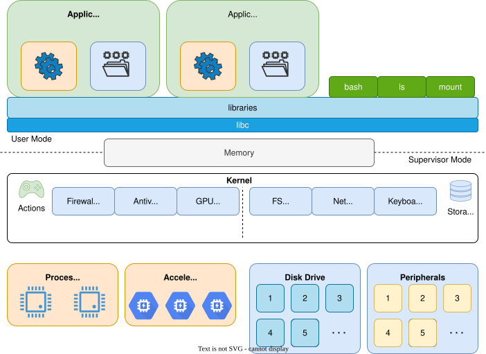
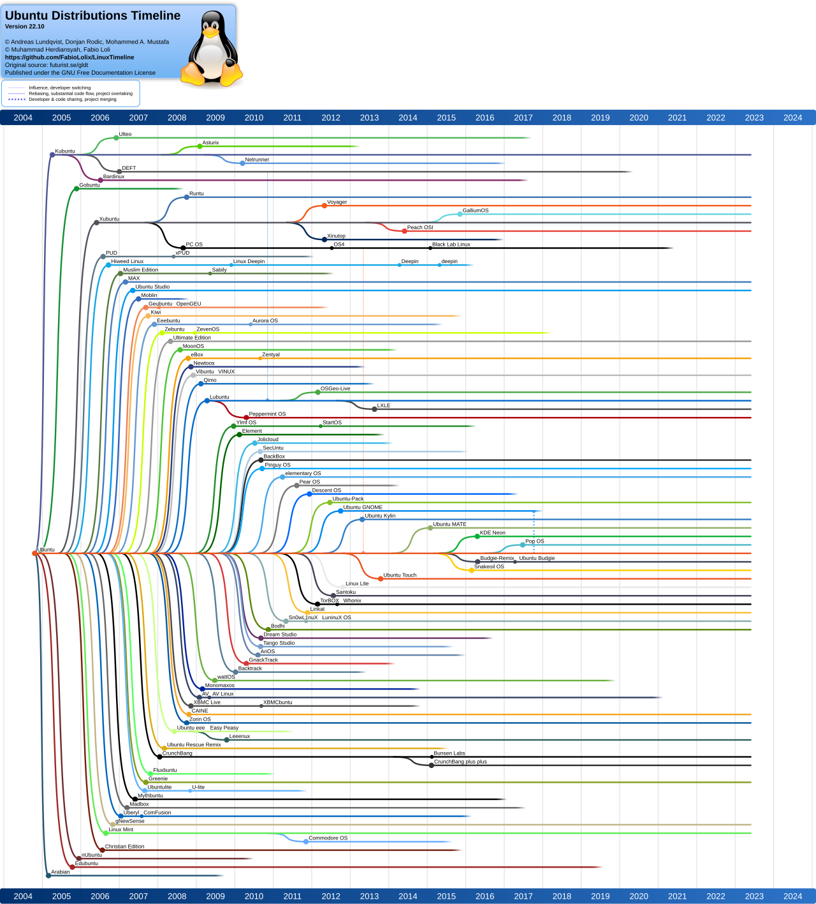
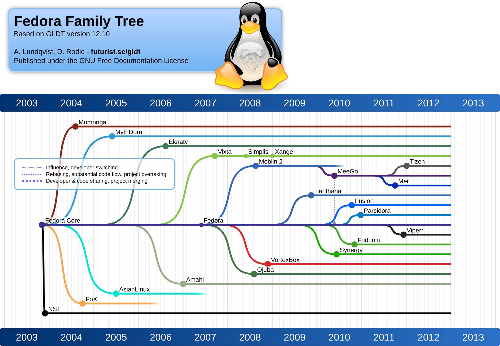
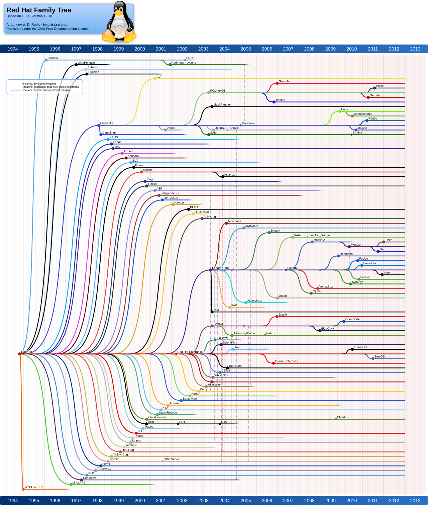
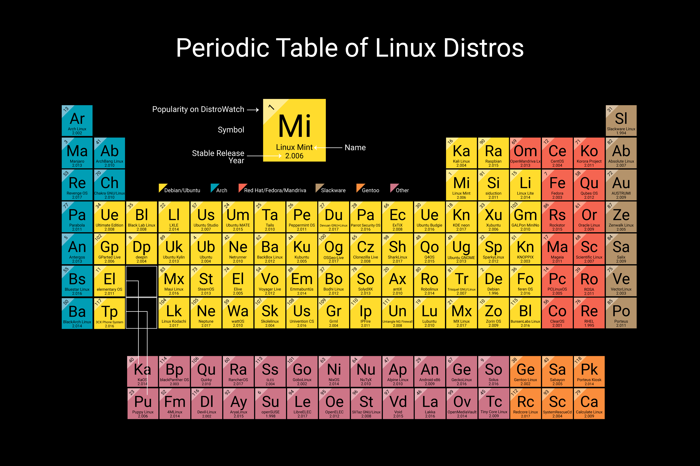

# 01. Linux Distributions

## Objectives

- Understand what a Linux distribution is
- Understand what a Virtual Machine is
- Install a few Linux distributions using Virtual Box
- Setup remote access using SSH
- Understand how to install a Linux Server distribution at home

## The Operating System

Before diving into Linux distributions, it is important to understand the role of an Operating System(OS). The purpose of an OS is to manage hardware resources, allow portability by providing a hardware-independent API, and isolate applications so they cannot access hardware directly.

The OS is divided into two main privilege levels:

* **Supervisor Mode(Kernel)**: The core of the OS that directly interacts with the processor, memory (RAM), storage, and peripherals.
* **User mode**: Where standard applications run. Applications must request the kernel's permission to perform actions.

In modern desktop and server operating systems, the two main abstractions provided by the OS to the user are Processes (for executing actions via the processor) and Files (for managing data on storage).

## Distributiens

A Linux distribution combines the Linux [kernel](https://kernel.org) with userland tools, package management,
and applications to form a complete OS.

The evolution of Linux distributions began shortly after the Linux kernel's initial release in 1991.
While the kernel was a crucial component, it was only one part of a usable system. Early adopters needed to assemble GNU
userland tools:
- a shell
- a compiler
- other essential components

to form a working Unix-like OS.
This gave rise to distributions: curated, pre-packaged systems bundling the Linux kernel with a userland,
an init system, and package management.

### Base Distributions

| Distribution | Tagline | Package Format | Package Manager | Release Year |
|-|-|-|-|-|
| [Slackware](http://www.slackware.com) | *Oldest distribution* | `tgz` | `pkgtool` | 1993 |
| [Debian](https://www.debian.org) | *Free Software* | `deb` | `apt` / `dpkg` | 1993 |
| [Red Hat Linux](https://www.redhat.com) | *Enterprise* | `rpm` | `dnf` / `rpm` | 1995 |
  
#### Slackware

**Slackware**, released by Patrick Volkerding in 1993, is the oldest surviving distribution and remains notable for its strict adherence to simplicity and Unix principles. It uses tarballs and shell scripts for package management, with no dependency resolution, assuming the sysadmin understands and controls the system state. Slackware avoids patching upstream software and favors vanilla source builds. It uses a BSD-style init system and explicitly avoids `systemd`, staying close to traditional *nix* workflows.

Slackware uses `pkgtool` as its legacy package manager, with package archives distributed as `.tgz` or `.txz` files. Installation and removal are handled via simple shell scripts (`install/doinst.sh`), and dependency tracking is left to the administrator. To aid with modern package handling, tools like `slackpkg` and `sbopkg` have emerged, supporting mirrors and third-party repositories like SlackBuilds.org.

#### Debian

**Debian**, also founded in 1993 by Ian Murdock, took a more community-centric and structured approach. It introduced
the `.deb` package format and APT (*Advanced Packaging Tool*), enabling robust dependency resolution and
easier system maintenance. Debian emphasizes free software, policy compliance, and reproducibility.

Debian's structure includes multiple branches:
- **stable**
- **testing**,
- **unstable (sid)**

These serve different use cases ranging from production environments to development and packaging. Its strict
package guidelines and QA processes make it a reliable base for derivative distributions. Notably, **Ubuntu**
builds on Debian’s `testing` and `unstable` branches, using its package ecosystem and extending it with
user-focused enhancements and regular LTS (*Long Term Support*) releases.

Debian pioneered the use of the `.deb` package format and introduced `dpkg` as the low-level package manager.On top
of that, the APT (*Advanced Packaging Tool*) system revolutionized Linux package management with features
like dependency resolution, pinning, and automated upgrades via `apt`, `apt-get`, and `apt-cache`.

#### Red Hat

**Red Hat Linux**, released in 1995, targeted the commercial market early on and introduced the RPM package format. Red Hat pioneered structured package management (via `rpm` and later `yum` / `dnf`) and formalized the notion of enterprise support for Linux systems.

In 2003, Red Hat split its distribution into two projects:
- **RHEL (Red Hat Enterprise Linux)**: A commercially supported, stable enterprise distro with long-term support, certified hardware/software stacks, and predictable release cycles.
- **Fedora**: A community-driven upstream project used to integrate and test new technologies, such as **SELinux**, **systemd**, **Wayland**, and **Btrfs**, before they are considered for RHEL.

Fedora's rapid release cycle and close adherence to upstream standards have made it a favored choice among developers and contributors working on bleeding-edge features.

Red Hat introduced the `.rpm` format, still widely used across RPM-based distributions. The original tool, `rpm`,
handled low-level operations like installing and querying packages. Later, `yum` (Yellowdog Updater, Modified) added
dependency resolution, repository management, and group installs. Today, `yum` has been replaced
by `dnf` (Dandified Yum) in Fedora and RHEL, which offers improved performance, modularity support, and a
cleaner API.

:::info

Since our lab computers run Fedora, you will use `.rpm` packages and the `dnf` package manager natively.

:::

### Modern Distributions

| Distribution | Tagline | Parent | Package Format | Package Manager | Release Year |
|-|-|-|-|-|-|
| [Ubuntu](https://www.ubuntu.org) | *Linux for Humans* | Debian | `deb` and `snap` | `apt` / `dpkg` and `snap` | 2004 |
| [Fedora](https://www.redhat.com) | *Desktop Linux* | Red Hat Linux renamed | `rpm` | `dnf` / `rpm` | 2003 |
| [ArchLinux](https://archlinux.org) | *Minimal Linux* | N/A | `pkg.tar.zst` | `pacman` | 2002 |

**Ubuntu**, based on Debian, was launched in 2004 with a focus on usability, regular
time-based releases, and long-term support (LTS) versions. It became the de facto standard for Linux on desktops,
laptops, and later, in the cloud. Ubuntu introduced key tools like `snap`, simplified hardware support, and
polished desktop environments. It maintained compatibility with Debian packages while building its own
packaging infrastructure and developer ecosystem.

**Fedora**, Red Hat’s upstream project, became a hotbed of innovation. Its willingness to adopt
major changes (e.g., `systemd`, `dnf`, Wayland) early in the development cycle made it the testbed for future
enterprise-grade features in RHEL. Fedora Workstation, Fedora Server, and Fedora CoreOS represent its diversification
toward desktop users, server admins, and container-native environments.

**RHEL** evolved into a cornerstone of enterprise IT infrastructure. Through predictable life cycles, certified
application stacks, and strong commercial support, RHEL became widely adopted in mission-critical environments.
Red Hat also provides **CentOS Stream**, a rolling-release preview of what’s next in RHEL, bridging the gap between
Fedora and stable enterprise releases.

**Arch Linux** is an independently developed Linux distribution and is not directly based on any of the early
major distributions such as Slackware, Debian, or Red Hat. However, it draws certain philosophical and
technical influences from them. Like Slackware, Arch emphasizes simplicity, minimalism, and user control, offering
a clean base system without unnecessary modifications or graphical configuration tools. In contrast to
Debian and Red Hat, which focus on stability and pre-configured environments, Arch follows a rolling release
model and encourages a do-it-yourself approach. Its package manager, `pacman`, is unique to Arch but aligns with the  
simplicity principles found in Slackware. While Arch does not descend from the "big three" distributions, it
was shaped by the same Unix-like ideals that those projects helped to establish in the Linux ecosystem.

### Meaningful Distributions

These are a few other meaningful distributions used today.

| Distribution | Tagline | Parent | Package Format | Package Manager | Release Year |
|-|-|-|-|-|-|
| [Gentoo](https://www.gentoo.org) | *Meta-distribution for power users* | Independent | Source-based | `portage` | 2000 |
| [Alpine Linux](https://alpinelinux.org) | *Security-oriented, lightweight Linux* | Independent | `apk` | `apk-tools` | 2005 |
| [Android](https://source.android.com) | *Mobile Linux platform* | Linux kernel (AOSP) | `.apk` (only Android apps) | AOSP tools (not typical package manager) | 2008 |
| [Linux Mint](https://linuxmint.com) | *Elegant, comfortable desktop* | Ubuntu / Debian | `deb` | `apt`, `dpkg` | 2006 |
| [Kali Linux](https://www.kali.org) | *Linux for penetration testing* | Debian | `deb` | `apt` | 2013 |
| [Manjaro](https://manjaro.org) | *User-friendly Arch-based distro* | Arch Linux | `pkg.tar.zst` | `pacman` | 2011 |
| [openSUSE](https://www.opensuse.org) | *Stable, usable Linux for everyone* | SUSE Linux | `rpm` | `zypper`, `rpm` | 2005 |
| [SUSE Linux](https://www.suse.com) | *Enterprise-grade Linux* | Originally Slackware, later RPM-based | `rpm` | `zypper`, `yast` | 1994 |
| [Pop!_OS](https://pop.system76.com) | *Productivity-focused desktop* | Ubuntu | `deb` | `apt`, `dpkg` | 2017 |
| [elementary OS](https://elementary.io) | *A fast and open replacement for Windows and macOS* | Ubuntu | `deb` | `apt`, `dpkg` | 2011 |
| [ChromeOS](https://chromeos.google) | *The cloud-first OS* | Gentoo Linux | Custom (`.crx`, `.apk`, others) | `portage`, `cros_sdk`, Flatpak (via Crostini) | 2011 |
| [Tails](https://tails.net) | *Privacy for anyone anywhere* | Debian | `deb` | `apt` | 2009 |

- Android is not a traditional GNU/Linux distro, but it does use the Linux kernel and is often included in overviews of Linux-based systems.
- Gentoo is unique for being source-based and extremely customizable.
- Alpine is widely used in containers and minimal environments.
- Kali is popular among security professionals and hackers.
- Manjaro aims to make Arch accessible to average users.
- elementary OS and Pop!_OS target user-friendly desktop experiences.

:::info

If you want to find information about an odd distribution you can click [here](https://distrowatch.com/random)

:::

## Virtual Machines

A **Virtual Machine (VM)** is a software-based simulation of a physical computer. It runs an entire  
operating system (called a *guest*) inside another operating system (called the *host*), using a  
hypervisor (operating system driver) to manage the underlying resources. This allows users to run multiple isolated  
environments on a single physical machine, each with its own CPU, memory, disk, and network 
interfaces.

For users on **Windows** desktops, VMs are commonly used to test different operating systems, run
Linux tools, or create isolated development environments without modifying the main system. On
**macOS**, VMs serve similar purposes, though compatibility may vary depending on whether you're
using Intel-based (`x86_64`) or Apple Silicon (`arm64`) Macs. Modern virtualization platforms like
[**VirtualBox**](https://www.virtualbox.org) and [**VMware**](https://www.vmware.com) support both
architectures, though some guest operating systems may be limited to specific hardware types.

Virtual Machines are also essential in **server environments**, where they allow administrators to
run multiple virtual servers on a single physical host—maximizing resource usage and enabling
efficient isolation. For personal use, VMs are ideal for safely experimenting with different Linux
distributions, development stacks, or even running legacy software.

Popular tools such as [**VirtualBox**](https://www.virtualbox.org) (free and open source) and
[**VMware**](https://www.vmware.com) (commercial but feature-rich) make it easy to set up and manage
VMs on desktop systems. These platforms abstract the hardware differences between the host and guest
systems, but performance and compatibility may still vary between **x86_64** (common on most PCs and
older Macs) and **arm64** (increasingly common on newer Macs and some Windows ARM devices).

### VirtualBox vs VMware vs QEMU
| Feature                    | VirtualBox                                             | VMware Workstation / Fusion                  | QEMU                                          |
|----------------------------|--------------------------------------------------------|----------------------------------------------|------------------------------------------------|
| License                    | Free, open-source (PUEL)                               | Commercial (free version available)          | Free, open-source (GPL)                        |
| Host OS Support            | Windows, macOS[^vboxmac], Linux                        | Windows, macOS (Intel & Apple Silicon[^fusionmac])      | Linux, macOS, Windows, BSD                      |
| Guest OS Support           | Linux, Windows, BSD, others                            | Linux, Windows, macOS[^macosguest], BSD, others         | Linux, Windows, BSD, macOS[^qemumacosguest], others |
| Architectures Supported    | Intel/AMD (`x86_64`), Apple Silicon (`arm64`)            | `x86_64`, some support for `arm64` (Fusion only) | `x86_64`, `arm64`, `ppc`, `riscv`, and many others[^qemuarch] |
| Snapshot Support           | Yes                                                    | Yes                                          | Yes (via QCOW2 or external tools)              |
| Performance                | Moderate                                               | Higher (with hardware acceleration)          | Near-native with KVM acceleration[^qemukvm]     |
| USB / Device Passthrough   | Limited                                                | Better support                               | Extensive (PCI, USB, GPU passthrough)          |
| 3D Acceleration            | Basic                                                  | More advanced (especially in paid versions)  | Basic to moderate (via VirGL/virtio-gpu)       |
| Integration Tools          | Guest Additions                                        | VMware Tools                                 | QEMU Guest Agent (optional)                    |
| Ideal For                  | Free development/testing                               | Professional or performance-critical usage   | Flexible, scriptable, or cross-architecture emulation |

[^vboxmac]: VirtualBox support for recent macOS versions has lagged behind other host OSes.
[^fusionmac]: VMware Fusion added native Apple Silicon support starting with version 12.2 in 2021.
[^macosguest]: Running macOS as a guest is legally restricted under Apple's EULA except on Apple hardware.
[^qemumacosguest]: Running macOS as a guest is legally restricted under Apple's EULA except on Apple hardware.
[^qemuarch]: QEMU supports a wide range of guest architectures via emulation, not just virtualization.
[^qemukvm]: On Linux hosts, QEMU paired with KVM enables hardware-accelerated virtualization comparable to native performance.

:::tip

Take a VirtualBox snapshot right after your first successful install. This lets you experiment freely and roll back if something breaks — you'll test this directly in the "On Your Own" section.

:::

### QEMU

[**QEMU**](https://www.qemu.org) is an open-source emulator and virtualizer that is fundamentally different from desktop-focused solutions 
like VirtualBox and VMware. While VirtualBox and VMware primarily target ease of use on Windows and macOS desktops, 
QEMU is designed for maximum flexibility and portability across architectures. It can emulate a wide range of CPUs 
including **x86_64**, **arm64**, **aarch64**, PowerPC, and more, making it ideal for testing software on multiple 
hardware platforms without needing the physical devices. Unlike VirtualBox or VMware, which rely heavily on a 
graphical interface and preconfigured virtual hardware, QEMU works at a lower level, emulating devices and CPUs, 
and can be combined with **KVM** on Linux for near-native performance. This makes QEMU especially popular for 
developers, embedded system engineers, and anyone needing to experiment with exotic architectures or complex 
networked virtual environments. Its flexibility comes at the cost of a steeper learning curve, particularly for USB, 
3D acceleration, and guest integration compared to the more polished, user-friendly desktop VMs.

The **Android Emulator**, used by developers to test Android apps, is based on **QEMU**. It leverages QEMU's 
CPU and device emulation to simulate a wide range of Android devices on a desktop. This allows developers 
to run ARM or x86/x86_64 system images without needing the physical device. While the emulator uses QEMU 
under the hood, it includes additional optimizations for mobile performance, integration with Android Studio, 
GPU acceleration, fast boot, and debugging tools, making it more user-friendly than raw QEMU. Essentially, 
the Android Emulator is a specialized QEMU instance tailored for Android app development on Windows, macOS, 
and Linux desktops.

## Remote Access

**SSH**, or *Secure Shell*, is a protocol that allows you to securely access and control a Linux computer 
remotely over a network. It encrypts all communication, so you can safely log in, run commands, and transfer 
files without exposing your data to eavesdropping. SSH is commonly used by system administrators, developers, 
and anyone who needs to manage Linux servers from another computer.

The software that allows remote access via SSH is called an **SSH client**.

On **Windows** desktop, several SSH clients are available. The simplest is the built-in **OpenSSH client**, 
which comes with recent versions of Windows 10 and 11. It can be accessed via the **Command Prompt** or 
**PowerShell** using the `ssh` command. For users who prefer a graphical interface, programs like 
[**PuTTY**](https://www.putty.org) are widely used. PuTTY allows you to save connection settings, generate 
SSH keys, and manage multiple sessions easily.

On **macOS**, SSH is built into the operating system through the **Terminal app**, so you can simply open
Terminal and use the `ssh` command to connect to a remote Linux machine. macOS users can also use GUI
clients like [**Cyberduck**](https://cyberduck.io) or [**Termius**](https://termius.com) if they prefer
graphical management of multiple servers and SSH keys.

#### SSH Clients

| Client       | Platform        | Interface       | Website / Link                      | Notes / Pros                                             |
|-------------|----------------|----------------|------------------------------------|---------------------------------------------------------|
| OpenSSH     | Windows, macOS, Linux | Command-line  | [OpenSSH](https://www.openssh.com) | Built-in on macOS & Linux; Windows 10+ includes it; very lightweight and flexible |
| PuTTY       | Windows        | Graphical      | [PuTTY](https://www.chiark.greenend.org.uk/~sgtatham/putty/latest.html)     | Popular GUI client for Windows; supports saved sessions and key management |
| Termius     | Windows, macOS, Linux, Mobile | Graphical & CLI | [Termius](https://termius.com)     | Cross-platform; syncs SSH keys and sessions; modern UI |
| MobaXterm   | Windows        | Graphical      | [MobaXterm](https://mobaxterm.mobatek.net) | Includes X server for GUI apps; great for remote Linux desktop apps |
| Cyberduck   | macOS, Windows | Graphical      | [Cyberduck](https://cyberduck.io)  | GUI-focused; supports SFTP for file transfers; simple interface |

## Exercises

We will be using Virtual Box for all these exercises. Virtual Box should be installed on the lab computers.

For all of the following exercises, create a virtual machine with:
- 1 CPU
- 4GB of RAM
- 20 GB hard drive

1. **Test a Live Environment**: Create a VM and attach the ubuntu-desktop.iso or debian-live.iso. Start the VM and choose the "Try" or "Live" option. Open the file manager and web browser to explore the graphical user interface.
2. **Install a Debian-based System**: Reboot the previous VM and select "Install". Follow the graphical prompts to partition the 20GB drive, create a user, and set a password.
3. **Install an RPM-based System**: Create a new VM and attach the fedora-workstation.iso. Walk through the Anaconda installer. Compare the installation experience to Ubuntu.
4. **Install a Server Distribution (No GUI)**: Create a new VM using ubuntu-server.iso or fedora-server.iso. Notice that the installation and final environment are entirely text-based.
5. Connect via SSH:
  * Boot your Server VM.
  * Find its IP address by typing `ip a` in the virtual machine's terminal.
  * Open the terminal on your **Fedora host machine**.
  * Type `ssh username@<IP_ADDRESS>` to remotely connect to your virtual server.
  * If the connection times out, the server's firewall may be blocking SSH. On the VM, run `sudo firewall-cmd --add-service=ssh --permanent && sudo firewall-cmd --reload`.

:::caution
  
Before attempting SSH, set your VM's Network Adapter to **Bridged Adapter** (or **Host-only Adapter**) in VirtualBox settings. The default **NAT** adapter isolates the VM from your host machine's network and SSH will fail to connect.
  
:::

## On Your Own

To master Linux, you must learn to read documentation. Use the internet to complete the following tasks:

1. **The Arch Wiki**: Search the [Arch Linux Wiki](https://wiki.archlinux.org/) for the command `ls`. Read the first paragraph. What does this command do?
2. **Package Managers**: Open the terminal on your Fedora host machine. Type `man dnf` to read the manual for Fedora's package manager. How do you exit the manual page?
3. **VM Snapshots**: Look up the "Snapshot" feature in VirtualBox. Take a snapshot of one of your installed VMs, delete a file on its desktop, and then restore the snapshot. What happens?
4. **Reflection**: Having installed both a Debian-based and an RPM-based distribution, what differences did you notice in the installer, package manager, and default file layout? Which would you choose for a home server, and why?
