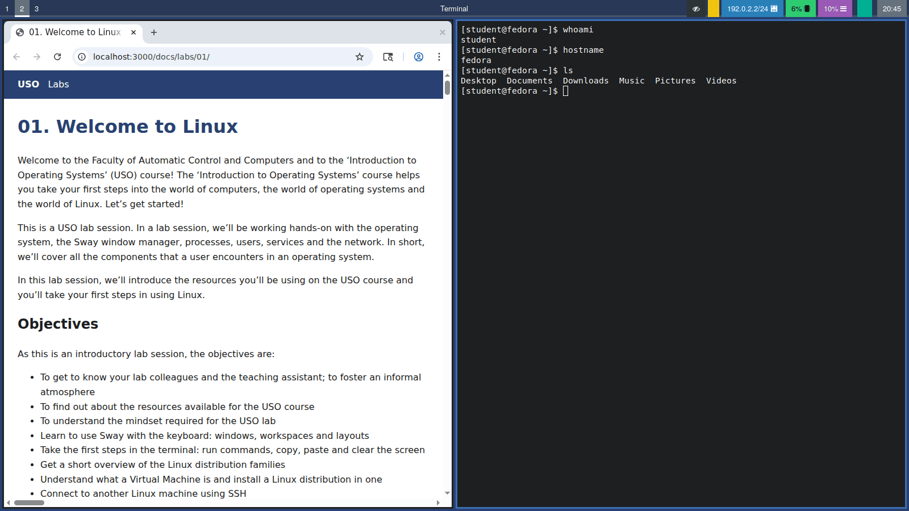
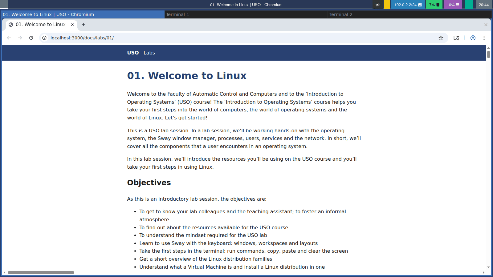
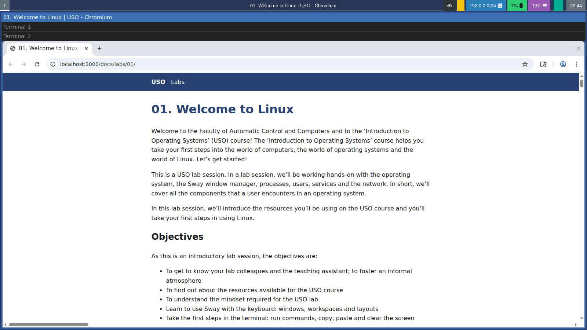
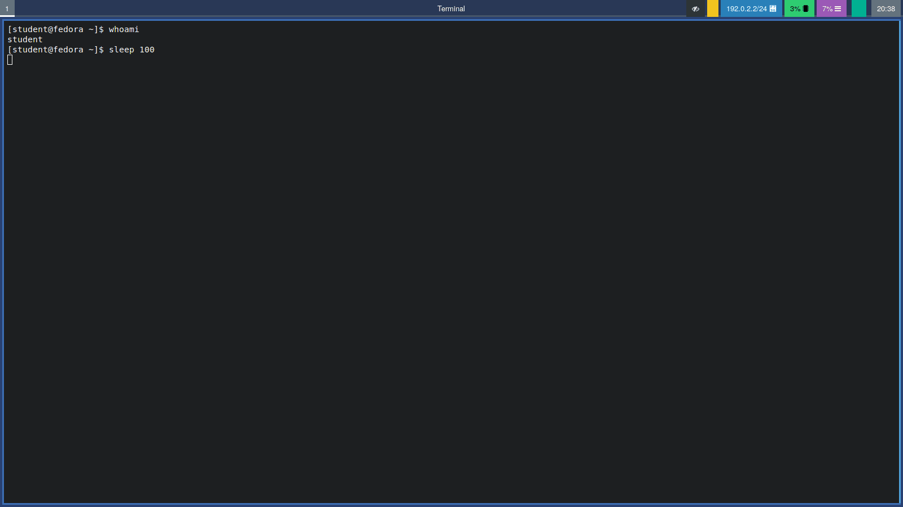

# 01. Welcome to Linux

Welcome to the Faculty of Automatic Control and Computers and to the ‘Introduction to Operating Systems’ (USO) course! The ‘Introduction to Operating Systems’ course helps you take your first steps into the world of computers, the world of operating systems and the world of Linux. Let’s get started!

This is a USO lab session. In a lab session, we’ll be working hands-on with the operating system, the Sway window manager, processes, users, services and the network. In short, we’ll cover all the components that a user encounters in an operating system.

In this lab session, we’ll introduce the resources you’ll be using on the USO course and you’ll take your first steps in using Linux.

## Objectives

As this is an introductory lab session, the objectives are:

- To get to know your lab colleagues and the teaching assistant; to foster an informal atmosphere
- To find out about the resources available for the USO course
- To understand the mindset required for the USO lab
- Learn to use Sway with the keyboard: windows, workspaces and layouts
- Take the first steps in the terminal: run commands, copy, paste and clear the screen
- Get a short overview of the Linux distribution families
- Understand what a Virtual Machine is and install a Linux distribution in one
- Connect to another Linux machine using SSH

## Let’s get to know each other

To begin with, let’s get to know each other better. Together with the lab assistant, say:

* **name**: how people call you, not what’s on your ID card
* **which town/school** you come from
* **why** you chose this study programme
* what your **first impression** of the university is

The lab assistant will ask you some more questions. Feel free to ask the lab assistant any questions you may have or anything you’re curious about.

:::info

We don’t want to be too formal. Avoid expressions such as ‘you’ or the second-person plural. We’re friends and we’re learning together; we help each other and enjoy having a chat.

:::

### Course Resources

#### Wiki (other series course website)

Link: https://ocw.cs.pub.ro/courses/uso/

The Open Courseware wiki platform is where you’ll find the study materials of other series: lecture slides, lab exercises, links to the timetable, syllabus, virtual machines and other necessary supplementary resources.

#### Microsoft Teams

Announcements and most of the discussions (except homework support) take place in [this team](https://teams.microsoft.com/l/team/19%3ApCj64uqV0k1ySbFlrPQ8mdAQEGd-Sm9cueH83AvH4UE1%40thread.tacv2/conversations?groupId=aa3a7384-2009-4263-bafc-cb1ab59a9f21&tenantId=2d8cc8ba-8dda-4334-9e5c-fac2092e9bac).

#### curs.upb.ro

Link: https://curs.upb.ro/

This is the online course platform for the Faculty of Automatic Control and Computers. At USO, it is the dynamic component of the course, where communication with the teaching team takes place. For both the USO course and other courses using the Moodle platform, you will find:

* Links to courses and practical sessions
* Useful announcements for you
* A discussion forum where you can ask questions about the course or the faculty
* You can provide feedback to the teaching assistants
* Links to homework assignments and their deadlines

Information about accounts can be found on the homepage of the website.

:::info

If you have any uncertainties regarding the USO course or laboratory, or the subject in general, or any questions relating to USO or the faculty, please post them on the dedicated forum for the USO course on Moodle.
On the discussion forum on the Moodle platform, you will receive quick, prompt and informed answers to questions regarding the USO course and its activities. Please feel free to use the relevant forums when you are not in class or in the laboratory and cannot speak directly to the course lecturer or laboratory assistant.

Before asking a question, please ensure that it has not already been asked by someone else.

Please contact teaching assistants or course lecturers via their personal email addresses only in cases of private matters or issues that do not concern all your fellow students on the forum.

:::

:::warning

Please do not use Facebook to communicate with the USO team. Please use the forums on curs.upb.ro or the email addresses listed on the [team’s page](https://ocw.cs.pub.ro/courses/uso/echipa) for private discussions.

:::

#### Facebook page

Link: https://www.facebook.com/uso.acs

The Facebook page is where we post announcements about USO, community activities and (often amusing) news from the world of computing.

#### The faculty’s NCIT cluster

Link: https://cloud.curs.pub.ro/

The faculty’s NCIT cluster, accessible via the front-end processor at fep.grid.pub.ro using the SSH protocol, is a resource that will be used for homework assignments and the practical test. You log in to the system using the same credentials you use to log in to the Moodle platform (https://curs.upb.ro/).

The cloud infrastructure within the NCIT cluster is based on the open-source [OpenStack](https://www.openstack.org/) solution. This is an IaaS (Infrastructure as a Service) solution. It will be used to create virtual machines in the cloud for your practical tests.

#### Support (issues)

Link: https://support.upb.ro/

The platform where you can submit a ticket if you are experiencing problems with your @stud.acs.upb.ro email account or with the account you use to access the Moodle platform (i.e. the website https://curs.upb.ro).

#### USO Git Repository

Link: https://github.com/systems-cs-pub-ro/uso

The USO course’s Git repository is where you will find the supplementary materials required for a lab session and, where applicable, source code files for the solutions.

## Resources

1. *[Razvan Deaconescu, Razvan Rughinis, Mihai Carabas, Alexandru Radovici, Utilizarea Sistemelor
de Operare, Printech 2021](https://github.com/systems-cs-pub-ro/carte-uso/releases/download/uso-ed1-2021/uso.pdf)*
2. *Brian Ward, How LINUX Works, 3rd Edition, No Starch Press, 2021*
3. *[Sway official website](https://swaywm.org)*
4. *[Sway Wiki on GitHub](https://github.com/swaywm/sway/wiki)*
5. *[Arch Wiki - Sway](https://wiki.archlinux.org/title/Sway)* - useful even if you do not use Arch Linux
6. *[VirtualBox User Manual](https://www.virtualbox.org/manual/)*
7. *[Arch Wiki - OpenSSH](https://wiki.archlinux.org/title/OpenSSH)*
8. The manual pages: `man sway`, `man 5 sway`, `man ssh`

:::tip

A **manual page** is the documentation of a program, installed on your computer. Open one by typing `man` in the commands terminal followed
by the name of the program in a terminal (for example `man ssh`). Scroll with the arrow keys and press <kbd>q</kbd>
to quit.

:::

## Welcome to the Tiles of Sway

When you use Windows, macOS or GNOME, windows are placed on top of each other and you move and resize them with the
mouse. **Sway** works differently. It is a **tiling window manager**: it arranges the windows automatically so that
they **never overlap** and together they fill the whole screen, like tiles on a floor. When you open a new window,
the others shrink to make room for it. Everything is done with the **keyboard**.


It feels strange at first, but after a few hours it becomes very fast: you never need to move or resize windows with
the mouse again.

Sway is very small. It only manages windows and shows a bar at the top or bottom of the screen. Other tasks are done
by separate small programs, for example:

| Task | Program |
|-|-|
| Terminal | `foot` |
| Application launcher (a menu to start programs) | `rofi`, `wofi` or `wmenu` |
| Status bar | `swaybar` or `waybar` |
| File manager (to browse files and folders) | `thunar` |

Fedora offers an edition called [Fedora Sway](https://fedoraproject.org/spins/sway/), which comes with Sway and all
these programs already configured. On other distributions, Sway can be installed with the package manager (for
example `sudo dnf install sway` or `sudo apt install sway`).

### First Steps in Sway

#### The Mod Key

Almost every Sway shortcut starts with a special key called the **mod key**, written **`$mod`**. By default it is the
<kbd>Super</kbd> key (the key with the Windows logo). So <kbd>$mod</kbd> + <kbd>Enter</kbd> means: hold the
<kbd>Super</kbd> key and press <kbd>Enter</kbd>.

:::caution

If you run Sway inside a VM, the host might "steal" the <kbd>Super</kbd> key. Click inside the VM window first so
that the hypervisor captures the keyboard (see [Keyboard and Mouse Capture](#keyboard-and-mouse-capture)).

:::

#### The Essentials

If you remember only these, you can already use Sway:

| Keybinding | Action |
|-|-|
| <kbd>$mod</kbd> + <kbd>Enter</kbd> | Open a terminal |
| <kbd>$mod</kbd> + <kbd>d</kbd> | Open the application launcher |
| <kbd>$mod</kbd> + arrow keys | Move the focus to another window |
| <kbd>$mod</kbd> + <kbd>1</kbd> ... <kbd>9</kbd> | Go to workspace 1 ... 9 |
| <kbd>$mod</kbd> + <kbd>Shift</kbd> + <kbd>q</kbd> | Close the window |
| <kbd>$mod</kbd> + <kbd>Shift</kbd> + <kbd>e</kbd> | Exit Sway (log out) |

:::caution

When Sway locks the screen, **nothing is shown**: no login box, no password field, no message, only a plain screen(by default with the background image). The computer is not frozen. Just type your password and press <kbd>Enter</kbd>. While you type,
a small circle appears in the middle of the screen. If the monitor is off, press any key or move the mouse first
to wake it up.

:::

### Default Keybindings

You do not need to memorize this table. Come back to it during the exercises.

| Keybinding | Action |
|-|-|
| <kbd>$mod</kbd> + <kbd>Enter</kbd> | Open a terminal |
| <kbd>$mod</kbd> + <kbd>d</kbd> | Open the application launcher |
| <kbd>$mod</kbd> + <kbd>Shift</kbd> + <kbd>q</kbd> | Close the focused window |
| <kbd>$mod</kbd> + arrow keys (or <kbd>h</kbd> <kbd>j</kbd> <kbd>k</kbd> <kbd>l</kbd>) | Move the focus left / down / up / right |
| <kbd>$mod</kbd> + <kbd>Shift</kbd> + arrow keys (or <kbd>h</kbd> <kbd>j</kbd> <kbd>k</kbd> <kbd>l</kbd>) | Move the focused window left / down / up / right |
| <kbd>$mod</kbd> + <kbd>1</kbd> ... <kbd>0</kbd> | Go to workspace 1 ... 10 |
| <kbd>$mod</kbd> + <kbd>Shift</kbd> + <kbd>1</kbd> ... <kbd>0</kbd> | Move the focused window to workspace 1 ... 10 |
| <kbd>$mod</kbd> + <kbd>b</kbd> | The next window will open to the right |
| <kbd>$mod</kbd> + <kbd>v</kbd> | The next window will open below |
| <kbd>$mod</kbd> + <kbd>e</kbd> | Switch between side by side and one above another |
| <kbd>$mod</kbd> + <kbd>w</kbd> | Tabbed layout |
| <kbd>$mod</kbd> + <kbd>s</kbd> | Stacking layout |
| <kbd>$mod</kbd> + <kbd>f</kbd> | Fullscreen on / off |
| <kbd>$mod</kbd> + <kbd>r</kbd> | Resize mode (arrow keys resize, <kbd>Esc</kbd> exits) |
| <kbd>$mod</kbd> + <kbd>Shift</kbd> + <kbd>Space</kbd> | Floating on / off for the focused window |
| <kbd>$mod</kbd> + <kbd>Space</kbd> | Move the focus between tiled and floating windows |
| <kbd>$mod</kbd> + <kbd>Shift</kbd> + <kbd>-</kbd> | Hide the focused window in the *scratchpad* |
| <kbd>$mod</kbd> + <kbd>-</kbd> | Show / hide the scratchpad window |
| <kbd>$mod</kbd> + <kbd>Shift</kbd> + <kbd>c</kbd> | Reload the configuration file |
| <kbd>$mod</kbd> + <kbd>Shift</kbd> + <kbd>e</kbd> | Exit Sway (log out) |
| <kbd>$mod</kbd> + left mouse drag | Move a floating window |
| <kbd>$mod</kbd> + right mouse drag | Resize a window |

:::info

Why <kbd>h</kbd> <kbd>j</kbd> <kbd>k</kbd> <kbd>l</kbd>? They come from the `vi` text editor, where they mean left,
down, up and right. Your hand stays in the middle of the keyboard. You can use the arrow keys instead, they do the
same thing.

:::

:::tip

`vi` was written by Bill Joy in 1976, at a time when keyboards usually had **no separate arrow keys**. He used an
**ADM-3A** terminal, where the arrows were printed directly on the <kbd>h</kbd> <kbd>j</kbd> <kbd>k</kbd>
<kbd>l</kbd> keys, so those letters became the way to move the cursor. The same keyboard also had <kbd>Esc</kbd>
where <kbd>Tab</kbd> is today, which is why `vi` uses <kbd>Esc</kbd> so much. Many programs still use these keys today:
`vim`, `less`, `man`, and of course Sway.

:::

### Core Concepts

#### Focus

At any moment, exactly **one** window has the **focus**: it is the window that receives what you type. In Sway, the
focused window has a colored border. When you type and "nothing happens", check which window has the focus.


#### Workspaces

A **workspace** is like a separate screen. You can keep your browser on workspace 1, your terminals on workspace 2
and your music on workspace 3, and jump between them with <kbd>$mod</kbd> + a number. The bar shows the workspaces
that are in use. A workspace disappears automatically when it is empty and you leave it.



#### Layouts

Windows on a workspace are arranged in one of four ways:

| Layout | Keybinding | What you see |
|-|-|-|
| Side by side | <kbd>$mod</kbd> + <kbd>e</kbd> | Windows next to each other, left to right |
| One above another | <kbd>$mod</kbd> + <kbd>e</kbd> (press again) | Windows on top of each other, top to bottom |
| Tabbed | <kbd>$mod</kbd> + <kbd>w</kbd> | One window at a time, with tabs at the top, like a web browser |
| Stacking | <kbd>$mod</kbd> + <kbd>s</kbd> | One window at a time, with a list of titles at the top |

| Split: the browser on the left, two terminals one above another on the right | Tabbed: the browser and two terminals |
|-|-|
|  |  |



:::tip

<kbd>$mod</kbd> + <kbd>b</kbd> and <kbd>$mod</kbd> + <kbd>v</kbd> **do not move anything right away**. They tell Sway
where the **next** window will open. Press one of them, then open a new terminal to see the effect.

:::

#### Floating Windows

Some windows (small dialogs, a calculator) look better on top of the others. These are **floating** windows. Make any
window float with <kbd>$mod</kbd> + <kbd>Shift</kbd> + <kbd>Space</kbd>, and press the same keys again to put it back
into the tiles.


#### The Scratchpad

The **scratchpad** is a hidden place for windows you need only from time to time. Hide a window there with
<kbd>$mod</kbd> + <kbd>Shift</kbd> + <kbd>-</kbd> and bring it back, on any workspace, with <kbd>$mod</kbd> +
<kbd>-</kbd>.

#### Resize Mode

After pressing <kbd>$mod</kbd> + <kbd>r</kbd>, the arrow keys **resize** the focused window instead of moving the
focus. Press <kbd>Esc</kbd> to return to normal.

### Tools

Sway itself only places windows on the screen. Almost everything else you see and use (the bar, the terminal, the
application launcher, the lock screen, the screenshots) is done by **small separate programs**, and Sway simply runs
them as **commands in the background**. For example:

* <kbd>$mod</kbd> + <kbd>Enter</kbd> is just a keybinding that runs the command `foot` (the terminal);
* <kbd>$mod</kbd> + <kbd>d</kbd> is a keybinding that runs the application launcher.

In the configuration file this looks like `bindsym $mod+Return exec foot`: "when this key is pressed, run this
command". This means that you can also run all these programs yourself, by typing their name in a
[terminal](#the-terminal), and that you can change how your desktop behaves by changing the commands (see
[_Modding_ Sway](#modding-sway)).

#### Locking the Screen

`swaylock` locks the screen. Run it in a terminal and the screen is locked right away:

```bash
swaylock
```

Remember that the lock screen shows **nothing**: just type your password and press <kbd>Enter</kbd> to unlock it.

The `-f` option means *fork*: `swaylock` locks the screen and then moves to the background, so the terminal does
not wait for you to unlock the screen. Try it: run `swaylock` in a terminal and, after unlocking, look at when the
`$` comes back; then do the same with `swaylock -f`.

#### Screenshots

On Sway, applications cannot capture the screen by themselves. `grim` takes the screenshot:

```bash
grim ~/Pictures/full.png    # the whole screen
```

To look at your screenshots, use **Thunar**, the file manager installed on the lab computers. Open it from the
application launcher (<kbd>$mod</kbd> + <kbd>d</kbd>, type `thunar`) or by running `thunar` in a terminal, go to
the `Pictures` folder and double click an image to open it.

## The Terminal

The **terminal** is the tool you will use the most, not only in this lab but in **the whole USO course**. It is a
window where you type commands instead of clicking with the mouse: you write a command, press <kbd>Enter</kbd>, and
the computer runs it and shows the result. Almost everything you will do in the following labs (working with files,
users, processes, services and the network) happens in the terminal. In Sway, open one with <kbd>$mod</kbd> +
<kbd>Enter</kbd> (the default terminal is `foot`). For now, you only need the basics below; the terminal and the
**shell** (the program that reads and runs your commands) will be presented in detail in the following labs.

### Running Commands

When the terminal is ready, it shows a line that ends with a **`$`** sign, called the **prompt**. It usually looks
like this:

```shell-session
[student@fedora ~]$ 
```

The `$` means "I am waiting for your command". Type a command after it and press <kbd>Enter</kbd> to run it. While
the command runs, the `$` disappears; when the command finishes, the terminal prints a new `$` on a new line, and
only then you can type the next command.

For example, `sleep 5` does nothing for 5 seconds. Run it and watch: the `$` is "hidden" for 5 seconds and comes
back only when `sleep` finishes. If you type something in the meantime, it is not run as a new command right away.
If you do not want to wait, press <kbd>Ctrl</kbd>+<kbd>C</kbd> to stop the command and get the `$` back.



:::tip

If you do not see a `$` at the end of the last line, a command is still running (or a program such as `nano` or
`man` is open). Wait for it to finish, close the program, or press <kbd>Ctrl</kbd>+<kbd>C</kbd>.

:::

A few commands you will need in this lab:

| Command | What it does |
|-|-|
| `whoami` | Shows your user name |
| `hostname` | Shows the name of the computer |
| `ls` | Lists the files in the current directory |
| `sleep <seconds>` | Waits the given number of seconds, then finishes |
| `clear` | Clears the terminal screen (the shortcut <kbd>Ctrl</kbd>+<kbd>L</kbd> does almost the same) |
| `ip a` | Shows the network addresses of the computer |
| `nano <file>` | Opens a simple text editor (<kbd>Ctrl</kbd>+<kbd>O</kbd> saves, <kbd>Ctrl</kbd>+<kbd>X</kbd> exits) |
| `exit` | Closes the terminal (or an SSH connection) |

:::tip

When the screen is full of old output and you lose track of what you typed, run `clear` (or press
<kbd>Ctrl</kbd>+<kbd>L</kbd>) to start again from a clean screen. Your files and programs are not affected: it
only cleans the terminal window.

:::

### Copy and Paste

In most applications (the browser, the text editor, the file manager) you copy with <kbd>Ctrl</kbd> + <kbd>C</kbd>
and paste with <kbd>Ctrl</kbd> + <kbd>V</kbd>. The **terminal is different**, because there these keys already have
another meaning: <kbd>Ctrl</kbd> + <kbd>C</kbd> **stops** (interrupts) the command that is running. So, in the terminal,
copy and paste use an extra <kbd>Shift</kbd> key:

| Keybinding | Action in the terminal |
|-|-|
| Select the text with the mouse, then <kbd>Ctrl</kbd> + <kbd>Shift</kbd> + <kbd>C</kbd> | Copy the selected text |
| <kbd>Ctrl</kbd> + <kbd>Shift</kbd> + <kbd>V</kbd> | Paste the copied text at the cursor |
| Select the text with the mouse, then click the **middle mouse button** (the wheel) | Quick copy and paste, without any key |
| <kbd>Ctrl</kbd> + <kbd>C</kbd> | **Not copy!** Stops the running command |

:::caution

The <kbd>Ctrl</kbd> + <kbd>Shift</kbd> prefix is **only for the terminal**. In every other application (the browser, the
text editor, the file manager) keep using the usual <kbd>Ctrl</kbd> + <kbd>C</kbd> and <kbd>Ctrl</kbd> +
<kbd>V</kbd>. The clipboard is shared: text copied in the terminal with <kbd>Ctrl</kbd> + <kbd>Shift</kbd> +
<kbd>C</kbd> can be pasted in the browser with <kbd>Ctrl</kbd> + <kbd>V</kbd>, and text copied in the browser with
<kbd>Ctrl</kbd> + <kbd>C</kbd> can be pasted in the terminal with <kbd>Ctrl</kbd> + <kbd>Shift</kbd> + <kbd>V</kbd>.

:::

:::tip

Selecting text and clicking the middle mouse button uses a second, separate clipboard, called the **primary
selection**. It works in (almost) all Linux applications, not only in the terminal, and it does not change what you
copied with <kbd>Ctrl</kbd> + <kbd>C</kbd>.

:::

:::danger

Be careful when you paste commands copied from a web page. If the text ends with a new line, the command **runs
immediately**, before you have a chance to read it. Paste only commands that you understand.

:::

## Linux Distributions

**Linux** itself is only the *kernel*, the core of the operating system. To get something you can actually use, you
also need a shell, tools, a graphical interface, applications and a way to install new programs. A **Linux
distribution** (or *distro*) puts all of these together into a complete operating system.

There are hundreds of distributions, but most of them belong to a few families. The biggest difference between the
families is the **package manager**, the program you use to install software.

| Family | Examples | Install a program with |
|-|-|-|
| Debian | [Debian](https://www.debian.org), [Ubuntu](https://ubuntu.com), Linux Mint | `sudo apt install <name>` |
| Red Hat | [Fedora](https://fedoraproject.org), [RHEL](https://www.redhat.com), CentOS Stream | `sudo dnf install <name>` |
| Arch | [Arch Linux](https://archlinux.org), Manjaro | `sudo pacman -S <name>` |
| SUSE | [openSUSE](https://www.opensuse.org) | `sudo zypper install <name>` |

Many distributions come in several **flavors** (also called *spins* or *editions*): the same system, but with a
different graphical interface. For example, **Fedora Sway** is Fedora with Sway instead of the default GNOME desktop.

:::info

Our lab computers run Fedora, so you will use the `dnf` package manager. If you are curious about other
distributions, [click here](https://distrowatch.com/random) for a random one.

:::

## Virtual Machines

A **Virtual Machine (VM)** lets you run an operating system as an application. It runs a complete operating system
(the **guest**) inside a window of your real operating system (the **host**). The guest thinks it has its own CPU,
memory, disk and network card, but it is actually sharing those of the host. The program that makes this possible is
called a **hypervisor**.

Why is this useful?

* You can try a new distribution without touching your real system.
* If you break something inside the VM, your computer is not affected.
* You can save the state of a VM (a **snapshot**) and go back to it later.
* Servers on the internet very often run inside VMs.

The most common programs for running VMs are:

| | VirtualBox | VMware Workstation / Fusion | QEMU |
|-|-|-|-|
| Price | Free | Free for personal use | Free |
| Runs on | Windows, macOS, Linux | Windows, macOS | any major CPU architecture |
| Good for | Beginners, it is easy to use | Better performance | Advanced users, many CPU types |

To install an operating system in a VM, you need its **ISO image**: a single file (ending in `.iso`) that contains
the installer, like a virtual DVD. You download it from the website of the distribution.

:::caution

Download the ISO image that matches your computer's processor. Most PCs are **x86_64** (and their architecture is
called `amd64`), while new Apple Macs (M1, M2, ...) are **arm64** (and their architecture is called `aarch64`).

:::

### Creating a VM in VirtualBox

We will use **VirtualBox**, which is installed on the lab computers.

1. Open VirtualBox and click **New**.
2. Give the VM a name and choose the ISO image (you can find several under the `Downloads/` directory).
3. Set the memory (**RAM**) to 4 GB and the number of **CPUs** to 2.
4. Create a virtual hard disk of 20 GB.
5. Before starting the VM, open **Settings** and check the settings from the table below.
6. Click **Start**. The VM boots from the ISO image and you can run the installer.
7. Follow the installer. Most of the time the default options are fine. When you create your user:
   * choose a simple user name (for example `student`) and a password you will remember;
   * if the installer shows an option such as **Make this user administrator**, **check it**. Without it, `sudo`
     will not work and you will not be able to do the SSH exercises.
8. At the end, the installer asks you to reboot. After the reboot, you should see the login screen of the installed
   system.

:::tip

If after the reboot the VM starts the **installer again** instead of the installed system, the ISO image is still
attached. Shut down the VM, open **Settings → Storage**, select the ISO under the optical drive and remove it, then
start the VM again.

:::

| Setting | Value | Why |
|-|-|-|
| Display → Graphics Controller | **VMSVGA** | Needed for some graphical interfaces |
| Display → Video Memory | 128 MB | |
| Display → Enable 3D Acceleration | **checked** | Needed for some graphical interfaces |
| Network → Adapter 1 | **NAT** | The VM gets internet access on any network |
| Network → Adapter 1 → Advanced → Port Forwarding | Host port **2222** → Guest port **22** | So you can connect to the VM with SSH later (see [Port Forwarding](#port-forwarding)) |

### Keyboard and Mouse Capture

Your keyboard and mouse are shared between the host and the VM, so the hypervisor has to decide who receives each key
you press. When you click inside the VM window, the hypervisor **captures** the keyboard and mouse: from now on, the
keys go to the VM, not to the host. To give them back to the host, press the **Host key** (in VirtualBox, by default
the right <kbd>Ctrl</kbd>). The small keyboard icon at the bottom right of the VirtualBox window shows who has the
keyboard right now.

Each hypervisor uses a different key combination to release the keyboard and mouse:

| Hypervisor | Release keyboard and mouse | Toggle fullscreen | Send <kbd>Ctrl</kbd>+<kbd>Alt</kbd>+<kbd>Del</kbd> to the VM |
|-|-|-|-|
| **VirtualBox** (Windows, Linux) | Right <kbd>Ctrl</kbd> (the *Host key*) | <kbd>Host</kbd> + <kbd>F</kbd> | <kbd>Host</kbd> + <kbd>Del</kbd> |
| **VirtualBox** (macOS) | Left <kbd>⌘ Command</kbd> | <kbd>Host</kbd> + <kbd>F</kbd> | <kbd>Host</kbd> + <kbd>Del</kbd> |
| **VMware Workstation** (Windows, Linux) | <kbd>Ctrl</kbd> + <kbd>Alt</kbd> | <kbd>Ctrl</kbd> + <kbd>Alt</kbd> + <kbd>Enter</kbd> | <kbd>Ctrl</kbd> + <kbd>Alt</kbd> + <kbd>Insert</kbd> |
| **VMware Fusion** (macOS) | <kbd>Ctrl</kbd> + <kbd>⌘ Command</kbd> | <kbd>Ctrl</kbd> + <kbd>⌘ Command</kbd> + <kbd>F</kbd> | Menu **Virtual Machine → Send Key** |
| **QEMU** | <kbd>Ctrl</kbd> + <kbd>Alt</kbd> + <kbd>G</kbd>  or Left <kbd>Ctrl</kbd> + Left <kbd>Alt</kbd>| <kbd>Ctrl</kbd> + <kbd>Alt</kbd> + <kbd>F</kbd> or Menu **View → Fullscreen** | Menu **Machine** or the QEMU monitor or Menu **Send Key** |

:::note

In VirtualBox you can change the Host key in **File → Preferences → Input → Virtual Machine → Host Key Combination**.
The other hypervisors also let you change these combinations in their preferences, so a computer configured by
someone else might use different keys.

:::

This matters a lot for the <kbd>Super</kbd> key (the key with the Windows logo). Both the host and the guest want to
use it: GNOME opens its overview with it, and Sway uses it for almost every shortcut. If the keyboard is **not**
captured, the host gets <kbd>Super</kbd> and the VM never sees it.

* Always **click inside the VM window** before using <kbd>Super</kbd> shortcuts in the VM.
* Check that **Auto Capture Keyboard** is enabled (in VirtualBox: **File → Preferences → Input**).
* If the host still reacts to <kbd>Super</kbd>, put the VM in **fullscreen** (in VirtualBox: **View → Full-screen
  Mode**, or <kbd>Host</kbd> + <kbd>F</kbd>). Press the same keys again to leave fullscreen.

:::tip

If you feel "stuck" inside the VM (the mouse will not leave the window, or your host shortcuts do not work), press
the release combination of your hypervisor from the table above (in VirtualBox, the **Host key** once).

:::

### Snapshots

A **snapshot** saves the complete state of a VM at one moment. In VirtualBox, select the VM, open the **Snapshots**
view and click **Take**. If something goes wrong later, select the snapshot and click **Restore**: the VM goes back
exactly as it was. Take a snapshot right after every successful installation.

## Remote Access

**SSH** (*Secure Shell*) lets you open a terminal on **another computer** over the network. Everything you type is
sent, encrypted, to the other computer and runs there. This is how people manage servers that have no screen at all.

Two programs are involved:

* the **SSH server** (`sshd`) runs on the computer you want to reach;
* the **SSH client** (`ssh`) runs on the computer you are sitting at.

To reach a computer, you need its **IP address**, a number like `192.168.1.25` that identifies it on the network, and
a **port**, a number that tells the computer which program should receive the connection. The SSH server listens on
port **22** by default. On Linux, `ip a` shows the IP address (look for `inet` in the section of the network card,
not the `127.0.0.1` one).

### Port Forwarding

With **NAT**, the VM is hidden behind the host, like a computer behind a home router. Inside the VM, `ip a` shows an
address such as `10.0.2.15`, but this address exists **only inside VirtualBox**: the host cannot use it to reach the
VM. The solution is **port forwarding**: we ask VirtualBox to listen on a port of the host and to send everything that
arrives there to a port of the VM.

```
  host                                          VM
  ssh student@localhost -p 2222  ──►  VirtualBox  ──►  sshd on port 22
```

The `localhost` (or `127.0.0.1`) is a special name that always means _this computer_. So when you run
`ssh -p 2222 student@localhost` on the host, you connect to the host itself on port 2222, and VirtualBox passes the
connection on to port 22 of the VM. We use 2222 because port 22 of the host may already be used by the host's own
SSH server.

To add the rule in VirtualBox:

1. Select the VM, open **Settings → Network → Adapter 1**, and check that it is attached to **NAT**.
2. Expand **Advanced** and click **Port Forwarding**.
3. Click the **+** button and fill in the new rule:

| Name | Protocol | Host IP | Host Port | Guest IP | Guest Port |
|-|-|-|-|-|-|
| ssh | TCP | 127.0.0.1 | 2222 | *(leave empty)* | 22 |

4. Click **OK**. The rule works immediately, even if the VM is already running.

### Connecting to a VM

On the **VM** (the computer you want to reach):

```bash
sudo systemctl enable --now sshd                  # start the SSH server
```

:::note
When using Fedora you might need to allow the connection through the firewall using:

```bash
sudo firewall-cmd --add-service=ssh --permanent 
sudo firewall-cmd --reload
```

:::

:::caution

`sudo` asks for **your own password** (not a special administrator password). After you type it correctly, it
remembers it for a few minutes, so it does not ask again for every command.

When you type a password in the terminal, **nothing appears on the screen**: no letters, no dots, no stars. This is
normal and is done for security. Type the password anyway and press <kbd>Enter</kbd>. If you make a mistake, press
<kbd>Ctrl</kbd>+<kbd>U</kbd> to clear what you typed and start again.

:::

On the **host** (the lab computer):

```bash
ssh -p 2222 student@localhost     # log in, replace "student" with your username inside the VM
```

The first time, SSH asks if you trust the computer: type `yes`. Then type the password of the user on the VM. Now
every command you type runs on the VM. Type `exit` to come back to the host.

:::caution

Without the port forwarding rule, `ssh -p 2222 student@localhost` answers `Connection refused`. Without `-p 2222`,
`ssh` tries port 22 of the **host** and you end up logging in to the host, not the VM. Run `hostname` after logging in
to check where you are.

:::

:::note

In all the commands in this lab, `student` is only an example. Replace it with the user name **you** created in
the VM installer.

:::

### SSH from Windows and macOS

Windows 10/11 and macOS already have the `ssh` command (in PowerShell or in the Terminal app). There are also
graphical programs, such as [PuTTY](https://www.chiark.greenend.org.uk/~sgtatham/putty/latest.html) and
[MobaXterm](https://mobaxterm.mobatek.net) for Windows, or [Termius](https://termius.com) for all systems. In all of
them, use `localhost` as the host name and `2222` as the port.

## Troubleshooting

| Problem | Solution |
|-|-|
| I pressed keys but nothing happened | Check which window has the **focus** (the colored border). In a VM, click inside the VM window first |
| <kbd>Super</kbd> does not work in the VM | Click inside the VM to capture the keyboard, or put the VM in fullscreen (see [Keyboard and Mouse Capture](#keyboard-and-mouse-capture)) |
| The mouse cannot leave the VM window | Press the release keys of your hypervisor (in VirtualBox the **Host key**, right <kbd>Ctrl</kbd>; see the table in [Keyboard and Mouse Capture](#keyboard-and-mouse-capture)) |
| Sway does not start in the VM, or the screen is black | Enable **3D Acceleration** and use the **VMSVGA** graphics controller in the VM *Display* settings |
| The mouse cursor is invisible in the VM | Add `export WLR_NO_HARDWARE_CURSORS=1` to `~/.bash_profile`, then log out and in again |
| `ssh` says `Connection refused` | Check the port forwarding rule (host port 2222 → guest port 22), that the SSH server is running in the VM (`systemctl status sshd`) and that you opened the firewall |
| `ssh` logged me in, but `hostname` shows the host | You forgot `-p 2222`, so you connected to the host itself |
| `ssh` shows `WARNING: REMOTE HOST IDENTIFICATION HAS CHANGED!` | You reinstalled the VM, or another VM now uses port 2222. Run `ssh-keygen -R "[localhost]:2222"` on the host and connect again |

## Exercises

The exercises are marked for the two types of lab:

* 🌱 **basic** (1 hour - **AC**): do only the exercises marked with 🌱;
* 🌳 **full** (2 hours - **CD**): do all the exercises, both 🌱 and 🌳.

Both types of exercises cover the main parts: Sway, the terminal, virtual machines and remote access. If you
finish early, continue with the other exercises and then with the [Extra](#extra) section.

### Getting Used to Sway

Do these exercises in order. Try to use **only the keyboard**.

1. 🌱 **Look around**: Log in to Sway. Look at the bar: can you find the workspace number and the clock? Is there
   anything else on the screen? <small>→ [Welcome to the Tiles of Sway](#welcome-to-the-tiles-of-sway)</small>
2. 🌱 **Your first terminal**: Open a terminal with <kbd>$mod</kbd> + <kbd>Enter</kbd>. Type `whoami`, then `hostname`,
   then `ls`. Close the terminal with <kbd>$mod</kbd> + <kbd>Shift</kbd> + <kbd>q</kbd>. <small>→ [The Essentials](#the-essentials) · [Running Commands](#running-commands)</small>
3. 🌱 **Tiling**: Open one terminal, then a second one, then a third one. What happens to the size of the windows each
   time you open a new one? Now close them one by one and watch again. <small>→ [Welcome to the Tiles of Sway](#welcome-to-the-tiles-of-sway)</small>
4. 🌱 **Focus**: Open three terminals. Move the focus between them with <kbd>$mod</kbd> + arrow keys. In each terminal,
   type a different word (for example `one`, `two`, `three`) to be sure you know which window has the focus. <small>→ [Focus](#focus)</small>
5. 🌳 **The vi keys**: Do the previous exercise again, but use <kbd>$mod</kbd> + <kbd>h</kbd> and <kbd>$mod</kbd> +
   <kbd>l</kbd> instead of the arrow keys. <small>→ [Default Keybindings](#default-keybindings)</small>
6. 🌱 **Moving windows**: With three terminals open, move the focused one to the far left, then to the far right, using
   <kbd>$mod</kbd> + <kbd>Shift</kbd> + arrow keys. <small>→ [Default Keybindings](#default-keybindings)</small>
7. 🌱 **The launcher**: Press <kbd>$mod</kbd> + <kbd>d</kbd>, type the first letters of `firefox` and press
   <kbd>Enter</kbd>. Use the launcher again to open the file manager, **Thunar** (type `thunar`). <small>→ [The Essentials](#the-essentials)</small>
8. 🌳 **Fullscreen**: Focus the browser and press <kbd>$mod</kbd> + <kbd>f</kbd>. Press it again to go back. <small>→ [Default Keybindings](#default-keybindings)</small>
9. 🌱 **Workspaces**: Go to workspace 2 with <kbd>$mod</kbd> + <kbd>2</kbd> and open a terminal there. Go to workspace 3
   and open another one. Jump between workspaces 1, 2 and 3. Look at the bar each time. <small>→ [Workspaces](#workspaces)</small>
10. 🌱 **Moving to another workspace**: Focus the browser and send it to workspace 4 with <kbd>$mod</kbd> +
    <kbd>Shift</kbd> + <kbd>4</kbd>. Where are you now: on workspace 4 or still on the old one? Go to workspace 4 and
    check that the browser is there. <small>→ [Workspaces](#workspaces)</small>
11. 🌳 **Empty workspaces**: Move the only window from workspace 3 to workspace 1. Look at the bar: what happened to
    workspace 3? <small>→ [Workspaces](#workspaces)</small>
12. 🌱 **Splitting**: On an empty workspace, open one terminal. Press <kbd>$mod</kbd> + <kbd>v</kbd> and open a second
    terminal. Where did it appear? Now press <kbd>$mod</kbd> + <kbd>b</kbd> and open a third one. Where did that one
    appear? <small>→ [Layouts](#layouts)</small>
13. 🌳 **Build a layout**: On an empty workspace, build this: one terminal on the **left half** of the screen, and two
    terminals **one above the other** on the **right half**. (Hint: open two terminals, focus the right one, press
    <kbd>$mod</kbd> + <kbd>v</kbd>, then open the third.) <small>→ [Layouts](#layouts)</small>
14. 🌱 **Tabs and stacks**: Open three terminals on an empty workspace. Press <kbd>$mod</kbd> + <kbd>w</kbd> for tabs and
    move between them with <kbd>$mod</kbd> + arrow keys. Then try <kbd>$mod</kbd> + <kbd>s</kbd>. Go back to the
    normal layout with <kbd>$mod</kbd> + <kbd>e</kbd>. <small>→ [Layouts](#layouts)</small>
15. 🌱 **Resizing**: With two terminals side by side, press <kbd>$mod</kbd> + <kbd>r</kbd> and make the left one bigger
    with the arrow keys. Press <kbd>Esc</kbd> when you are done. <small>→ [Resize Mode](#resize-mode)</small>
16. 🌱 **Floating**: Make a terminal floating with <kbd>$mod</kbd> + <kbd>Shift</kbd> + <kbd>Space</kbd>. Move it by
    holding <kbd>$mod</kbd> and dragging with the left mouse button, and resize it by dragging with the right button.
    Put it back into the tiles with the same keys. <small>→ [Floating Windows](#floating-windows)</small>
17. 🌳 **The scratchpad**: Hide a terminal in the scratchpad with <kbd>$mod</kbd> + <kbd>Shift</kbd> + <kbd>-</kbd>. Go
    to another workspace and bring it back with <kbd>$mod</kbd> + <kbd>-</kbd>. Press <kbd>$mod</kbd> +
    <kbd>-</kbd> again to hide it. <small>→ [The Scratchpad](#the-scratchpad)</small>
18. 🌳 **Challenge - your desk**: Without using the mouse, set up this:
    * workspace 1: the browser, in fullscreen;
    * workspace 2: two terminals side by side;
    * workspace 3: three terminals in tabs.

    Then jump between the three workspaces a few times. <small>→ [Workspaces](#workspaces) · [Layouts](#layouts)</small>
19. 🌳 **Log out and in**: Exit Sway with <kbd>$mod</kbd> + <kbd>Shift</kbd> + <kbd>e</kbd> and log in again. Are your
    windows and workspaces still there? <small>→ [The Essentials](#the-essentials)</small>

### The Terminal

20. 🌱 **Clean screen**: Open a terminal and run `whoami`, `hostname`, `ls` and `ip a`. Now run `clear`. What happened
    to the screen? Run the commands again and press <kbd>Ctrl</kbd> + <kbd>L</kbd> this time. Scroll up with
    <kbd>Shift</kbd> + <kbd>Page Up</kbd> after each of them: can you still see the old output? <small>→ [Running Commands](#running-commands)</small>
21. 🌱 **From the terminal to the browser**: Run `hostname`. Select its output with the mouse and copy it with
    <kbd>Ctrl</kbd> + <kbd>Shift</kbd> + <kbd>C</kbd>. Open the browser, click in the search bar and paste it with
    <kbd>Ctrl</kbd> + <kbd>V</kbd>. Now select some text on a web page and press <kbd>Ctrl</kbd> + <kbd>Shift</kbd> +
    <kbd>C</kbd> in the browser: did it copy the text, or did something else happen? (Close what opened with the
    same keys.) <small>→ [Copy and Paste](#copy-and-paste)</small>
22. 🌱 **From the browser to the terminal**: In the browser, open this page, select the command `ip a` from the
    [Running Commands](#running-commands) table and copy it with <kbd>Ctrl</kbd> + <kbd>C</kbd>. Go to the terminal and
    paste it with <kbd>Ctrl</kbd> + <kbd>Shift</kbd> + <kbd>V</kbd>, then press <kbd>Enter</kbd>. Try
    <kbd>Ctrl</kbd> + <kbd>V</kbd> in the terminal as well: what happens? <small>→ [Copy and Paste](#copy-and-paste)</small>
23. 🌳 **From a terminal to another terminal**: Open two terminals side by side. In the first one, run `whoami` and copy
    the output. In the second one, type `echo Hello, `, paste the user name and press <kbd>Enter</kbd>. <small>→ [Copy and Paste](#copy-and-paste)</small>
24. 🌱 **Ctrl+C is not copy**: Run `sleep 10` and watch the prompt: when does the `$` come back? Now run `sleep 100`
    (a command that just waits 100 seconds). Can you see a `$`? While it runs, press <kbd>Ctrl</kbd> +
    <kbd>C</kbd>. What happened to the command and to the `$`? Explain why the terminal uses <kbd>Ctrl</kbd> +
    <kbd>Shift</kbd> + <kbd>C</kbd> for copy. <small>→ [Running Commands](#running-commands) · [Copy and Paste](#copy-and-paste)</small>
25. 🌳 **The middle button**: Run `ls`, select one of the file names with the mouse (a double click selects a whole
    word) and paste it with the **middle mouse button** after `ls -l `. Then paste it in the browser search bar with
    the middle button too. Did you need any key? <small>→ [Copy and Paste](#copy-and-paste)</small>

### Sway Tools

26. 🌳 **Lock the screen**: In a terminal, run `swaylock`. What do you see? Unlock the screen by typing your password and
    pressing <kbd>Enter</kbd>. Then run `swaylock -c 000000` and `swaylock -c 0000ff`: what does the `-c` option
    change? (Hint: `man swaylock`.) <small>→ [Locking the Screen](#locking-the-screen)</small>
27. 🌳 **Take a screenshot**: Run `grim ~/Pictures/full.png` to capture the whole screen. Now run
    `sleep 5; grim ~/Pictures/later.png` and, in those 5 seconds, go to another workspace. Open **Thunar**, go to the `Pictures` folder and look at both screenshots: what does each of them
    show? <small>→ [Screenshots](#screenshots)</small>

### Virtual Machines

28. 🌱 **Install another distribution**: Create a VM following [Creating a VM in VirtualBox](#creating-a-vm-in-virtualbox)
    and attach the `.iso` file of a distribution (you can find several in the `Downloads/` directory). Boot the VM,
    run the installer, create a user and set a password. <small>→ [Creating a VM in VirtualBox](#creating-a-vm-in-virtualbox)</small>
29. 🌱 **Explore the guest**: Log in to the VM, open a terminal and run `whoami`, `hostname` and `ip a`. Run the same
    commands in a terminal on the host. What is different? Can you guess why the VM's IP address starts with `10.0.2`? <small>→ [Virtual Machines](#virtual-machines) · [Remote Access](#remote-access)</small>
30. 🌳 **Keyboard capture**: Click inside the VM window and press <kbd>Super</kbd>. Then press the **Host key** and press
    <kbd>Super</kbd> again. Which system reacted each time: the VM or the host? Watch the keyboard icon at the bottom
    right of the VM window. <small>→ [Keyboard and Mouse Capture](#keyboard-and-mouse-capture)</small>
31. 🌳 **Take a snapshot**: Shut down the VM and take a snapshot called `fresh-install`. <small>→ [Snapshots](#snapshots)</small>
32. 🌳 **Break and restore**: Start the VM and create a file with `nano ~/test.txt`. Shut down the VM and restore the
    `fresh-install` snapshot. Start the VM again: is `test.txt` still there? Why? <small>→ [Snapshots](#snapshots)</small>

### Remote Access

33. 🌱 **Connect via SSH**: Make sure the VM network adapter is **NAT** and add the port forwarding rule (see
    [Port Forwarding](#port-forwarding)). In the VM, start the SSH server and open the firewall (see
    [Connecting to a VM](#connecting-to-a-vm)). From a terminal on the **host**, connect with
    `ssh -p 2222 <user>@localhost`. Run `hostname` to check that you are on the VM, then type `exit`. <small>→ [Port Forwarding](#port-forwarding) · [Connecting to a VM](#connecting-to-a-vm)</small>
34. 🌳 **Wrong door**: From the host, run `ssh <user>@localhost` **without** `-p 2222`. What happens? Where would you be
    if it worked? Use `hostname` to check. <small>→ [Port Forwarding](#port-forwarding)</small>
35. 🌳 **Two sides**: Put the VM window and a host terminal next to each other. Over SSH, create a file with
    `nano hello.txt` and write something in it. Then, in a terminal **inside the VM window**, run `ls` and
    `cat hello.txt`. Is it the same file? <small>→ [Connecting to a VM](#connecting-to-a-vm)</small>

## Wrap-up Questions

Use the **last 5 minutes** of the lab to answer these questions together with your colleagues and the teaching
assistant. There are no wrong answers for the last three.

1. What is a **tiling window manager**, and how is it different from Windows or macOS?
2. What does the **focus** mean in Sway? How do you know which window has it?
3. What is the difference between a **window**, a **layout** and a **workspace**?
4. What does the `$` at the end of the prompt tell you? What happens to it while a command runs?
5. Why does the terminal use <kbd>Ctrl</kbd> + <kbd>Shift</kbd> + <kbd>C</kbd> to copy, and not
   <kbd>Ctrl</kbd> + <kbd>C</kbd>?
6. What is a **virtual machine**? Which one is the **host** and which one is the **guest**?
7. Why did you need `-p 2222` to connect to the VM with SSH?
8. What was the hardest thing to get used to in Sway?
9. What was faster with the keyboard than with the mouse?
10. Would you use Sway on your own computer? Why?

## Extra

1. **Sway in the VM**: Install Sway in the VM you created, using its package manager (see the table in
   [Linux Distributions](#linux-distributions)). Log out and choose Sway on the login screen. Redo a few of the
   Sway exercises inside the VM. Do the <kbd>Super</kbd> shortcuts work? If not, try fullscreen mode. <small>→ [Linux Distributions](#linux-distributions) · [Keyboard and Mouse Capture](#keyboard-and-mouse-capture)</small>
2. **Two workspaces, two computers**: Put the VM on workspace 2 of the host and your SSH terminal on workspace 1.
   Jump between them with <kbd>$mod</kbd> + <kbd>1</kbd> and <kbd>$mod</kbd> + <kbd>2</kbd>. <small>→ [Workspaces](#workspaces) · [Remote Access](#remote-access)</small>
3. **Other tiling window managers**: Read about [i3](https://i3wm.org), [Hyprland](https://hyprland.org) or
   [niri](https://github.com/YaLTeR/niri). What do they have in common with Sway, and what is different? <small>→ [Welcome to the Tiles of Sway](#welcome-to-the-tiles-of-sway)</small>
4. **Your own bar**: Copy the Waybar files to `~/.config/waybar/` (see [The Bar](#the-bar)) and change them:
   * in `config.jsonc`, remove one module you do not need from `modules-right` (for example the battery on a
     desktop computer);
   * in `config.jsonc`, make the clock show the seconds too: set its `format` to `"{:%H:%M:%S}"` and add
     `"interval": 1`;
   * in `style.css`, change the `background-color` of `window#waybar` to a color you like.

   Reload Waybar after each change. If the bar disappears, you probably made a mistake in `config.jsonc`: run
   `waybar` in a terminal to see the error. <small>→ [The Bar](#the-bar)</small>

### _Modding_ Sway

All the keybindings above are written in a text file. The default one is `/etc/sway/config`. To change it, first make
your own copy (never start from an empty file, or you will have no keybindings at all):

```bash
mkdir -p ~/.config/sway
cp /etc/sway/config ~/.config/sway/config
nano ~/.config/sway/config
```

Lines that start with `#` are comments and are ignored. Some simple things you can change:

```bash title="~/.config/sway/config (fragment)"
# The mod key: Mod4 is Super, Mod1 is Alt
set $mod Mod4

# Space between windows
gaps inner 10

# Keyboard layouts: US and Romanian, switch with Alt+Shift
input type:keyboard {
    xkb_layout "us,ro"
    xkb_variant ",std"
    xkb_options "grp:alt_shift_toggle"
}
```

Save the file (<kbd>Ctrl</kbd>+<kbd>O</kbd>, <kbd>Enter</kbd>), exit `nano` (<kbd>Ctrl</kbd>+<kbd>X</kbd>) and reload
Sway with <kbd>$mod</kbd> + <kbd>Shift</kbd> + <kbd>c</kbd>. If you made a mistake, Sway shows a red bar with the
error at the top of the screen. Open the file again and fix it.

:::tip

If after editing the file no keybinding works, press <kbd>Ctrl</kbd>+<kbd>Alt</kbd>+<kbd>F3</kbd> (in a VirtualBox VM:
<kbd>Host</kbd>+<kbd>F3</kbd>) to get a text console, log in, and run `rm ~/.config/sway/config` to go back to the
default configuration. If the VM still accepts SSH connections, you can also log in with `ssh -p 2222` and fix the
file from the host.

:::

#### The Bar

Sway has a built-in bar called `swaybar`, configured in the `bar { ... }` block (see `man 5 sway-bar`). Fedora Sway
uses **Waybar** instead, a much more customizable bar. Waybar is configured with two files:

* `~/.config/waybar/config.jsonc` - which *modules* to show (workspaces, clock, battery, network, volume, ...) and
  where
* `~/.config/waybar/style.css` - the look of the bar, written in CSS

As with the Sway configuration, start by copying the default files from `/etc/xdg/waybar/`:

```bash
mkdir -p ~/.config/waybar
cp /etc/xdg/waybar/* ~/.config/waybar/
```

The list of modules and their options is on the [Waybar Wiki](https://github.com/Alexays/Waybar/wiki).

After you change one of these files, reload Sway with <kbd>$mod</kbd> + <kbd>Shift</kbd> + <kbd>c</kbd>, or tell
Waybar to reload its files with:

```bash
killall -SIGUSR2 waybar
```
