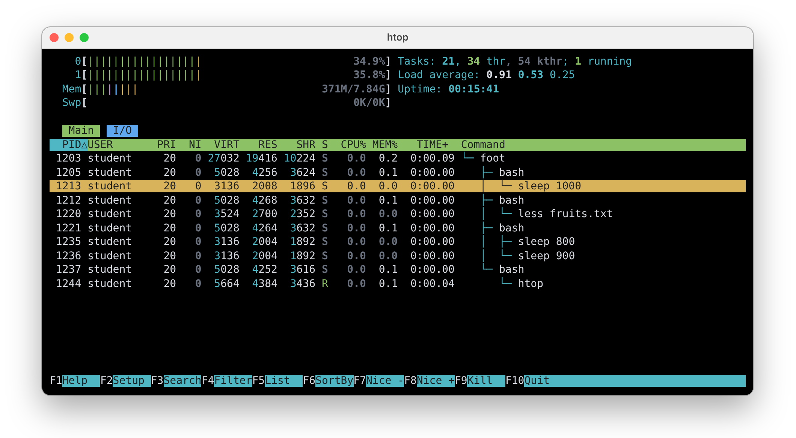

# 03. Processes and Redirects

In the second lab you learned to find your way in the file system tree and to work with files and directories. In this
lab you will learn to **redirect** what a command reads and writes: you will save the output of a command into a file,
keep the errors apart and give a command a file instead of the keyboard. Then you will put many files together into
**archives**, and make them smaller by **compressing** them, with `tar`, `gzip`, `bzip2`, `xz` and `zip`. At the end
you will **inspect processes**: the running programs, through the files that the kernel makes for them in `/proc`, and
with `top`, `htop` and `btop`.

The most important idea of this lab is that a command reads from its **standard input** and writes to its **standard
output**, without knowing what is behind them: the keyboard, the display, a file or another command. The shell decides,
and a redirect is how you tell it.

## Objectives

- Understand the **standard input**, the **standard output** and the **standard error** of a command
- **Redirect** the output, the errors and the input of a command with `>`, `>>`, `2>`, `2>>`, `&>` and `<`
- Connect commands with **pipes** (`|`) and use the special files `/dev/null`, `/dev/zero` and `/dev/urandom`
- **Compress** and decompress files with `gzip`, `bzip2` and `xz`
- Create, list and extract **archives** with `tar`, uncompressed or compressed (`.tar.gz`, `.tar.bz2`, `.tar.xz`), and
  with `zip`
- Find out the type of an archive with `file`
- List processes with `ps` and find their **PID** and **PPID**
- **Inspect** a process through its directory in `/proc`: its state, its command, its current directory and its open
  files
- Watch the processes live with `top`, `htop` and `btop`

## Resources

1. *[Razvan Deaconescu, Razvan Rughinis, Mihai Carabas, Alexandru Radovici, Utilizarea Sistemelor de
Operare, Printech 2021](https://github.com/systems-cs-pub-ro/carte-uso/releases/download/uso-ed1-2021/uso.pdf)*
   - Chapter 2 - *Utilizarea sistemului de fișiere*, section 2.4
   - Chapter 4 - *Procese*, sections 4.2, 4.4, 4.7 and 4.8
2. *Brian Ward, How LINUX Works, 3rd Edition, No Starch Press, 2021*
   - Chapter 2 - *Basic Commands and Directory Hierarchy*, sections 2.14, 2.16 and 2.18
   - Chapter 8 - *A Closer Look at Processes and Resource Utilization*, sections 8.1 and 8.2
3. *[htop](https://htop.dev)* and *[btop](https://github.com/aristocratos/btop)*
4. The lecture slides: [03. Processes](/docs/lectures/03)
5. The manual pages: `man tar`, `man gzip`, `man bzip2`, `man xz`, `man zip`, `man unzip`, `man ps`, `man proc`,
   `man top`, `man htop`, `man hier` (the directories of the system), and `man bash` (search for `REDIRECTION`)

## Standard Input, Output and Error

Every running command has a list of the files it has open, the **File Descriptor Table**. The **index** in this table is
the **file descriptor**, and the first three are always there:

| File descriptor | Name | In a terminal |
|-|-|-|
| `0` | `stdin`, the standard input | the keyboard |
| `1` | `stdout`, the standard output | the display |
| `2` | `stderr`, the standard error | the display |

A command reads its input from `0`, writes its results to `1` and its error messages to `2`. It does not know what is
behind them. Before it starts the command, the shell can connect any of them to a **file**: this is a **redirect**.

## Redirects

| Redirect | What it does |
|-|-|
| `command > file` | Writes the output (`1`) into `file`. The file is **emptied** first, or created |
| `command >> file` | **Appends** the output to the end of `file` |
| `command 2> file` | Writes the errors (`2`) into `file` |
| `command 2>> file` | Appends the errors to the end of `file` |
| `command > out 2> err` | The output into `out`, the errors into `err` |
| `command &> file` | Both the output and the errors into `file` |
| `command > file 2>&1` | The same, written in the older way: "`2` goes where `1` goes" |
| `command < file` | Reads the input (`0`) from `file`, instead of the keyboard |

:::danger

`>` **empties** the file before the command starts, even if the command fails. `ls > notes.txt` deletes everything that
was in `notes.txt`. Use `>>` when you want to keep the old content.

:::

### Output: `>` and `>>`

```shell-session
[student@fedora lab03]$ ls Music > list.txt
[student@fedora lab03]$ cat list.txt
jazz.mp3
pop.mp3
rock.mp3
[student@fedora lab03]$ echo "--- end ---" >> list.txt
[student@fedora lab03]$ cat list.txt
jazz.mp3
pop.mp3
rock.mp3
--- end ---
[student@fedora lab03]$ echo "new" > list.txt
[student@fedora lab03]$ cat list.txt
new
```

* `ls Music > list.txt` printed nothing on the display: its output went into `list.txt`, which was created.
* `>>` added a line at the end of the file.
* The last `>` emptied the file and wrote only `new`.

### Errors: `2>` and `2>>`

Error messages are written to `2`, not to `1`. A `>` alone does **not** redirect them:

```shell-session
[student@fedora lab03]$ ls Music /nope > list.txt
ls: cannot access '/nope': No such file or directory
[student@fedora lab03]$ ls Music /nope > list.txt 2> errors.txt
[student@fedora lab03]$ cat errors.txt
ls: cannot access '/nope': No such file or directory
[student@fedora lab03]$ ls /nada 2>> errors.txt
[student@fedora lab03]$ cat errors.txt
ls: cannot access '/nope': No such file or directory
ls: cannot access '/nada': No such file or directory
[student@fedora lab03]$ ls Music /nope &> all.txt
[student@fedora lab03]$ cat all.txt
ls: cannot access '/nope': No such file or directory
Music:
jazz.mp3
pop.mp3
rock.mp3
```

* With `> list.txt`, the list went into the file, but the error still appeared on the display.
* With `2> errors.txt`, the error went into its own file, and `2>>` added a second error at the end of it.
* With `&>`, both the list and the error went into the same file.

### Input: `<`

`<` gives a command a file **instead of the keyboard**. The command reads its input from `0` and does not know that it
is a file:

```shell-session
[student@fedora lab03]$ sort < fruits.txt
apple
apple
apple
banana
banana
cherry
kiwi
[student@fedora lab03]$ wc -l fruits.txt
7 fruits.txt
[student@fedora lab03]$ wc -l < fruits.txt
7
```

* `sort` read the lines from `fruits.txt` and printed them in alphabetical order.
* `wc -l fruits.txt` counted the lines of a file that it **opened by itself**, so it knows its name and prints it.
* With `<`, the shell opened the file and gave it to `wc` as its input: `wc` does not know any name, so it prints only
  the number.

:::tip

Run `sort` without anything: it reads from the keyboard. Type a few words, one per line, then press
<kbd>Ctrl</kbd>+<kbd>D</kbd> (*end of input*): `sort` prints them in order. In the same way, `cat > notes.txt` saves
everything you type into `notes.txt`, until you press <kbd>Ctrl</kbd>+<kbd>D</kbd>.

:::

### Pipes: `|`

A **pipe** connects the **output** (`1`) of a command to the **input** (`0`) of the next one, without any file in
between:

```shell-session
[student@fedora lab03]$ ls /usr/bin | wc -l
1843
[student@fedora lab03]$ ls -l /usr/bin | less
```

* `ls /usr/bin | wc -l` counted the programs in `/usr/bin`: `ls` wrote the names, one per line, and `wc -l` counted
  the lines.
* `ls -l /usr/bin | less` showed the long list one screen at a time, instead of letting it run off the screen.

| Command | What it does with its input |
|-|-|
| `sort` | Sorts the lines (`-n` as numbers, `-r` in reverse order) |
| `wc -l` | Counts the lines |
| `head -n <N>` | Keeps the first `N` lines (`head -c <N>` the first `N` bytes) |
| `tail -n <N>` | Keeps the last `N` lines |
| `grep <text>` | Keeps the lines that contain `text` |
| `less` | Shows it one screen at a time, like `man` (quit with <kbd>q</kbd>) |

#### Searching for a text: `grep`

`grep` prints only the lines that contain a text. It reads the files given as parameters, or its input when there are
none, so it works at the end of a pipe too:

```shell-session
[student@fedora lab03]$ grep apple fruits.txt
apple
apple
apple
[student@fedora lab03]$ grep -c apple fruits.txt
3
[student@fedora lab03]$ grep -i APPLE fruits.txt
apple
apple
apple
[student@fedora lab03]$ grep student /etc/group
wheel:x:10:student
student:x:1000:
[student@fedora lab03]$ ps | grep bash
   2817 pts/0    00:00:00 bash
```

* `grep apple fruits.txt` printed the three lines of `fruits.txt` that contain `apple`; `-c` only counted them.
* `-i` ignores the difference between upper and lower case letters.
* `grep student /etc/group` showed the groups of `student`: its own group, and `wheel`, the group of the users that
  are allowed to use `sudo`.
* `ps | grep bash` kept only the line of `bash` from the list of `ps`.

| Option | What it does |
|-|-|
| `-i` | Ignores upper and lower case |
| `-c` | Prints only how many lines contain the text |
| `-v` | Prints the lines that do **not** contain the text |
| `-n` | Prints the number of every line in front of it |
| `-r` | Searches in all the files of a directory |

:::tip

Put the text between quotes when it has spaces: `grep 'model name' /proc/cpuinfo`.

:::

### Special Files

The kernel makes some **special files** in `/dev`. They are not stored on the disk: a driver in the kernel answers
when a command reads or writes them.

| File | Writing | Reading |
|-|-|-|
| `/dev/null` | Everything is **discarded** | Gives *end of file* right away |
| `/dev/zero` | Everything is discarded | Gives as many `0` bytes as you ask for |
| `/dev/urandom` | — | Gives as many **random** bytes as you ask for |

```shell-session
[student@fedora lab03]$ find /etc -name passwd 2> /dev/null
/etc/pam.d/passwd
/etc/passwd
[student@fedora lab03]$ head -c 8 /dev/zero | xxd
00000000: 0000 0000 0000 0000                      ........
[student@fedora lab03]$ head -c 8 /dev/urandom | xxd
00000000: 9f3a 51c2 07e8 b4d1                      .:Q.....
```

* `2> /dev/null` threw away the `Permission denied` messages of `find`.
* `head -c 8` kept the first 8 bytes, and `xxd` showed them in hexadecimal: zeros, then random bytes (different every
  time).

## Archives and Compression

An **archive** is a single file that holds many files and directories, together with their names, their dates and
their permissions. **Compression** makes a file smaller, by writing the same information with fewer bytes. On Linux, the
two are usually done by different programs: `tar` makes the archive, and `gzip`, `bzip2` or `xz` compress it. `zip`
does both at once.

### Compressing One File: `gzip`, `bzip2` and `xz`

The three compressors work in the same way: they replace a file with a compressed one, with an extension added at the
end, and they put it back when you decompress it.

| Compress | Decompress | Extension | |
|-|-|-|-|
| `gzip <file>` | `gunzip <file>.gz` or `gzip -d` | `.gz` | the fastest, compresses the least |
| `bzip2 <file>` | `bunzip2 <file>.bz2` or `bzip2 -d` | `.bz2` | slower, compresses more |
| `xz <file>` | `unxz <file>.xz` or `xz -d` | `.xz` | the slowest, usually compresses the most |

| Option | Means (the same for all three) |
|-|-|
| `-k` | **keep** the original file |
| `-c` | write the result to the standard output, to use with `>` or `\|` |
| `-v` | print how much smaller the file got |
| `-1` ... `-9` | from the fastest (`-1`) to the best compression (`-9`) |

```shell-session
[student@fedora lab03]$ gzip -k numbers.txt
[student@fedora lab03]$ bzip2 -k numbers.txt
[student@fedora lab03]$ xz -k numbers.txt
[student@fedora lab03]$ ls -l numbers.txt*
-rw-r--r--. 1 student student 108894 Oct  6 10:12 numbers.txt
-rw-r--r--. 1 student student  25147 Oct  6 10:12 numbers.txt.bz2
-rw-r--r--. 1 student student  45016 Oct  6 10:12 numbers.txt.gz
-rw-r--r--. 1 student student   4948 Oct  6 10:12 numbers.txt.xz
[student@fedora lab03]$ rm numbers.txt
[student@fedora lab03]$ unxz -k numbers.txt.xz
[student@fedora lab03]$ wc -l numbers.txt
20000 numbers.txt
```

* With `-k`, each compressor kept `numbers.txt` and made a compressed copy of it.
* The same file became 45 KB with `gzip`, 25 KB with `bzip2` and less than 5 KB with `xz`.
* After deleting `numbers.txt`, `unxz -k` put it back from `numbers.txt.xz`, with all its 20000 lines.

:::caution

Without `-k`, `gzip numbers.txt` **deletes** `numbers.txt` and leaves only `numbers.txt.gz`. This is the normal
behavior of all three compressors.

:::

:::info

A compressor works on **one** file. It cannot put a directory or several files together: this is the job of `tar`.

:::

### Archives: `tar`

`tar` (*tape archive*) puts files and directories together into a single file, usually called `.tar`. Its options are
letters, written together, and the most used ones are:

| Letter | Means |
|-|-|
| `c` | **create** an archive |
| `t` | lis**t** the content of an archive |
| `x` | e**x**tract an archive |
| `r` | add files at the end of an archive |
| `v` | **verbose**: print the name of every file |
| `f <archive>` | the name of the archive **file**, always the **last** letter |
| `-C <directory>` | change to this directory first: extract the archive there |

| Command | What it does |
|-|-|
| `tar cvf music.tar Music fruits.txt` | Creates `music.tar` with the directory `Music` and the file `fruits.txt` |
| `tar tf music.tar` | Lists the content of `music.tar` |
| `tar tvf music.tar` | Lists the content with the details: permissions, owner, size and date |
| `tar xvf music.tar` | Extracts `music.tar` in the current directory |
| `tar xvf music.tar -C /tmp/extract` | Extracts it in `/tmp/extract` (the directory must exist) |
| `tar xvf music.tar Music/jazz.mp3` | Extracts only one file, with the name it has in the archive |
| `tar rvf music.tar numbers.txt` | Adds `numbers.txt` at the end of the archive |

```shell-session
[student@fedora lab03]$ tar cvf music.tar Music fruits.txt
Music/
Music/jazz.mp3
Music/pop.mp3
Music/rock.mp3
fruits.txt
[student@fedora lab03]$ tar tf music.tar
Music/
Music/jazz.mp3
Music/pop.mp3
Music/rock.mp3
fruits.txt
[student@fedora lab03]$ mkdir /tmp/extract
[student@fedora lab03]$ tar xvf music.tar -C /tmp/extract
Music/
Music/jazz.mp3
Music/pop.mp3
Music/rock.mp3
fruits.txt
[student@fedora lab03]$ file music.tar
music.tar: POSIX tar archive (GNU)
```

* `tar cvf` created the archive and printed every file it put in it, the directory `Music` with everything inside it.
* `tar tf` listed the content without extracting anything.
* `tar xvf ... -C /tmp/extract` recreated the same files in `/tmp/extract`: `/tmp/extract/Music/jazz.mp3`, and so on.
* `file` looked inside the archive and found that it is a `tar` archive.

:::caution

Do not forget the name of the archive after `f`. `tar cvf Music` tries to create an archive called `Music` and stops
with `Cowardly refusing to create an empty archive`. Worse, `tar cvf fruits.txt Music` **overwrites** `fruits.txt` with
an archive.

:::

:::info

A `.tar` archive is **not** compressed: it is as large as all its files together, plus a little.

:::

### Compressed Archives: `.tar.gz`, `.tar.bz2` and `.tar.xz`

`tar` can compress the archive, with one more letter. It runs `gzip`, `bzip2` or `xz` for you:

| Letter | Compressor | Extension | Example |
|-|-|-|-|
| `z` | `gzip` | `.tar.gz` or `.tgz` | `tar czvf music.tar.gz Music` |
| `j` | `bzip2` | `.tar.bz2` or `.tbz2` | `tar cjvf music.tar.bz2 Music` |
| `J` | `xz` | `.tar.xz` or `.txz` | `tar cJvf music.tar.xz Music` |
| `a` | chosen from the **extension** of the name | any of the above | `tar cavf music.tar.xz Music` |

To **list** or **extract** a compressed archive, you do not need the letter: `tar` finds out the compression by
itself.

```shell-session
[student@fedora lab03]$ tar cf all.tar Music numbers.txt
[student@fedora lab03]$ tar czf all.tar.gz Music numbers.txt
[student@fedora lab03]$ tar cjf all.tar.bz2 Music numbers.txt
[student@fedora lab03]$ tar cJf all.tar.xz Music numbers.txt
[student@fedora lab03]$ ls -l all.*
-rw-r--r--. 1 student student 112640 Oct  6 10:20 all.tar
-rw-r--r--. 1 student student  25333 Oct  6 10:20 all.tar.bz2
-rw-r--r--. 1 student student  45234 Oct  6 10:20 all.tar.gz
-rw-r--r--. 1 student student   5692 Oct  6 10:20 all.tar.xz
[student@fedora lab03]$ file all.*
all.tar:     POSIX tar archive (GNU)
all.tar.bz2: bzip2 compressed data, block size = 900k
all.tar.gz:  gzip compressed data, from Unix, original size modulo 2^32 112640
all.tar.xz:  XZ compressed data, checksum CRC64
[student@fedora lab03]$ tar tvf all.tar.xz
drwxr-xr-x student/student   0 2026-10-06 10:12 Music/
-rw-r--r-- student/student   0 2026-10-06 10:12 Music/jazz.mp3
-rw-r--r-- student/student   0 2026-10-06 10:12 Music/pop.mp3
-rw-r--r-- student/student   0 2026-10-06 10:12 Music/rock.mp3
-rw-r--r-- student/student 108894 2026-10-06 10:12 numbers.txt
```

* The four archives hold the same files. The `.tar` is a little larger than the files themselves; the compressed ones
  are much smaller, `xz` the smallest.
* `file` recognized every type from the content, not from the extension.
* `tar tvf` listed the `.tar.xz` archive without being told it is compressed with `xz`.

:::tip

A compressed archive is a `.tar` archive compressed as a single file: `all.tar.gz` is exactly what you get with
`tar cf all.tar ...` followed by `gzip all.tar`. This is why it has two extensions.

:::

### Zip Archives: `zip` and `unzip`

`zip` archives and compresses in one step, and its archives open on every operating system, including Windows and
macOS.

| Command | What it does |
|-|-|
| `zip music.zip Music/*` | Creates `music.zip` with the files in `Music` |
| `zip -r music.zip Music fruits.txt` | Creates `music.zip` with the directory `Music`, **everything** inside it, and `fruits.txt` |
| `zip -u music.zip numbers.txt` | Adds `numbers.txt` to the archive, or updates it if it changed |
| `zip -sf music.zip` | Lists the names in the archive |
| `unzip -l music.zip` | Lists the content, with sizes and dates |
| `unzip music.zip` | Extracts the archive in the current directory |
| `unzip music.zip -d /tmp/unzipped` | Extracts it in `/tmp/unzipped` (the directory is created) |
| `unzip music.zip fruits.txt` | Extracts only one file |

```shell-session
[student@fedora lab03]$ zip -r music.zip Music fruits.txt
  adding: Music/ (stored 0%)
  adding: Music/jazz.mp3 (stored 0%)
  adding: Music/pop.mp3 (stored 0%)
  adding: Music/rock.mp3 (stored 0%)
  adding: fruits.txt (deflated 40%)
[student@fedora lab03]$ unzip -l music.zip
Archive:  music.zip
  Length      Date    Time    Name
---------  ---------- -----   ----
        0  10-06-2026 10:12   Music/
        0  10-06-2026 10:12   Music/jazz.mp3
        0  10-06-2026 10:12   Music/pop.mp3
        0  10-06-2026 10:12   Music/rock.mp3
       45  10-06-2026 10:12   fruits.txt
---------                     -------
       45                     5 files
```

`zip` printed how much it compressed every file: the empty `.mp3` files were stored as they are, and `fruits.txt`
became 40% smaller.

:::caution

Without `-r`, `zip music.zip Music` puts only the **empty** directory in the archive, not the files inside it.

:::

### Which One to Use

| Format | Archive and compress with | Extract with | Use it for |
|-|-|-|-|
| `.tar` | `tar cf` | `tar xf` | putting files together, without compressing them |
| `.tar.gz` | `tar czf` | `tar xf` | the most common archive on Linux, fast |
| `.tar.bz2` | `tar cjf` | `tar xf` | smaller archives, older programs |
| `.tar.xz` | `tar cJf` | `tar xf` | the smallest archives, for example the source code of the Linux kernel |
| `.zip` | `zip -r` | `unzip` | files you send to people who use Windows or macOS |

:::tip

Not sure what an archive is? Run `file` on it. The extension is only part of the name: `file` looks at the content.

:::

## Inspecting Processes

A **program** is a file on the disk, for example `/usr/bin/sleep`. When you run it, the operating system loads it into
memory and it becomes a **process**. Every process has a number, the **PID** (*Process ID*), and remembers the PID of
the process that started it, its **parent**: the **PPID** (*Parent Process ID*).

### Listing Processes: `ps`

| Command | What it shows |
|-|-|
| `echo $$` | The PID of the current shell |
| `ps` | The processes of the current terminal |
| `ps -f` | The same processes, with more columns: `UID`, `PID`, `PPID`, the start time and the full command |
| `ps -ef` | **All** the processes of the system, with the columns of `-f` |
| `ps -p <PID>` | Only the process with this PID |
| `ps -o <columns>` | Only the columns you choose, for example `ps -o pid,ppid,stat,cmd` |
| `pgrep <name>` | Only the PIDs of the processes whose name is `name` |

```shell-session
[student@fedora ~]$ echo $$
2817
[student@fedora ~]$ ps -f
UID          PID    PPID  C STIME TTY          TIME CMD
student     2817    2790  0 10:02 pts/0    00:00:00 bash
student     3105    2817  0 10:15 pts/0    00:00:00 ps -f
```

* The shell of this terminal is `bash`, with the PID `2817`, the same number as `$$`.
* `ps` is a process too, started by `bash`: its PPID is `2817`. Every time you run it, it gets a new PID.

To have a process to look at, open a **second terminal** and start a command that keeps running, for example
`sleep 1000` (it waits for 1000 seconds). Find it from the first terminal:

```shell-session
[student@fedora ~]$ pgrep sleep
3150
[student@fedora ~]$ ps -f -p 3150
UID          PID    PPID  C STIME TTY          TIME CMD
student     3150    2905  0 10:16 pts/1    00:00:00 sleep 1000
```

`sleep` runs in the other terminal (`pts/1`), and its parent, `2905`, is the `bash` of that terminal. When you are done
with it, stop it with <kbd>Ctrl</kbd>+<kbd>C</kbd> in its terminal.

### The `/proc` File System

The kernel shows every process as a **directory** in `/proc`, named after its PID: `/proc/3150` for the `sleep` above.
Like the special files, these files are not on the disk: the kernel makes up their content when you read them.
`/proc/self` is always the directory of the process that reads it, and `/proc/$$` is the one of your shell.

| File | What it shows |
|-|-|
| `/proc/<PID>/status` | The name, the state, the PID, the PPID, the owner and the memory of the process |
| `/proc/<PID>/cmdline` | The command line, with the words separated by `\0` bytes instead of spaces |
| `/proc/<PID>/cwd` | A link to the **current directory** of the process |
| `/proc/<PID>/exe` | A link to the **program** that runs |
| `/proc/<PID>/fd/` | The **File Descriptor Table**: one link for every open file |
| `/proc/<PID>/environ` | The environment variables, separated by `\0` bytes |
| `/proc/<PID>/maps` | How the program and its libraries are placed in memory |

```shell-session
[student@fedora ~]$ head -n 7 /proc/3150/status
Name:	sleep
Umask:	0022
State:	S (sleeping)
Tgid:	3150
Ngid:	0
Pid:	3150
PPid:	2905
[student@fedora ~]$ ls -l /proc/3150/exe /proc/3150/cwd
lrwxrwxrwx. 1 student student 0 Oct  6 10:17 /proc/3150/cwd -> /home/student
lrwxrwxrwx. 1 student student 0 Oct  6 10:17 /proc/3150/exe -> /usr/bin/sleep
[student@fedora ~]$ cat -v /proc/3150/cmdline
sleep^@1000^@
[student@fedora ~]$ ls -l /proc/3150/fd
total 0
lrwx------. 1 student student 64 Oct  6 10:17 0 -> /dev/pts/1
lrwx------. 1 student student 64 Oct  6 10:17 1 -> /dev/pts/1
lrwx------. 1 student student 64 Oct  6 10:17 2 -> /dev/pts/1
```

* `status` shows that `sleep` is waiting (`S`), and that its parent is `2905`.
* `exe` points to the program, `/usr/bin/sleep`, and `cwd` to the directory where it was started.
* `cmdline` separates the words with `\0` bytes, which are invisible: `cat -v` shows them as `^@`.
* `0`, `1` and `2` point to `/dev/pts/1`: the second terminal, which is both its keyboard and its display.

The letter in the `State` line (and in the `STAT` column of `ps`) is the **state** of the process:

| Letter | State | Means |
|-|-|-|
| `R` | Running or Ready | Runs on a processor, or waits for one |
| `S` | Sleeping (waiting) | Waits for something: a key, a file, a timer |
| `T` | Stopped | Paused |
| `Z` | Zombie | Finished, but its parent has not read its exit code yet |

`/proc` also has files about the whole system:

| File | What it shows |
|-|-|
| `/proc/cpuinfo` | The processors, one block for each of them |
| `/proc/meminfo` | The memory: `MemTotal`, `MemFree`, `MemAvailable`, ... |
| `/proc/uptime` | The number of seconds since the system started |
| `/proc/loadavg` | How busy the system was in the last 1, 5 and 15 minutes |
| `/proc/version` | The version of the kernel |

:::info

The PIDs and the paths above are different on your computer: use the ones that `pgrep` and `ps` print for you. You can
read the files of your own processes; for the processes of other users, most of them say `Permission denied`.

:::

### `top`

`top` shows the processes **live**, like the *Task Manager* of Windows. It updates the list every few seconds, with the
processes that use the most processor time at the top.

```
top - 10:30:12 up  1:28,  1 user,  load average: 0.08, 0.12, 0.10
Tasks: 248 total,   1 running, 247 sleeping,   0 stopped,   0 zombie
%Cpu(s):  1.3 us,  0.7 sy,  0.0 ni, 97.9 id,  0.0 wa,  0.1 hi,  0.0 si,  0.0 st
MiB Mem :   3911.4 total,   1873.2 free,   1245.6 used,    1042.9 buff/cache
MiB Swap:   3911.0 total,   3911.0 free,      0.0 used.    2665.8 avail Mem

    PID USER      PR  NI    VIRT    RES    SHR S  %CPU  %MEM     TIME+ COMMAND
   1718 student   20   0 1186420  98340  61200 S   1.3   2.5   0:12.41 sway
   2790 student   20   0  318264  41212  30124 S   0.3   1.0   0:02.03 foot
      1 root      20   0   49736  38544  10208 S   0.0   1.0   0:02.31 systemd
```

* The first lines are a summary of the system: the time since it started, the load, how many processes are in every
  state, the use of the processors and of the memory.
* Below, every process has its PID, its owner (`USER`), its memory (`RES`, in KB), its state (`S`), the share of the
  processor and of the memory it uses, and its command.

| Key | Action |
|-|-|
| <kbd>P</kbd> | Sort by processor use (the default) |
| <kbd>M</kbd> | Sort by memory use |
| <kbd>T</kbd> | Sort by the processor time used so far |
| <kbd>c</kbd> | Show the full command line |
| <kbd>u</kbd> | Show only the processes of a user (type the name and press <kbd>Enter</kbd>) |
| <kbd>1</kbd> | Show every processor on its own line |
| <kbd>V</kbd> | Show the processes as a tree |
| <kbd>h</kbd> | Help |
| <kbd>q</kbd> | Quit |

:::tip

`top -b -n 1` prints the list only **once**, without updating it, so you can redirect it: `top -b -n 1 > top.txt`.

:::

### `htop`

`htop` does the same job as `top`, but with colors, bars for every processor, and menus at the bottom of the screen.
Start it with `htop` and quit with <kbd>q</kbd> or <kbd>F10</kbd>.



At the top, `htop` shows a bar for every processor (`0` and `1`), the memory (`Mem`) and the swap (`Swp`), the number of
tasks, the load average and the uptime. Below them is the list of processes, one per line, and at the bottom the menu
with the function keys. In the image above, the list shows only the processes of `student` (<kbd>u</kbd>) as a tree
(<kbd>F5</kbd>): the terminal (`foot`) runs four `bash` shells, and each of them runs a command (the third one runs the
pipeline `sleep 800 | sleep 900`). The chosen process is `sleep 1000`.

| Key | Action | Like |
|-|-|-|
| <kbd>↑</kbd> <kbd>↓</kbd> | Choose a process | |
| <kbd>F3</kbd> or <kbd>/</kbd> | Search for a process by name | `pgrep` |
| <kbd>F4</kbd> or <kbd>\\</kbd> | Show only the processes whose name contains a text (filter) | |
| <kbd>F5</kbd> or <kbd>t</kbd> | Show the processes as a tree | <kbd>V</kbd> in `top` |
| <kbd>F6</kbd> | Choose the column to sort by | |
| <kbd>P</kbd> / <kbd>M</kbd> | Sort by processor / by memory use | <kbd>P</kbd> / <kbd>M</kbd> in `top` |
| <kbd>u</kbd> | Show only the processes of a user | <kbd>u</kbd> in `top` |
| <kbd>l</kbd> | Show the open files of the chosen process | `ls -l /proc/<PID>/fd` |
| <kbd>F2</kbd> | Setup: choose the columns and the colors | |
| <kbd>F1</kbd> or <kbd>h</kbd> | Help | |
| <kbd>q</kbd> or <kbd>F10</kbd> | Quit | |

:::tip

`htop` also shows the **threads** of the processes, in green. Press <kbd>H</kbd> to hide them, the list becomes much
shorter.

:::

### `btop`

`btop` is a newer program of the same kind. Its screen is split into boxes: the processors with a graph of their use,
the memory and the disks, the network, and the list of processes. Start it with `btop` and quit with <kbd>q</kbd>.

| Key | Action |
|-|-|
| <kbd>↑</kbd> <kbd>↓</kbd> | Choose a process |
| <kbd>Enter</kbd> | Show the details of the chosen process |
| <kbd>f</kbd> or <kbd>/</kbd> | Show only the processes that match a text (filter) |
| <kbd>e</kbd> | Show the processes as a tree |
| <kbd>←</kbd> <kbd>→</kbd> | Choose the column to sort by |
| <kbd>r</kbd> | Reverse the sorting order |
| <kbd>1</kbd> ... <kbd>4</kbd> | Show or hide the boxes: processors, memory, network, processes |
| <kbd>Esc</kbd> or <kbd>m</kbd> | Menu |
| <kbd>h</kbd> or <kbd>F1</kbd> | Help |
| <kbd>q</kbd> | Quit |

## Troubleshooting

| Problem | Solution |
|-|-|
| `bash: <command>: command not found` | The program is not installed: install it with `sudo dnf install <package>` on Fedora, or with `sudo apt install <package>` on Debian and Ubuntu; the package usually has the same name as the command |
| The error still shows on the display after `>` | Errors go to `2`: use `2>` or `&>` |
| A file is empty after a redirect | `>` empties the file first: use `>>` to append |
| A command waits and does nothing | It reads from the keyboard: type the input and press <kbd>Ctrl</kbd>+<kbd>D</kbd>, or stop it with <kbd>Ctrl</kbd>+<kbd>C</kbd> |
| `gzip: numbers.txt.gz already exists` | The compressed file is already there: delete it, or add `-f` to overwrite it |
| The original file disappeared after `gzip` | Normal: use `-k` to keep it, or decompress it with `gunzip` |
| `tar: Cowardly refusing to create an empty archive` | The name of the archive after `f` is missing |
| `tar: ...: Not found in archive` | The name is wrong: list the archive with `tar tf` and copy the name exactly |
| `tar: /tmp/extract: Cannot open: No such file or directory` | The directory given to `-C` must exist: create it with `mkdir` |
| A `zip` archive has a directory, but not its files | Add `-r` |
| `No such file or directory` in `/proc/<PID>` | The process has finished, or the PID is wrong: check it with `pgrep` or `ps` |
| `Permission denied` in `/proc/<PID>` | The process belongs to another user |

## Exercises

The exercises get harder as you go:

* [First Steps](#first-steps) (exercises 1 - 31) goes once through **everything** in this lab, with easy exercises;
* [Going Further](#going-further) (exercises 32 - 45) has harder exercises;
* [Challenges](#challenges) (exercises 46 - 51) has the hardest ones.

The exercises are also marked for the two types of lab:

* 🌱 **basic** (1 hour - **AC**): do only the exercises marked with 🌱 (exercises 1 - 31);
* 🌳 **full** (2 hours - **CD**): do all the exercises, both 🌱 and 🌳.

Do the exercises **in order**: each one uses the files left by the previous ones.

Some exercises ask for things that the lab does not show you, for example an option that is not in the tables
above. Find it in the **manual page** of the command (`man <command>`), as explained in
[Searching in a Manual Page](/docs/labs/02#searching-in-a-manual-page) in lab 02.

Many exercises use the **files of the system**, from `/etc`, `/usr`, `/var`, `/proc` and `/dev`, so that you also get to
know how a Linux system is organized. To find out what a directory is for, look in `man hier`; to find out what a file
in `/etc` contains, look in section 5 of the manual, for example `man 5 passwd`, `man 5 shells` or `man 5 os-release`.

Keep **two terminals side by side** in Sway: the first one to run the commands, and the second one to run the commands
that you inspect, or to check the results. Many exercises use the PID of a process: it is different on your computer,
use the one that `pgrep` or `ps` prints for you.

:::danger

Do not use `sudo` to look at processes. The files in `/proc` are made by the kernel: read them, but do not try to
change them.

:::

### First Steps

1. 🌱 **The practice tree**:
   1. Run these commands to create the files used in the exercises (copy them from the browser with
      <kbd>Ctrl</kbd>+<kbd>C</kbd> and paste them in the terminal with <kbd>Ctrl</kbd>+<kbd>Shift</kbd>+<kbd>V</kbd>):

      ```bash
      mkdir -p ~/lab03/Music ~/lab03/Photos ~/lab03/Reports ~/lab03/Archives
      touch ~/lab03/Music/jazz.mp3 ~/lab03/Music/rock.mp3 ~/lab03/Music/pop.mp3
      touch ~/lab03/Photos/cat.jpg ~/lab03/Photos/dog.jpg
      printf 'banana\napple\ncherry\napple\nkiwi\nbanana\napple\n' > ~/lab03/fruits.txt
      seq 1 20000 > ~/lab03/numbers.txt
      ```

   2. Go to `~/lab03` and run `tree`.

   **Check:** you see the four directories, the five empty files, `fruits.txt` and `numbers.txt`; `wc -l fruits.txt
   numbers.txt` prints `7` and `20000`. <small>→ [Navigation](/docs/labs/02#navigation)</small>

**Redirects**

2. 🌱 **The root of the system**: From `~/lab03`, save the tree of `/`, only one level deep, into `Reports/system.txt`
   (look in `man tree` for the option that limits how deep `tree` goes). Print the file.

   **Check:** `tree` printed nothing on the display, and the file shows the main directories of the system: `boot`,
   `dev`, `etc`, `home`, `proc`, `tmp`, `usr` and `var`; `bin` is a link to `usr/bin`. <small>→ [Output](#output--and-)</small>
3. 🌱 **Append**: Append the tree of `/usr`, one level deep, to `Reports/system.txt`. Then **overwrite** the file with the
   tree of `/var`, one level deep.

   **Check:** after the append, the file has both trees (`/usr` has `bin`, `lib`, `share`); after the last command,
   only the tree of `/var`, with `cache`, `lib` and `log`. <small>→ [Output](#output--and-)</small>
4. 🌱 **Errors apart**: With a **single** `ls -a`, list `/etc/skel` (the files copied into the home directory of every new
   user) and `/root` (the home directory of the administrator), so that the list goes into `Reports/list.txt` and the
   error into `Reports/errors.txt`.

   **Check:** nothing appears on the display; `Reports/list.txt` has `.bashrc` and `.bash_profile`, and
   `Reports/errors.txt` has a `Permission denied` for `/root`. <small>→ [Errors](#errors-2-and-2)</small>
5. 🌱 **More errors**: Print `/etc/shadow` (the file with the passwords of the users) and append the error to
   `Reports/errors.txt`, without losing the first error.

   **Check:** `Reports/errors.txt` has two lines, one for `/root` and one for `/etc/shadow`: only `root` can read
   them. <small>→ [Errors](#errors-2-and-2)</small>
6. 🌱 **The users and the groups**: Copy `/etc/passwd` into `Reports/users.txt` and `/etc/group` into
   `Reports/groups.txt`, using `cat` and redirects (not `cp`).

   **Check:** `wc -l` prints the same number of lines for each copy and for its original. <small>→ [Output](#output--and-)</small>
7. 🌱 **Everything in one file**: Run `ls -a /etc/skel /root` so that both the list and the error go into
   `Reports/all.txt`. Do it in both ways from the table.

   **Check:** both times, `Reports/all.txt` has the error for `/root` and the files of `/etc/skel`. <small>→ [Redirects](#redirects)</small>
8. 🌱 **Silence**: Search `/etc` and `/usr` for files called `os-release`, without seeing any `Permission denied` message.
   Print the one in `/etc`.

   **Check:** only paths are printed: `/etc/os-release` and `/usr/lib/os-release`; the file shows the name and the
   version of your distribution, `Fedora Linux`. <small>→ [Special Files](#special-files)</small>
9. 🌱 **Input from a file**: Sort `/etc/shells` (the list of the shells installed in the system) using `<`. Count the
   lines of `/etc/passwd` with `wc -l` twice: once with the name of the file as a parameter, and once with `<`.

   **Check:** the shells in `/bin` come before the ones in `/usr/bin`; only the first `wc` prints the name of the file.
   <small>→ [Input](#input-)</small>
10. 🌱 **Type a file**: Create `Reports/todo.txt` with `cat` and a redirect, typing three lines from the keyboard.

    **Check:** `cat Reports/todo.txt` prints the three lines you typed. <small>→ [Input](#input-)</small>
11. 🌱 **Pipes**: Count the programs in `/usr/bin` and the entries in `/etc` (the configuration of the system). Then
    show the long list of `/etc` one screen at a time.

    **Check:** there are more than a thousand programs and a few hundred entries in `/etc`; the long list stops after
    every screen, and you quit it with <kbd>q</kbd>. <small>→ [Pipes](#pipes-)</small>
12. 🌱 **Search with grep**: Show your own line from `/etc/passwd` (the list of the users), and count the users whose
    shell is `nologin` (the users of the services, that cannot log in). Then list the programs in `/usr/bin` whose
    name contains `zip`.

    **Check:** your line ends with `/home/student:/bin/bash`; most of the users have `nologin`; the list of programs
    has `gzip` and `gunzip`. <small>→ [Searching for a Text](#searching-for-a-text-grep)</small>
13. 🌱 **Zeros and random bytes**: Show the first 16 bytes of `/dev/zero` and of `/dev/urandom` in hexadecimal.

    **Check:** the first line is only zeros; the second one is different every time you run the command. <small>→ [Special Files](#special-files)</small>

**Archives and compression**

14. 🌱 **Three compressors**: Compress `numbers.txt` with `gzip`, `bzip2` and `xz`, keeping the original file every time.
    Compare the sizes with `ls -l`.

    **Check:** you have `numbers.txt`, `numbers.txt.gz`, `numbers.txt.bz2` and `numbers.txt.xz`, and the `.xz` file is
    the smallest. <small>→ [Compressing One File](#compressing-one-file-gzip-bzip2-and-xz)</small>
15. 🌱 **How much smaller**: Delete the three compressed files and compress `numbers.txt` again with each compressor, this
    time so that it prints **how much** smaller the file got.

    **Check:** each compressor printed a percentage; the one of `xz` is the largest. <small>→ [Compressing One File](#compressing-one-file-gzip-bzip2-and-xz)</small>
16. 🌱 **Decompress**: Delete `numbers.txt` and get it back from `numbers.txt.gz`. Delete it again and get it back from
    `numbers.txt.bz2`, keeping the compressed file.

    **Check:** `wc -l numbers.txt` prints `20000` both times, and `numbers.txt.bz2` still exists. <small>→ [Compressing One File](#compressing-one-file-gzip-bzip2-and-xz)</small>
17. 🌱 **What kind of file**: With a **single** `file` command, find out the type of `numbers.txt` and of the three
    compressed files. Then delete the compressed files. Find out the type of `/usr/share/man/man1/ls.1.gz`, the manual
    page of `ls`, too.

    **Check:** `file` says `ASCII text`, `gzip compressed data`, `bzip2 compressed data` and `XZ compressed data`; the
    manual pages are stored compressed with `gzip`, and `man` decompresses them when you read them. <small>→ [Which One to Use](#which-one-to-use)</small>
18. 🌱 **A tar archive**: In `~/lab03`, create `Archives/music.tar` with the directories `Music` and `Photos` and the file
    `fruits.txt`. List its content, then check its type with `file`.

    **Check:** the archive has `Music/`, `Photos/`, the five empty files and `fruits.txt`, and `file` says
    `POSIX tar archive`. <small>→ [Archives](#archives-tar)</small>
19. 🌱 **Extract**: Extract `Archives/music.tar` into `/tmp/extract`.

    **Check:** `tree /tmp/extract` shows `Music`, `Photos` and `fruits.txt`, with the same files as in `~/lab03`. <small>→ [Archives](#archives-tar)</small>
20. 🌱 **Only one file**: Create `/tmp/single` and extract only `Photos/dog.jpg` from `Archives/music.tar` into it.

    **Check:** `tree /tmp/single` shows `Photos/dog.jpg`, and nothing else. <small>→ [Archives](#archives-tar)</small>
21. 🌱 **Add a file**: Add `numbers.txt` to `Archives/music.tar`, then list the archive with the details of every file.

    **Check:** `numbers.txt` is the last file in the list, with the size `108894`. <small>→ [Archives](#archives-tar)</small>
22. 🌱 **Compressed archives**: From `~/lab03`, create `Archives/all.tar.gz`, `Archives/all.tar.bz2` and
    `Archives/all.tar.xz`, each with `Music`, `Photos` and `numbers.txt`. Compare their sizes with the size of a `.tar`
    archive of the same files.

    **Check:** the `.tar` is the largest and the `.tar.xz` the smallest. <small>→ [Compressed Archives](#compressed-archives-targz-tarbz2-and-tarxz)</small>
23. 🌱 **List compressed archives**: List the content of the three compressed archives, **without** telling `tar` how they
    are compressed. Check their types with `file`.

    **Check:** all three lists are the same; `file` shows a different compression for each of them. <small>→ [Compressed Archives](#compressed-archives-targz-tarbz2-and-tarxz)</small>
24. 🌱 **Extract compressed archives**: Extract each of the three compressed archives into its own directory:
    `/tmp/gz`, `/tmp/bz2` and `/tmp/xz`.

    **Check:** the trees of the three directories are the same. <small>→ [Compressed Archives](#compressed-archives-targz-tarbz2-and-tarxz)</small>
25. 🌱 **A zip archive**: Create `Archives/all.zip` with `Music`, `Photos` and `numbers.txt` (with everything inside the
    directories). List it, then extract it into `/tmp/unzipped`.

    **Check:** `unzip -l` lists 8 entries, and `tree /tmp/unzipped` shows the same files as `/tmp/gz`. <small>→ [Zip Archives](#zip-archives-zip-and-unzip)</small>
26. 🌱 **Update a zip archive**: Add `fruits.txt` to `Archives/all.zip`, and extract only this file into `/tmp/single`.

    **Check:** `zip -sf Archives/all.zip` lists `fruits.txt`, and `/tmp/single` has `fruits.txt` and `Photos`. <small>→ [Zip Archives](#zip-archives-zip-and-unzip)</small>

**Processes**

27. 🌱 **My shell**: Print the PID of your shell, and list the processes of the terminal with all the columns of `-f`.
    Then show the line of your shell from its `/proc/<PID>/status` file: its name, its state, its PID and its PPID.

    **Check:** `ps` and `status` show the same PID and PPID for `bash`, and its state is `S`. <small>→ [Listing Processes](#listing-processes-ps) · [The `/proc` File System](#the-proc-file-system)</small>
28. 🌱 **Inspect a process**: In the second terminal, run `sleep 1000`. From the first terminal, find its PID, then show its
    `status`, its command line, its program (`exe`) and its current directory (`cwd`) from `/proc`.

    **Check:** the state is `S`, the command is `sleep 1000`, the program is `/usr/bin/sleep`, and the current directory
    is the one of the second terminal. <small>→ [The `/proc` File System](#the-proc-file-system)</small>
29. 🌱 **Open files**: List the File Descriptor Table of your shell, and the one of `sleep`. Then stop `sleep` with
    <kbd>Ctrl</kbd>+<kbd>C</kbd> and try to list its table again.

    **Check:** `0`, `1` and `2` point to a `/dev/pts/...` file, a different one for each terminal; after
    <kbd>Ctrl</kbd>+<kbd>C</kbd>, `/proc/<PID>` no longer exists. <small>→ [The `/proc` File System](#the-proc-file-system)</small>
30. 🌱 **The system**: Using the files in `/proc`, find the model of your processor, how many processors you have, the
    total memory, for how many seconds the system has been running, and the version of the kernel (`/proc/version`).
    Use `grep` to show only the lines you need from `/proc/cpuinfo` and `/proc/meminfo`.

    **Check:** the number of `processor` lines in `/proc/cpuinfo` is the same as the number printed by `nproc`, the
    time matches the `up` part of `uptime`, and the version of the kernel is the same as `uname -r`. <small>→ [The `/proc` File System](#the-proc-file-system)</small>
31. 🌱 **top and htop**: Start `top`, sort the processes by memory, then by processor, and quit. Start `htop`, find your
    `bash` with a search, and show the processes as a tree.

    **Check:** `top` shows the `Tasks` line with the number of processes in every state; in the tree of `htop`, your
    `bash` is under the terminal. <small>→ [top](#top) · [htop](#htop)</small>

### Going Further

32. 🌳 **Order matters**: Run `ls /etc/skel /root > Reports/a.txt 2>&1`, then `ls /etc/skel /root 2>&1 > Reports/b.txt`.
    Find out why the error is in `a.txt`, but not in `b.txt`.

    **Check:** the second command printed the error on the display. The shell reads the redirects from left to right,
    and `2>&1` makes `2` go where `1` goes **at that moment**. <small>→ [Redirects](#redirects)</small>
33. 🌳 **See and save**: Save the list of the programs in `/usr/bin` into `Reports/programs.txt` **and** count them, in a
    **single** command line (look in `man tee`).

    **Check:** the number printed is the same as `wc -l < Reports/programs.txt`. <small>→ [Pipes](#pipes-)</small>
34. 🌳 **Redirects seen from inside**: In the second terminal, run `sleep 900 < ~/lab03/fruits.txt > /tmp/out.txt 2>
    /dev/null`. From the first terminal, list the File Descriptor Table of this `sleep`. Stop it.

    **Check:** `0` points to `fruits.txt`, `1` to `/tmp/out.txt` and `2` to `/dev/null`: the shell changed the table
    before `sleep` started. <small>→ [The `/proc` File System](#the-proc-file-system) · [Redirects](#redirects)</small>
35. 🌳 **A pipe seen from inside**: In the second terminal, run `sleep 800 | sleep 900`. From the first terminal, find
    the two PIDs and list the File Descriptor Tables of both processes. Stop them.

    **Check:** `1` of the first `sleep` and `0` of the second one point to the same `pipe:[...]`, with the same number. <small>→ [The `/proc` File System](#the-proc-file-system) · [Pipes](#pipes-)</small>
36. 🌳 **What does less read**: In the second terminal, open `/etc/services` (the list of the network services and their
    ports) with `less`. From the first terminal, find the files that `less` has open, its command line and its current
    directory. Quit `less`.

    **Check:** besides `0`, `1` and `2`, `less` has `/etc/services` open, at file descriptor `3` or higher. <small>→ [The `/proc` File System](#the-proc-file-system)</small>
37. 🌳 **Where is the other shell**: In the second terminal, go to `~/lab03/Music` and print `$$`. From the first
    terminal, find the current directory of that shell, and the value of its `HOME` variable from `environ` (open it with
    `less`: the `\0` bytes between the variables show up as `^@`).

    **Check:** `cwd` points to `/home/student/lab03/Music`, and `environ` has the line `HOME=/home/student`. <small>→ [The `/proc` File System](#the-proc-file-system)</small>
38. 🌳 **Big files**: Create `Archives/zeros.bin` with 10 MB from `/dev/zero`, and `Archives/random.bin` with 10 MB from
    `/dev/urandom` (look in `man head` for the option that prints a number of bytes instead of lines). Compress both
    with `xz`, keeping the originals, and compare the sizes.

    **Check:** `zeros.bin.xz` is a few KB, `random.bin.xz` is still about 10 MB: random data cannot be compressed. <small>→ [Special Files](#special-files) · [Compressing One File](#compressing-one-file-gzip-bzip2-and-xz)</small>
39. 🌳 **Compress into another file**: Compress `/etc/services` with each of `gzip`, `bzip2` and `xz` into
    `Archives/services.gz`, `Archives/services.bz2` and `Archives/services.xz`, **without** copying it first and without
    changing `/etc` (use `-c` and a redirect). Put `time` in front of each command and compare.

    **Check:** the three files exist, `/etc/services` is unchanged, `xz` makes the smallest file and takes the longest. <small>→ [Compressing One File](#compressing-one-file-gzip-bzip2-and-xz)</small>
40. 🌳 **Read without extracting**: Print the content of `Archives/services.gz` and count the lines of
    `Archives/services.xz`, without creating any new file (look in `man gzip` and `man xz` for the commands that print
    the content of a compressed file). Then print the first 20 lines of the compressed manual page
    `/usr/share/man/man1/ls.1.gz` in the same way.

    **Check:** the count is the same as `wc -l < /etc/services`; the manual page is a text file with formatting
    commands, lines that start with `.`, like `.TH` and `.SH`. <small>→ [Compressing One File](#compressing-one-file-gzip-bzip2-and-xz)</small>
41. 🌳 **Compression from the name**: Create `Archives/photos.tar.bz2` with `Photos`, letting `tar` choose the compressor
    from the extension (look in `man tar` for the option that chooses the compressor from the name of the archive).

    **Check:** `file Archives/photos.tar.bz2` says `bzip2 compressed data`. <small>→ [Compressed Archives](#compressed-archives-targz-tarbz2-and-tarxz)</small>
42. 🌳 **Without the full path**: Create `/tmp/doc.tar.gz` with the directory `/usr/share/doc/bash`, so that the names in
    the archive start with `bash/` and not with `usr/share/doc/` (look in `man tar` for the option that changes the
    directory before adding the files).

    **Check:** `tar tf /tmp/doc.tar.gz` lists names that start with `bash/`. <small>→ [Archives](#archives-tar)</small>
43. 🌳 **Save top**: Save the list of `top` into `Reports/top.txt`, only once, and only its first 15 lines.

    **Check:** `Reports/top.txt` has 15 lines, starting with the summary of `top`. <small>→ [top](#top) · [Pipes](#pipes-)</small>
44. 🌳 **htop in depth**: In `htop`, hide the threads, show only your processes, sort them by memory and show the open
    files of your `bash`. Then add the `PPID` column with <kbd>F2</kbd>.

    **Check:** the open files of `bash` are the same as in `ls -l /proc/$$/fd`, and the `PPID` of `bash` is the PID of
    the terminal. <small>→ [htop](#htop)</small>
45. 🌳 **Whose processes**: Count the processes of `root` and your own processes, with `ps` and `wc -l` (look in
    `man ps` for the option that selects the processes of a user).

    **Check:** `root` has many more processes than `student`: most of the system runs as `root`. <small>→ [The `/proc` File System](#the-proc-file-system) · [Pipes](#pipes-)</small>

### Challenges

46. 🌳 **Back up the configuration**: Create `/tmp/etc.tar.gz` with the whole `/etc` directory (the configuration of the
    system), **except** `/etc/pki` (the certificates), and save the errors of `tar` into `Reports/etc-errors.txt` (look
    in `man tar` for the option that leaves files out of the archive). Count the files in the archive and the errors.

    **Check:** `tar tf /tmp/etc.tar.gz` lists `etc/passwd` and `etc/os-release`, but nothing from `etc/pki`;
    `Reports/etc-errors.txt` has a `Permission denied` for every file that only `root` can read, like `/etc/shadow`. <small>→ [Compressed Archives](#compressed-archives-targz-tarbz2-and-tarxz)</small>
47. 🌳 **Strip a directory**: Extract `Archives/all.tar.gz` into `/tmp/flat` so that the files of `Music` and `Photos`
    end up directly in `/tmp/flat`, without their directories (look in `man tar` for the option that removes directories
    from the beginning of the names).

    **Check:** `tree /tmp/flat` shows the five empty files directly under `/tmp/flat`. <small>→ [Archives](#archives-tar)</small>
48. 🌳 **Archives through a pipe**: Create `/tmp/music.tar.gz` with `tar` writing the archive to its standard output and
    `gzip` compressing it, in a pipe (an archive file named `-` means the standard output). Then extract it into
    `/tmp/piped` with `gunzip -c` and `tar` in another pipe.

    **Check:** `file /tmp/music.tar.gz` says `gzip compressed data`, and `tree /tmp/piped` shows `Music`. <small>→ [Pipes](#pipes-) · [Compressed Archives](#compressed-archives-targz-tarbz2-and-tarxz)</small>
49. 🌳 **Count with /proc**: Count the directories in `/proc` whose name is a number, and compare with the number of
    processes printed by `ps -e`.

    **Check:** the two numbers are almost the same: every process is a directory in `/proc`. <small>→ [The `/proc` File System](#the-proc-file-system)</small>
50. 🌳 **Who has the file open**: In the second terminal, open `/etc/hosts` (the names of the computers that the system
    knows without asking the network) with `less`. From the first terminal, find the PID of the process that has
    `/etc/hosts` open, **without** using `pgrep` or `ps`: search the file descriptors of all the processes with `find`
    (look in `man find` for the test that checks where a symbolic link points to). Quit `less`.

    **Check:** `find` prints a path like `/proc/3402/fd/4`, and `3402` is the PID of `less`. <small>→ [The `/proc` File System](#the-proc-file-system)</small>
51. 🌳 **Clean up**: Delete, with a **single** `rm` command, every directory and archive you created in `/tmp` and the
    big files from exercise 38.

    **Check:** `ls /tmp` no longer shows them, and `ls -l ~/lab03/Archives` shows no `.bin` file. <small>→ [Managing Files](/docs/labs/02#managing-files)</small>

## Wrap-up Questions

Use the **last 5 minutes** of the lab to answer these questions together with your colleagues and the teaching
assistant. There are no wrong answers for the last two.

1. What are the file descriptors `0`, `1` and `2`, and where do they point to in a terminal?
2. What is the difference between `>` and `>>`? And between `>` and `2>`?
3. Why does `wc -l < file` not print the name of the file?
4. What is the difference between an **archive** and a **compressed** file? Why does a `.tar.gz` have two extensions?
5. When would you use `.tar.xz`, and when `.zip`?
6. What is the difference between a **program** and a **process**? What are the **PID** and the **PPID**?
7. Where are the files in `/proc` stored?
8. What can you find out about a process from `/proc` that `ps` does not show?
9. When would you use `top`, and when `htop` or `btop`?
10. Which redirect or archive format will you use most often?

## Extra

1. **The memory of a process**: Print `/proc/$$/maps` with `less`. Find the lines of `/usr/bin/bash` and of `libc.so.6`:
   this is how the loader placed the program and its libraries in memory. <small>→ [The `/proc` File System](#the-proc-file-system)</small>
2. **Zstandard**: Fedora also has `zstd`, a newer compressor. Compress `numbers.txt` with it and compare the size and the
   time with `gzip` and `xz`; then create a `.tar.zst` archive (look in `man tar` for the option that compresses the archive with `zstd`). <small>→ [Compressing One File](#compressing-one-file-gzip-bzip2-and-xz)</small>
3. **Archive managers**: Open an archive with `yazi` (lab 02): it shows the content of `.tar.gz` and `.zip` archives as a preview. <small>→ [Yazi](/docs/labs/02#yazi)</small>
4. **htop settings**: Press <kbd>F2</kbd> in `htop` and change the meters at the top of the screen. <small>→ [htop](#htop)</small>
