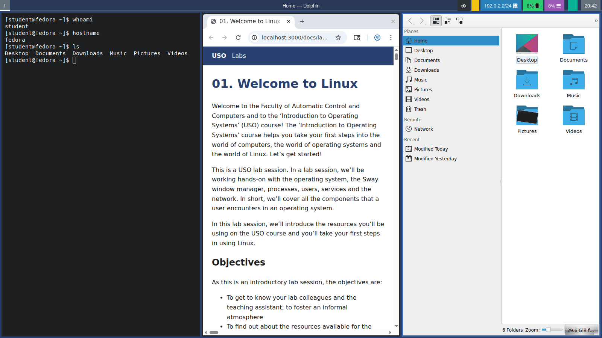
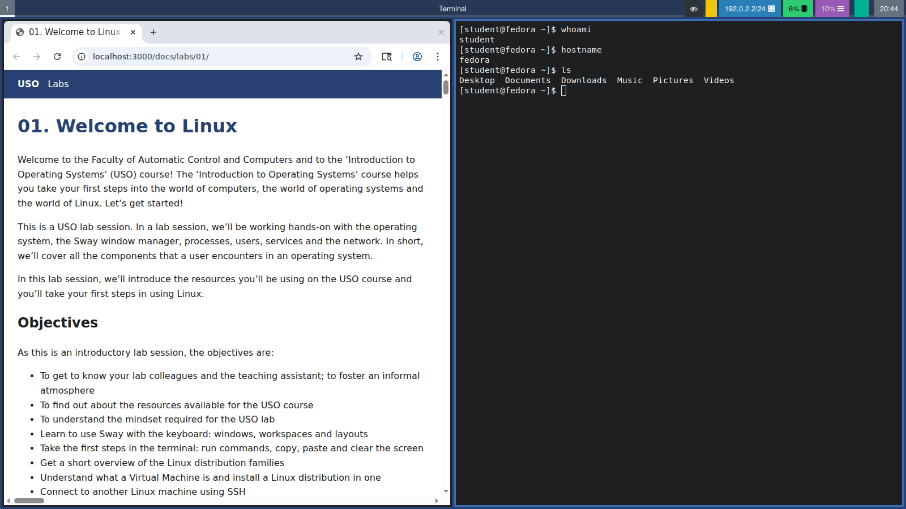
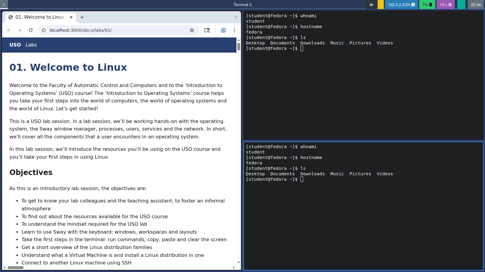
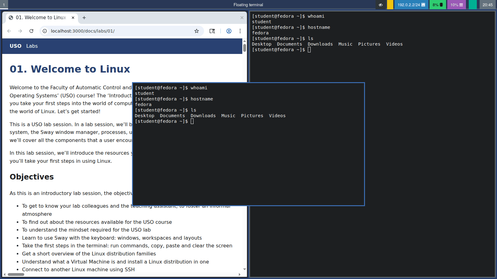

# 01. Bun venit în Linux

Bun venit la Facultatea de Automatică și Calculatoare și la cursul „Utilizarea Sistemelor de Operare” (USO)! Cursul „Utilizarea Sistemelor de Operare” vă ajută să faceți primii pași în lumea calculatoarelor, în lumea sistemelor de operare și în lumea Linux. Să începem!

Acesta este un laborator de USO. Într-un laborator vom lucra practic cu sistemul de operare, cu window managerul Sway, procese, utilizatori, servicii, rețea. Pe scurt cu toate componentele expuse unui utilizator de sistemul de operare.

În acest laborator vă prezentăm resursele pe care le veți folosi la USO și veți face primii pași în utilizarea Linux.

## Obiective {/* #objectives */}

Fiind un laborator introductiv, obiectivele sunt:

- Să vă cunoașteți colegii de laborator și asistentul; să creăm o atmosferă informală
- Să aflați ce resurse sunt disponibile pentru cursul USO
- Să înțelegeți modul de lucru de la laboratorul de USO
- Să învățați să folosiți Sway cu ajutorul tastaturii: ferestre, spații de lucru și aranjări
- Să faceți primii pași în terminal: rulați comenzi, copiați, lipiți și șterge conținutul ecranului
- Să aflați pe scurt care sunt familiile de distribuții Linux
- Să înțelegeți ce este o mașină virtuală și să instalați o distribuție Linux pe aceasta
- Să vă conectați la un alt calculator ce rulează Linux folosind SSH

## Să ne cunoaștem {/* #lets-get-to-know-each-other */}

Pentru început, să ne cunoaștem mai bine. Împreună cu asistentul, spuneți:

* **numele**: cum vă spun ceilalți, nu ce scrie în buletin
* **din ce oraș / de la ce liceu** veniți
* **de ce** ați ales această specializare
* care este **prima impresie** despre facultate

Asistentul vă mai pune întrebări. Puneți și voi întrebări asistentului de laborator și ce curiozități aveți.

:::info

Nu vrem să fim formali. Evitați expresii precum dumneavoastră sau persoana a doua plural. Suntem prieteni și învățăm împreună, ne ajutăm și discutăm cu plăcere.

:::

### Resursele cursului {/* #course-resources */}

#### Wiki (site-ul cursului pentru celelalte serii) {/* #wiki-other-series-course-website */}

Link: https://ocw.cs.pub.ro/courses/uso/

Platforma wiki Open Courseware este locul unde găsiți materialele celorlalte serii: slide-urile de curs, exercițiile de laborator, linkuri către orar, programa, mașinile virtuale și alte resurse suplimentare necesare.

#### Microsoft Teams {/* #microsoft-teams */}

Anunțurile și majoritatea discuțiilor (cu excepția suportului pentru teme) au loc în [această echipă](https://teams.microsoft.com/l/team/19%3ApCj64uqV0k1ySbFlrPQ8mdAQEGd-Sm9cueH83AvH4UE1%40thread.tacv2/conversations?groupId=aa3a7384-2009-4263-bafc-cb1ab59a9f21&tenantId=2d8cc8ba-8dda-4334-9e5c-fac2092e9bac).

#### curs.upb.ro {/* #cursupbro */}

Link: https://curs.upb.ro/

Aceasta este platforma online de cursuri a Facultății de Automatică și Calculatoare. La USO, ea este componenta dinamică a cursului, unde are loc comunicarea cu echipa. Atât pentru USO, cât și pentru celelalte materii care folosesc platforma Moodle, unde veți găsi::

* Linkuri către cursuri și laboratoare
* Anunțuri utile pentru voi
* Forum de discuții, unde puteți pune întrebări legate de curs sau de facultate
* Posibilitatea de a oferi feedback asistenților
* Link-uri către temele de casă și termenele limită pentru acestea

Informațiile despre conturi le găsiți pe pagina principală a site-ului.

:::info

Orice nelămurire cu privire la cursul sau laboratorul de USO, sau la materie în general, orice întrebare care are legătură cu USO sau cu facultatea, adresați-o pe forumul dedicat în cadrul materiei USO pe Moodle.
Pe forumul de discuții de pe platforma Moodle veți primiți răspunsuri rapide, prompte și avizate la probleme legate de cursul de USO și activitățile acestuia. Folosiți cu încredere forumurile aferente atunci când nu sunteți la curs sau laborator și nu puteți discuta direct cu titularul de curs sau asistentul de laborator.

Înainte de a pune o întrebare, asigurați-vă că nu a mai fost pusă de altcineva înainte.

Contactați asistenții sau titularii de curs pe adresa de e-mail personală doar în cazuri de probleme private sau care nu interesează pe toți colegii voștri prezenți pe forum.

:::

:::warning

Vă rugăm să nu folosiți Facebook pentru a comunica cu echipa USO. Folosiți forumurile de pe curs.upb.ro sau adresele de e-mail de pe [pagina echipei](https://ocw.cs.pub.ro/courses/uso/echipa) pentru discuții private.

:::

#### Pagina de Facebook {/* #facebook-page */}

Link: https://www.facebook.com/uso.acs

Pagina de Facebook este locul în care facem anunțuri despre USO și pentru activități de comunitate și pentru aflarea de informații (de multe ori amuzante) din lumea calculatoarelor.

#### Clusterul NCIT al facultății {/* #the-facultys-ncit-cluster */}

Link: https://cloud.curs.pub.ro/

Clusterul NCIT al facultății, care poate fi accesat prin procesorul front-end fep.grid.pub.ro folosind protocolul SSH, este o resursă pe care o veți folosi pentru teme și pentru testul practic. Vă autentificați cu aceleași date pe care le folosiți pentru platforma Moodle (https://curs.upb.ro/).

Infrastructura cloud din clusterul NCIT se bazează pe soluția open-source [OpenStack](https://www.openstack.org/). Aceasta este o soluție IaaS (Infrastructure as a Service) și va fi folosită pentru a crea în cloud mașinile virtuale pentru testele practice.

#### Suport (probleme) {/* #support-issues */}

Link: https://support.upb.ro/

Platforma pe care puteți deschide un tichet dacă aveți probleme cu adresa de e-mail @stud.acs.upb.ro sau cu contul cu care intrați pe platforma Moodle (adică pe site-ul https://curs.upb.ro).

#### Repository-ul Git USO {/* #uso-git-repository */}

Link: https://github.com/systems-cs-pub-ro/uso

Repository-ul Git al cursului USO este locul unde găsiți materialele suplimentare necesare pentru laborator și, unde este cazul, codul sursă al soluțiilor.

## Resurse {/* #resources */}

1. *[Razvan Deaconescu, Razvan Rughinis, Mihai Carabas, Alexandru Radovici, Utilizarea Sistemelor
de Operare, Printech 2021](https://github.com/systems-cs-pub-ro/carte-uso/releases/download/uso-ed1-2021/uso.pdf)*
2. *Brian Ward, How LINUX Works, ediția a 3-a, No Starch Press, 2021*
3. *[Site-ul oficial Sway](https://swaywm.org)*
4. *[Wiki-ul Sway pe GitHub](https://github.com/swaywm/sway/wiki)*
5. *[Arch Wiki - Sway](https://wiki.archlinux.org/title/Sway)* - util chiar dacă nu folosiți Arch Linux
6. *[Manualul de utilizare VirtualBox](https://www.virtualbox.org/manual/)*
7. *[Arch Wiki - OpenSSH](https://wiki.archlinux.org/title/OpenSSH)*
8. Paginile de manual: `man sway`, `man 5 sway`, `man ssh`

:::tip

O **pagină de manual** este documentația unui program, instalată pe calculatorul dumneavoastră. Deschideți una
scriind în terminal `man` urmat de numele programului (de exemplu `man ssh`). Derulați cu tastele săgeți și ieșiți cu
<kbd>q</kbd>.

:::

## Bun venit printre panourile Sway {/* #welcome-to-the-tiles-of-sway */}

Când folosim Windows, macOS sau GNOME, ferestrele sunt așezate una peste alta și le poți muta și redimensiona cu ajutorul
mouse-ului. **Sway** funcționează altfel. Este un **manager de ferestre de tip „tiling”**: aranjează ferestrele automat astfel încât
acestea să **nu se suprapună niciodată** și, împreună, să acopere întregul ecran. Când deschizi o fereastră nouă,
celelalte se micșorează pentru a-i face loc. Totul se face cu ajutorul **tastaturii**.



La început pare ciudat, dar după câteva ore devine foarte rapid: nu mai aveți nevoie niciodată să mutați sau să
redimensionați ferestre cu mouse-ul.

Sway este foarte mic. El doar gestionează ferestrele și afișează o bară sus sau jos pe ecran. Celelalte sarcini sunt
făcute de programe mici, separate, de exemplu:

| Sarcină | Program |
|-|-|
| Terminal | `foot` |
| Lansator de aplicații (un meniu din care porniți programe) | `rofi`, `wofi` sau `wmenu` |
| Bara de stare | `swaybar` sau `waybar` |
| Manager de fișiere (pentru a naviga prin fișiere și directoare) | `thunar` |

Fedora oferă o ediție numită [Fedora Sway](https://fedoraproject.org/spins/sway/), care vine cu Sway și cu toate
aceste programe deja configurate. Pe alte distribuții, Sway se poate instala cu managerul de pachete (de exemplu
`sudo dnf install sway` sau `sudo apt install sway`).

### Primii pași în Sway {/* #first-steps-in-sway */}

#### Tasta mod {/* #the-mod-key */}

Aproape toate scurtăturile din Sway încep cu o tastă specială numită **tasta mod**, scrisă **`$mod`**. Implicit,
aceasta este tasta <kbd>Super</kbd> (tasta cu logo-ul Windows). Așadar <kbd>$mod</kbd> + <kbd>Enter</kbd> înseamnă:
țineți apăsată tasta <kbd>Super</kbd> și apăsați <kbd>Enter</kbd>.

:::caution

Dacă rulați Sway într-o mașină virtuală, sistemul gazdă ar putea să „fure” tasta <kbd>Super</kbd>. Dați mai întâi
click în fereastra mașinii virtuale, ca hypervisorul să captureze tastatura (vedeți
[Capturarea tastaturii și a mouse-ului](#keyboard-and-mouse-capture)).

:::

#### Esențialul {/* #the-essentials */}

Dacă țineți minte doar acestea, puteți deja să folosiți Sway:

| Combinație de taste | Acțiune |
|-|-|
| <kbd>$mod</kbd> + <kbd>Enter</kbd> | Deschide un terminal |
| <kbd>$mod</kbd> + <kbd>d</kbd> | Deschide lansatorul de aplicații |
| <kbd>$mod</kbd> + săgeți | Mută focusul pe altă fereastră |
| <kbd>$mod</kbd> + <kbd>1</kbd> ... <kbd>9</kbd> | Trece la spațiul de lucru 1 ... 9 |
| <kbd>$mod</kbd> + <kbd>Shift</kbd> + <kbd>q</kbd> | Închide fereastra |
| <kbd>$mod</kbd> + <kbd>Shift</kbd> + <kbd>e</kbd> | Log Out |

:::caution

Când Sway blochează ecranul, **nu se afișează nimic**: nici caseta de autentificare, nici câmpul pentru parolă, niciun mesaj, doar un ecran gol (în mod implicit, cu imaginea de fundal). Calculatorul nu s-a blocat. Trebuie doar să introduceți parola și să apăsați <kbd>Enter</kbd>. În timp ce tastați,
în mijlocul ecranului apare un cerc mic. Dacă monitorul este oprit, apăsați mai întâi orice tastă sau mișcați mouse-ul
pentru a-l reactiva.

:::

### Combinațiile de taste implicite {/* #default-keybindings */}

Nu trebuie să învățați tabelul pe de rost. Reveniți la el în timpul exercițiilor.

| Combinație de taste | Acțiune |
|-|-|
| <kbd>$mod</kbd> + <kbd>Enter</kbd> | Deschide un terminal |
| <kbd>$mod</kbd> + <kbd>d</kbd> | Deschide lansatorul de aplicații |
| <kbd>$mod</kbd> + <kbd>Shift</kbd> + <kbd>q</kbd> | Închide fereastra care are focusul |
| <kbd>$mod</kbd> + săgeți (sau <kbd>h</kbd> <kbd>j</kbd> <kbd>k</kbd> <kbd>l</kbd>) | Mută focusul la stânga / jos / sus / dreapta |
| <kbd>$mod</kbd> + <kbd>Shift</kbd> + săgeți (sau <kbd>h</kbd> <kbd>j</kbd> <kbd>k</kbd> <kbd>l</kbd>) | Mută fereastra care are focusul la stânga / jos / sus / dreapta |
| <kbd>$mod</kbd> + <kbd>1</kbd> ... <kbd>0</kbd> | Trece la spațiul de lucru 1 ... 10 |
| <kbd>$mod</kbd> + <kbd>Shift</kbd> + <kbd>1</kbd> ... <kbd>0</kbd> | Mută fereastra care are focusul pe spațiul de lucru 1 ... 10 |
| <kbd>$mod</kbd> + <kbd>b</kbd> | Următoarea fereastră se va deschide în dreapta |
| <kbd>$mod</kbd> + <kbd>v</kbd> | Următoarea fereastră se va deschide dedesubt |
| <kbd>$mod</kbd> + <kbd>e</kbd> | Comută între una lângă alta și una deasupra alteia |
| <kbd>$mod</kbd> + <kbd>w</kbd> | Aspect cu file |
| <kbd>$mod</kbd> + <kbd>s</kbd> | Dispunerea în stivă |
| <kbd>$mod</kbd> + <kbd>f</kbd> | Pornește / oprește modul fullscreen |
| <kbd>$mod</kbd> + <kbd>r</kbd> | Modul de redimensionare (săgețile redimensionează, <kbd>Esc</kbd> iese) |
| <kbd>$mod</kbd> + <kbd>Shift</kbd> + <kbd>Space</kbd> | Face fereastra care are focusul plutitoare / o pune înapoi în panouri |
| <kbd>$mod</kbd> + <kbd>Space</kbd> | Comutarea focusului între ferestrele dispuse în grilă și cele flotante |
| <kbd>$mod</kbd> + <kbd>Shift</kbd> + <kbd>-</kbd> | Ascunde fereastra care are focusul în *scratchpad* |
| <kbd>$mod</kbd> + <kbd>-</kbd> | Arată / ascunde fereastra din scratchpad |
| <kbd>$mod</kbd> + <kbd>Shift</kbd> + <kbd>c</kbd> | Reîncarcă fișierul de configurare |
| <kbd>$mod</kbd> + <kbd>Shift</kbd> + <kbd>e</kbd> | Log Out |
| <kbd>$mod</kbd> + tragere cu butonul stâng al mouse-ului | Mută o fereastră plutitoare |
| <kbd>$mod</kbd> + tragere cu butonul drept al mouse-ului | Redimensionează o fereastră |

:::info

De ce <kbd>h</kbd> <kbd>j</kbd> <kbd>k</kbd> <kbd>l</kbd>? Vin de la editorul de text `vi`, unde înseamnă stânga,
jos, sus și dreapta. Mâna rămâne în mijlocul tastaturii. Puteți folosi în schimb săgețile, deoarece fac același lucru.

:::

:::tip

`vi` a fost creat de Bill Joy în 1976, într-o perioadă în care tastaturile nu aveau, de obicei, **taste separate pentru săgeți**. El a folosit un
terminal **ADM-3A**, pe care săgețile erau imprimate direct pe tastele <kbd>h</kbd> <kbd>j</kbd> <kbd>k</kbd>
<kbd>l</kbd>, astfel încât aceste litere au devenit modalitatea de a deplasa cursorul. Aceeași tastatură avea, de asemenea, tasta <kbd>Esc</kbd>
în locul unde se află astăzi tasta <kbd>Tab</kbd>, motiv pentru care `vi` folosește atât de des tasta <kbd>Esc</kbd>. Multe programe folosesc și astăzi aceste taste:
`vim`, `less`, `man` și, desigur, Sway.

:::

### Concepte de bază {/* #core-concepts */}

#### Focusul {/* #focus */}

În orice moment, exact **o singură** fereastră are **focus**: aceasta este fereastra în care se înregistrează ceea ce tastezi. În Sway,
fereastra cu focus are o margine colorată. Când tastezi și „nu se întâmplă nimic”, verificați care fereastră are focus.



#### Spațiile de lucru {/* #workspaces */}

Un **spațiu de lucru** (*workspace*) este ca un ecran separat. Puteți ține browserul pe spațiul de lucru 1,
terminalele pe spațiul de lucru 2 și player-ul de muzica pe spațiul de lucru 3, și treceți de la unul la altul cu <kbd>$mod</kbd>
+ un număr. Bara din partea de sus a ecranului arată spațiile de lucru folosite. Un spațiu de lucru dispare automat când este gol și îl părăsiți.


#### Aranjările {/* #layouts */}

Ferestrele dintr-un spațiu de lucru pot fi dispuse în unul dintre cele patru moduri:

| Dispunere | Combinatii de taste | Ce se vede |
|-|-|-|
| Alături unul de altul | <kbd>$mod</kbd> + <kbd>e</kbd> | Ferestre alăturate, de la stânga la dreapta |
| Una deasupra celeilalte | <kbd>$mod</kbd> + <kbd>e</kbd> (apăsați din nou) | Ferestre suprapuse, de sus în jos |
| Cu file | <kbd>$mod</kbd> + <kbd>w</kbd> | O singură fereastră la un moment dat, cu file în partea de sus, ca într-un browser web |
| Stivuire | <kbd>$mod</kbd> + <kbd>s</kbd> | O singură fereastră la un moment dat, cu o listă de titluri în partea de sus |

| Împărțit: browserul în stânga, două terminale unul deasupra celuilalt în dreapta | Cu file: browserul și două terminale |
|-|-|
|  |  |


:::tip

<kbd>$mod</kbd> + <kbd>b</kbd> și <kbd>$mod</kbd> + <kbd>v</kbd> **nu faceți nimic imediat**. Acestea îi indică
unde se va deschide **următoarea** fereastră. Apăsați una dintre ele, apoi deschideți un nou terminal pentru a vedea efectul.

:::

#### Ferestrele plutitoare {/* #floating-windows */}

Unele ferestre (ferestre de dialog mici, calculatorul) arată mai bine așezate deasupra celorlalte. Acestea sunt ferestre **plutitoare**. Poți face orice
fereastră să plutească apăsând <kbd>$mod</kbd> + <kbd>Shift</kbd> + <kbd>Space</kbd>, iar pentru a o readuce
în modul de afișare în casete, apasă din nou aceleași taste.



#### Scratchpadul {/* #the-scratchpad */}

**Scratchpad** este un loc ascuns pentru ferestrele de care ai nevoie doar din când în când. Ascunde o fereastră acolo folosind
<kbd>$mod</kbd> + <kbd>Shift</kbd> + <kbd>-</kbd> și readu-o la vedere, în orice spațiu de lucru, cu <kbd>$mod</kbd> +
<kbd>-</kbd>.

#### Modul de redimensionare {/* #resize-mode */}

După apăsarea tastelor <kbd>$mod</kbd> + <kbd>r</kbd>, tastele săgeată **redimensionează** fereastra care are focusul, în loc să
mute focusul. Apăsați <kbd>Esc</kbd> pentru a reveni la starea normală.

### Unelte {/* #tools */}

Sway în sine se ocupă doar de afișarea ferestrelor pe ecran. Aproape tot ce vezi și folosești (bara, terminalul,
lansatorul de aplicații, ecranul de blocare, capturile de ecran) este realizat de **mici programe separate**, iar Sway pur și simplu le execută
ca **comenzi în fundal**. De exemplu:

* <kbd>$mod</kbd> + <kbd>Enter</kbd> este doar o combinație de taste care rulează comanda `foot` (terminalul);
* <kbd>$mod</kbd> + <kbd>d</kbd> este o combinație de taste care rulează lansatorul de aplicații.

În fișierul de configurare, aceasta apare sub forma `bindsym $mod+Return exec foot`: „când se apasă această tastă, se execută această
comandă”. Aceasta înseamnă că poți rula și tu toate aceste programe, tastând numele lor într-un
[terminal](#the-terminal), și că poți modifica comportamentul desktopului tău schimbând comenzile (vezi
[_Modding_ Sway](#modding-sway)).

#### Blocarea ecranului {/* #locking-the-screen */}

`swaylock` blochează ecranul. Executați-l într-un terminal și ecranul se blochează imediat:

```bash
swaylock
```

Rețineți că ecranul de blocare nu afișează **nimic**: introduceți pur și simplu parola și apăsați <kbd>Enter</kbd> pentru a-l debloca.

Opțiunea `-f` înseamnă *fork*: `swaylock` blochează ecranul și apoi trece în fundal, astfel încât terminalul
nu așteaptă să deblocați ecranul. Încercați: rulați `swaylock` într-un terminal și, după deblocare, observați când
reapare simbolul `$`; apoi faceți același lucru cu `swaylock -f`.

#### Capturi de ecran {/* #screenshots */}

Pe Sway, aplicațiile nu pot captura ecranul pe cont propriu. `grim` realizează captura de ecran:

```bash
grim ~/Pictures/full.png    # tot ecranul
```

Pentru a vizualiza capturile de ecran, folosiți **Thunar**, managerul de fișiere instalat pe calculatoarele din laborator. Deschideți-l din
lansatorul de aplicații (<kbd>$mod</kbd> + <kbd>d</kbd>, tastați `thunar`) sau executând comanda `thunar` într-un terminal, accesați
folderul `Pictures` și faceți dublu clic pe o imagine pentru a o deschide.

## Terminalul {/* #the-terminal */}

**Terminalul** este instrumentul pe care îl veți folosi cel mai des, nu doar în acest laborator, ci și în **întregul curs USO**. Este o
fereastră în care introduceți comenzi în loc să faceți clic cu mouse-ul: scrieți o comandă, apăsați <kbd>Enter</kbd>, iar
calculatorul o execută și afișează rezultatul. Aproape tot ce veți face în laboratoarele următoare (lucrul cu fișiere,
utilizatori, procese, servicii și rețea) se desfășoară în terminal. În Sway, deschideți unul cu <kbd>$mod</kbd> +
<kbd>Enter</kbd> (terminalul implicit este `foot`). Deocamdată, aveți nevoie doar de noțiunile de bază de mai jos; terminalul și
**shell-ul** (programul care citește și execută comenzile), vor fi prezentate în detaliu în laboratoarele următoare.

### Rularea comenzilor {/* #running-commands */}

Când terminalul este gata, afișează o linie care se termină cu semnul **`$`**, numită **prompt**. De obicei arată
așa:

```shell-session
[student@fedora ~]$ 
```

Simbolul `$` înseamnă „Aștept comanda ta”. Tastează o comandă după acesta și apasă <kbd>Enter</kbd> pentru a o executa. În timp ce
comanda se execută, simbolul `$` dispare; când comanda se termină, terminalul afișează un nou simbol `$` pe o linie nouă, și
abia atunci poți tasta următoarea comandă.

De exemplu, `sleep 5` nu face nimic timp de 5 secunde. Executați-o și observați: simbolul `$` este „ascuns” timp de 5 secunde și reapare
abia când `sleep` se termină. Dacă tastați ceva între timp, aceasta nu este executată imediat ca o nouă comandă.
Dacă nu doriți să așteptați, apăsați <kbd>Ctrl</kbd>+<kbd>C</kbd> pentru a opri comanda și a readuce simbolul `$`.


:::tip

Dacă nu vedeți simbolul `$` la sfârșitul ultimei linii, o comandă încă rulează (sau este deschis un program precum `nano`
sau `man`). Așteptați să se termine, închideți programul sau apăsați <kbd>Ctrl</kbd>+<kbd>C</kbd>.

:::

Câteva comenzi de care aveți nevoie în acest laborator:

| Comandă | Ce face |
|-|-|
| `whoami` | Afișează numele tău de utilizator |
| `hostname` | Afișează numele computerului |
| `ls` | Afișează lista fișierelor din directorul curent |
| `sleep <secunde>` | Așteaptă numărul de secunde specificat, apoi se oprește |
| `clear` | Șterge ecranul terminalului (comanda rapidă <kbd>Ctrl</kbd>+<kbd>L</kbd> face aproape același lucru) |
| `ip a` | Afișează adresele de rețea ale computerului |
| `nano <fișier>` | Deschide un editor de text simplu (<kbd>Ctrl</kbd>+<kbd>O</kbd> salvează, <kbd>Ctrl</kbd>+<kbd>X</kbd> închide) |
| `exit` | Închide terminalul (sau o conexiune SSH) |

:::tip

Când ecranul este plin de mesaje vechi și nu mai știi ce ai tastat, execută comanda `clear` (sau apasă
<kbd>Ctrl</kbd>+<kbd>L</kbd>) pentru a începe din nou de la un ecran curat. Fișierele și programele tale nu sunt afectate: această comandă
curăță doar fereastra terminalului.

:::

### Copiere și lipire {/* #copy-and-paste */}

În majoritatea aplicațiilor (browserul, editorul de text, managerul de fișiere) copiați cu <kbd>Ctrl</kbd> +
<kbd>C</kbd> și lipiți cu <kbd>Ctrl</kbd> + <kbd>V</kbd>. **Terminalul este diferit**, pentru că acolo aceste taste
au deja alt rol: <kbd>Ctrl</kbd> + <kbd>C</kbd> **oprește** (întrerupe) comanda care rulează. Așa că, în terminal,
copierea și lipirea folosesc în plus tasta <kbd>Shift</kbd>:

| Combinație de taste | Acțiune în terminal |
|-|-|
| Selectați textul cu mouse-ul, apoi <kbd>Ctrl</kbd> + <kbd>Shift</kbd> + <kbd>C</kbd> | Copiază textul selectat |
| <kbd>Ctrl</kbd> + <kbd>Shift</kbd> + <kbd>V</kbd> | Lipește textul copiat la cursor |
| Selectați textul cu mouse-ul, apoi dați click cu **butonul din mijloc** al mouse-ului (rotița) | Copiere și lipire rapidă, fără nicio tastă |
| <kbd>Ctrl</kbd> + <kbd>C</kbd> | **Nu copiază!** Oprește comanda care rulează |

:::caution

Prefixul <kbd>Ctrl</kbd> + <kbd>Shift</kbd> este **destinat exclusiv terminalului**. În orice altă aplicație (browserul,
editorul de text, managerul de fișiere) continuați să folosiți combinațiile obișnuite <kbd>Ctrl</kbd> + <kbd>C</kbd> și <kbd>Ctrl</kbd> +
<kbd>V</kbd>. Clipboardul este comun: textul copiat în terminal cu <kbd>Ctrl</kbd> + <kbd>Shift</kbd> +
<kbd>C</kbd> poate fi lipit în browser cu <kbd>Ctrl</kbd> + <kbd>V</kbd>, iar textul copiat în browser cu
<kbd>Ctrl</kbd> + <kbd>C</kbd> poate fi lipit în terminal cu <kbd>Ctrl</kbd> + <kbd>Shift</kbd> + <kbd>V</kbd>.

:::

:::tip

Selectarea textului și click-ul cu butonul din mijloc folosesc un al doilea clipboard, separat, numit **primary
selection**. Funcționează în (aproape) toate aplicațiile Linux, nu doar în terminal, și nu schimbă ce ați copiat cu
<kbd>Ctrl</kbd> + <kbd>C</kbd>.

:::

:::danger

Aveți grijă când lipiți comenzi copiate de pe o pagină web. Dacă textul se termină cu o linie nouă, comanda **rulează
imediat**, înainte să apucați să o citiți. Lipiți doar comenzi pe care le înțelegeți.

:::

## Distribuții Linux {/* #linux-distributions */}

**Linux** în sine este doar *kernelul*, nucleul sistemului de operare. Ca să aveți ceva ce puteți folosi efectiv,
aveți nevoie și de un shell, de unelte, de o interfață grafică, de aplicații și de o modalitate de a instala programe
noi. O **distribuție Linux** (sau *distro*) pune toate acestea împreună într-un sistem de operare complet.

Există sute de distribuții, dar cele mai multe fac parte din câteva familii. Cea mai mare diferență dintre familii
este **managerul de pachete**, programul cu care instalați aplicatii.

| Familie | Exemple | Instalați un program cu |
|-|-|-|
| Debian | [Debian](https://www.debian.org), [Ubuntu](https://ubuntu.com), Linux Mint | `sudo apt install <nume>` |
| Red Hat | [Fedora](https://fedoraproject.org), [RHEL](https://www.redhat.com), CentOS Stream | `sudo dnf install <nume>` |
| Arch | [Arch Linux](https://archlinux.org), Manjaro | `sudo pacman -S <nume>` |
| SUSE | [openSUSE](https://www.opensuse.org) | `sudo zypper install <nume>` |

Multe distribuții vin în mai multe **variante** (numite și *spins* sau *ediții*): același sistem, dar cu altă
interfață grafică. De exemplu, **Fedora Sway** este Fedora cu Sway în locul desktopului implicit GNOME.

:::info

Calculatoarele din laborator rulează Fedora, așa că veți folosi managerul de pachete `dnf`. Dacă sunteți curioși de
alte distribuții, [dați click aici](https://distrowatch.com/random) pentru una aleatorie.

:::

## Mașini virtuale {/* #virtual-machines */}

O **mașină virtuală** (*Virtual Machine*, **VM**) vă permite să rulați un sistem de operare ca pe o aplicație. Ea
rulează un sistem de operare complet (**oaspetele**, *guest*) într-o fereastră a sistemului de operare real
(**gazda**, *host*). Oaspetele crede că are propriul procesor, propria memorie, propriul disc și propria placă de
rețea, dar de fapt le împarte pe ale gazdei. Programul care face acest lucru posibil se numește **hypervisor**.

La ce folosește?

* Puteți încerca o distribuție nouă fără să atingeți sistemul real.
* Dacă stricați ceva în mașina virtuală, calculatorul dumneavoastră nu este afectat.
* Puteți salva starea unei mașini virtuale (un **snapshot**) și puteți reveni la ea mai târziu.
* Serverele de pe internet rulează foarte des în mașini virtuale.

Cele mai folosite programe pentru mașini virtuale sunt:

| | VirtualBox | VMware Workstation / Fusion | QEMU |
|-|-|-|-|
| Preț | Gratuit | Gratuit pentru uz personal | Gratuit |
| Rulează pe | Windows, macOS, Linux | Windows, macOS | orice arhitectură de procesor importantă |
| Potrivit pentru | Începători, este ușor de folosit | Performanță mai bună | Utilizatori avansați, multe tipuri de procesoare |

Ca să instalați un sistem de operare într-o mașină virtuală, aveți nevoie de **imaginea ISO** a acestuia: un singur
fișier (cu extensia `.iso`) care conține programul de instalare, ca un DVD virtual. O descărcați de pe site-ul
distribuției.

:::caution

Descărcați imaginea ISO potrivită pentru procesorul calculatorului vostru. Majoritatea PC-urilor sunt
**x86_64** (iar arhitectura lor se numește `amd64`), în timp ce Mac-urile Apple noi (M1, M2, ...) sunt **arm64** (iar
arhitectura lor se numește `aarch64`).

:::

### Crearea unei mașini virtuale în VirtualBox {/* #creating-a-vm-in-virtualbox */}

Vom folosi **VirtualBox**, care este instalat pe calculatoarele din laborator.

1. Deschideți VirtualBox și dați click pe **New**.
2. Dați-i un nume mașinii virtuale și alegeți imaginea ISO (găsiți câteva în directorul `Downloads/`).
3. Setați memoria (**RAM**) la 4 GB și numărul de **procesoare** (CPU) la 2.
4. Creați un hard disk virtual de 20 GB.
5. Înainte să porniți mașina virtuală, deschideți **Settings** și verificați setările din tabelul de mai jos.
6. Dați click pe **Start**. Mașina virtuală pornește de pe imaginea ISO și puteți rula programul de instalare.
7. Urmați pașii programului de instalare. De cele mai multe ori, opțiunile implicite sunt bune. Când vă creați
   utilizatorul:
   * alegeți un nume de utilizator simplu (de exemplu `student`) și o parolă pe care o țineți minte;
   * dacă programul de instalare afișează o opțiune precum **Make this user administrator**, **bifați-o**. Fără ea,
     `sudo` nu va funcționa și nu veți putea face exercițiile cu SSH.
8. La final, programul de instalare vă cere să reporniți. După repornire, ar trebui să vedeți ecranul de
   autentificare al sistemului instalat.

:::tip

Dacă după repornire mașina virtuală pornește **din nou programul de instalare** în loc de sistemul instalat, imaginea
ISO este încă atașată. Opriți mașina virtuală, deschideți **Settings → Storage**, selectați imaginea ISO de la
unitatea optică și scoateți-o, apoi porniți din nou mașina virtuală.

:::

| Setare | Valoare | De ce |
|-|-|-|
| Display → Graphics Controller | **VMSVGA** | Necesar pentru unele interfețe grafice |
| Display → Video Memory | 128 MB | |
| Display → Enable 3D Acceleration | **bifat** | Necesar pentru unele interfețe grafice |
| Network → Adapter 1 | **NAT** | Mașina virtuală are acces la internet pe orice rețea |
| Network → Adapter 1 → Advanced → Port Forwarding | Portul **2222** al gazdei → portul **22** al oaspetelui | Ca să vă puteți conecta mai târziu la mașina virtuală cu SSH (vedeți [Redirectarea porturilor](#port-forwarding)) |

### Capturarea tastaturii și a mouse-ului {/* #keyboard-and-mouse-capture */}

Tastatura și mouse-ul sunt partajate între gazdă și mașina virtuală, așa că hipervizorul trebuie să decidă cui îi revine fiecare tastă
pe care o apeși. Când faceți clic în interiorul ferestrei mașinii virtuale, hipervizorul **preia** controlul asupra tastaturii și mouse-ului: de acum înainte,
apăsările de taste sunt direcționate către mașina virtuală, nu către gazdă. Pentru a le restitui gazdei, apăsați **tasta Host** (în VirtualBox, implicit
tasta din dreapta <kbd>Ctrl</kbd>). Mica pictogramă a tastaturii din colțul din dreapta jos al ferestrei VirtualBox indică cine deține
controlul asupra tastaturii în acest moment.

Fiecare hypervisor folosește altă combinație de taste pentru a elibera tastatura și mouse-ul:

| Hypervisor | Eliberează tastatura și mouse-ul | Comută fullscreen | Trimite <kbd>Ctrl</kbd>+<kbd>Alt</kbd>+<kbd>Del</kbd> mașinii virtuale |
|-|-|-|-|
| **VirtualBox** (Windows, Linux) | <kbd>Ctrl</kbd> din dreapta (*tasta Host*) | <kbd>Host</kbd> + <kbd>F</kbd> | <kbd>Host</kbd> + <kbd>Del</kbd> |
| **VirtualBox** (macOS) | <kbd>⌘ Command</kbd> din stânga | <kbd>Host</kbd> + <kbd>F</kbd> | <kbd>Host</kbd> + <kbd>Del</kbd> |
| **VMware Workstation** (Windows, Linux) | <kbd>Ctrl</kbd> + <kbd>Alt</kbd> | <kbd>Ctrl</kbd> + <kbd>Alt</kbd> + <kbd>Enter</kbd> | <kbd>Ctrl</kbd> + <kbd>Alt</kbd> + <kbd>Insert</kbd> |
| **VMware Fusion** (macOS) | <kbd>Ctrl</kbd> + <kbd>⌘ Command</kbd> | <kbd>Ctrl</kbd> + <kbd>⌘ Command</kbd> + <kbd>F</kbd> | Meniul **Virtual Machine → Send Key** |
| **QEMU** | <kbd>Ctrl</kbd> + <kbd>Alt</kbd> + <kbd>G</kbd> sau <kbd>Ctrl</kbd> din stânga + <kbd>Alt</kbd> din stânga | <kbd>Ctrl</kbd> + <kbd>Alt</kbd> + <kbd>F</kbd> sau meniul **View → Fullscreen** | Meniul **Machine**, monitorul QEMU sau meniul **Send Key** |

:::note

În VirtualBox puteți schimba tasta Host din **File → Preferences → Input → Virtual Machine → Host Key Combination**.
Și celelalte hypervisoare vă permit să schimbați aceste combinații din preferințe, așa că un calculator configurat de
altcineva poate folosi alte taste.

:::

Asta contează mult pentru tasta <kbd>Super</kbd> (tasta cu logo-ul Windows). Atât gazda, cât și oaspetele vor să o
folosească: GNOME deschide cu ea ecranul de ansamblu, iar Sway o folosește pentru aproape toate scurtăturile. Dacă
tastatura **nu** este capturată, gazda primește <kbd>Super</kbd>, iar mașina virtuală nu o vede niciodată.

* Dați întotdeauna **click în fereastra mașinii virtuale** înainte să folosiți scurtături cu <kbd>Super</kbd> în ea.
* Verificați dacă este activată opțiunea **Auto Capture Keyboard** (în VirtualBox: **File → Preferences → Input**).
* Dacă gazda tot reacționează la <kbd>Super</kbd>, puneți mașina virtuală în **fullscreen** (în VirtualBox: **View →
  Full-screen Mode** sau <kbd>Host</kbd> + <kbd>F</kbd>). Apăsați din nou aceleași taste ca să ieșiți din fullscreen.

:::tip

Dacă vă simțiți „blocați” în mașina virtuală (mouse-ul nu iese din fereastră sau scurtăturile gazdei nu
funcționează), apăsați combinația de eliberare a hypervisorului din tabelul de mai sus (în VirtualBox, o dată
**tasta Host**).

:::

### Snapshoturi {/* #snapshots */}

Un **snapshot** salvează starea completă a unei mașini virtuale la un moment dat. În VirtualBox, selectați mașina
virtuală, deschideți secțiunea **Snapshots** și dați click pe **Take**. Dacă ceva nu merge mai târziu, selectați
snapshotul și dați click pe **Restore**: mașina virtuală revine exact cum era. Faceți un snapshot imediat după
fiecare instalare reușită.

## Acces la distanță {/* #remote-access */}

**SSH** (*Secure Shell*) vă permite să deschideți un terminal pe **alt calculator** prin rețea. Tot ce scrieți este
trimis, criptat, către celălalt calculator și rulează acolo. Așa sunt administrate serverele care nu au deloc ecran.

Sunt implicate două programe:

* **serverul SSH** (`sshd`) rulează pe calculatorul la care vreți să ajungeți;
* **clientul SSH** (`ssh`) rulează pe calculatorul la care stați.

Ca să ajungeți la un calculator, aveți nevoie de **adresa IP** a lui, un număr precum `192.168.1.25` care îl
identifică în rețea, și de un **port**, un număr care îi spune calculatorului ce program trebuie să primească
conexiunea. Serverul SSH ascultă implicit pe portul **22**. Pe Linux, `ip a` afișează adresa IP (căutați `inet` în
secțiunea plăcii de rețea, nu pe cea cu `127.0.0.1`).

### Redirectarea porturilor {/* #port-forwarding */}

Cu **NAT**, mașina virtuală este ascunsă în spatele gazdei, ca un calculator în spatele unui router de acasă. În
mașina virtuală, `ip a` afișează o adresă precum `10.0.2.15`, dar această adresă există **doar în interiorul
VirtualBox**: gazda nu o poate folosi ca să ajungă la mașina virtuală. Soluția este **redirectarea porturilor**
(*port forwarding*): îi cerem lui VirtualBox să asculte pe un port al gazdei și să trimită tot ce ajunge acolo către
un port al mașinii virtuale.

```
  gazda                                         mașina virtuală
  ssh student@localhost -p 2222  ──►  VirtualBox  ──►  sshd pe portul 22
```

`localhost` (sau `127.0.0.1`) este un nume special care înseamnă întotdeauna _acest calculator_. Așadar, când rulați
`ssh -p 2222 student@localhost` pe gazdă, vă conectați chiar la gazdă, pe portul 2222, iar VirtualBox trimite mai
departe conexiunea către portul 22 al mașinii virtuale. Folosim 2222 pentru că portul 22 al gazdei poate fi deja
folosit de serverul SSH al gazdei.

Ca să adăugați regula în VirtualBox:

1. Selectați mașina virtuală, deschideți **Settings → Network → Adapter 1** și verificați dacă este atașată la
   **NAT**.
2. Extindeți **Advanced** și dați click pe **Port Forwarding**.
3. Dați click pe butonul **+** și completați regula nouă:

| Name | Protocol | Host IP | Host Port | Guest IP | Guest Port |
|-|-|-|-|-|-|
| ssh | TCP | 127.0.0.1 | 2222 | *(lăsați gol)* | 22 |

4. Dați click pe **OK**. Regula funcționează imediat, chiar dacă mașina virtuală rulează deja.

### Conectarea la o mașină virtuală {/* #connecting-to-a-vm */}

Pe **mașina virtuală** (calculatorul la care vreți să ajungeți):

```bash
sudo systemctl enable --now sshd                  # pornește serverul SSH
```

:::note
Pe Fedora s-ar putea să trebuiască să permiteți conexiunea prin firewall folosind:

```bash
sudo firewall-cmd --add-service=ssh --permanent 
sudo firewall-cmd --reload
```

:::

:::caution

`sudo` vă cere **propria parolă** (nu o parolă specială de administrator). După ce o scrieți corect, o ține minte
câteva minute, așa că nu v-o mai cere pentru fiecare comandă.

Când scrieți o parolă în terminal, **nu apare nimic pe ecran**: nicio literă, niciun punct, nicio steluță. Este
normal și se face din motive de securitate. Scrieți oricum parola și apăsați <kbd>Enter</kbd>. Dacă greșiți, apăsați
<kbd>Ctrl</kbd>+<kbd>U</kbd> ca să ștergeți ce ați scris și o luați de la capăt.

:::

Pe **gazdă** (calculatorul din laborator):

```bash
ssh -p 2222 student@localhost     # vă autentificați; înlocuiți "student" cu numele de utilizator din mașina virtuală
```

Prima dată, SSH vă întreabă dacă aveți încredere în calculator: scrieți `yes`. Apoi scrieți parola utilizatorului din
mașina virtuală. De acum, fiecare comandă pe care o scrieți rulează pe mașina virtuală. Scrieți `exit` ca să reveniți
pe gazdă.

:::caution

Fără regula de redirectare a porturilor, `ssh -p 2222 student@localhost` răspunde `Connection refused`. Fără
`-p 2222`, `ssh` încearcă portul 22 al **gazdei** și ajungeți să vă autentificați pe gazdă, nu pe mașina virtuală.
Rulați `hostname` după autentificare ca să verificați unde sunteți.

:::

:::note

În toate comenzile din acest laborator, `student` este doar un exemplu. Înlocuiți-l cu numele de utilizator pe care
l-ați creat în programul de instalare al mașinii virtuale.

:::

### SSH din Windows și macOS {/* #ssh-from-windows-and-macos */}

Windows 10/11 și macOS au deja comanda `ssh` (în PowerShell sau în aplicația Terminal). Există și programe grafice,
precum [PuTTY](https://www.chiark.greenend.org.uk/~sgtatham/putty/latest.html) și
[MobaXterm](https://mobaxterm.mobatek.net) pentru Windows, sau [Termius](https://termius.com) pentru toate sistemele.
În toate acestea, folosiți `localhost` ca nume al calculatorului și `2222` ca port.

## Rezolvarea problemelor {/* #troubleshooting */}

| Problemă | Soluție |
|-|-|
| Am apăsat taste, dar nu s-a întâmplat nimic | Verificați ce fereastră are **focusul** (chenarul colorat). Într-o mașină virtuală, dați mai întâi click în fereastra ei |
| <kbd>Super</kbd> nu funcționează în mașina virtuală | Dați click în mașina virtuală ca să capturați tastatura sau puneți mașina virtuală în fullscreen (vedeți [Capturarea tastaturii și a mouse-ului](#keyboard-and-mouse-capture)) |
| Mouse-ul nu poate ieși din fereastra mașinii virtuale | Apăsați tastele de eliberare ale hypervisorului (în VirtualBox, **tasta Host**, <kbd>Ctrl</kbd> din dreapta; vedeți tabelul din [Capturarea tastaturii și a mouse-ului](#keyboard-and-mouse-capture)) |
| Sway nu pornește în mașina virtuală sau ecranul este negru | Activați **3D Acceleration** și folosiți controlerul grafic **VMSVGA** în setările *Display* ale mașinii virtuale |
| Cursorul mouse-ului este invizibil în mașina virtuală | Adăugați `export WLR_NO_HARDWARE_CURSORS=1` în `~/.bash_profile`, apoi ieșiți din sesiune și autentificați-vă din nou |
| `ssh` afișează `Connection refused` | Verificați regula de redirectare a porturilor (portul 2222 al gazdei → portul 22 al oaspetelui), dacă serverul SSH rulează în mașina virtuală (`systemctl status sshd`) și dacă ați deschis firewallul |
| `ssh` m-a autentificat, dar `hostname` arată gazda | Ați uitat `-p 2222`, așa că v-ați conectat chiar la gazdă |
| `ssh` afișează `WARNING: REMOTE HOST IDENTIFICATION HAS CHANGED!` | Ați reinstalat mașina virtuală sau o altă mașină virtuală folosește acum portul 2222. Rulați `ssh-keygen -R "[localhost]:2222"` pe gazdă și conectați-vă din nou |

## Exerciții {/* #exercises */}

Exercițiile sunt marcate pentru cele două tipuri de laborator:

* 🌱 **de bază** (1 oră - **AC**): faceți doar exercițiile marcate cu 🌱;
* 🌳 **complet** (2 ore - **CD**): faceți toate exercițiile, atât 🌱, cât și 🌳.

Ambele tipuri de exerciții acoperă părțile principale ale laboratorului: Sway, terminalul, mașinile virtuale și accesul la distanță.
Dacă terminați mai devreme, continuați cu celelalte exerciții și apoi cu secțiunea [Extra](#extra).

### Să ne obișnuim cu Sway {/* #getting-used-to-sway */}

Faceți exercițiile în ordine. Încercați să folosiți **doar tastatura**.

1. 🌱 **Uitați-vă în jur**: Autentificați-vă în Sway. Uitați-vă la bară: găsiți numărul spațiului de lucru și ceasul?
   Mai este ceva pe ecran? <small>→ [Bun venit printre panourile Sway](#welcome-to-the-tiles-of-sway)</small>
2. 🌱 **Primul terminal**: Deschideți un terminal cu <kbd>$mod</kbd> + <kbd>Enter</kbd>. Scrieți `whoami`, apoi
   `hostname`, apoi `ls`. Închideți terminalul cu <kbd>$mod</kbd> + <kbd>Shift</kbd> + <kbd>q</kbd>. <small>→ [Esențialul](#the-essentials) · [Rularea comenzilor](#running-commands)</small>
3. 🌱 **Panourile**: Deschideți un terminal, apoi încă unul, apoi încă unul. Ce se întâmplă cu dimensiunea
   panourilor de fiecare dată când deschideți unul nou? Acum închideți-le unul câte unul și uitați-vă din nou. <small>→ [Bun venit printre panourile Sway](#welcome-to-the-tiles-of-sway)</small>
4. 🌱 **Focusul**: Deschideți trei terminale. Mutați focusul între ele cu <kbd>$mod</kbd> + săgeți. În fiecare
   terminal, scrieți un cuvânt diferit (de exemplu `unu`, `doi`, `trei`) ca să fiți siguri că știți ce fereastră are
   focusul. <small>→ [Focusul](#focus)</small>
5. 🌳 **Tastele vi**: Faceți din nou exercițiul anterior, dar folosiți <kbd>$mod</kbd> + <kbd>h</kbd> și
   <kbd>$mod</kbd> + <kbd>l</kbd> în loc de săgeți. <small>→ [Combinațiile de taste implicite](#default-keybindings)</small>
6. 🌱 **Mutarea ferestrelor**: Cu trei terminale deschise, mutați-l pe cel care are focusul complet în stânga, apoi
   complet în dreapta, folosind <kbd>$mod</kbd> + <kbd>Shift</kbd> + săgeți. <small>→ [Combinațiile de taste implicite](#default-keybindings)</small>
7. 🌱 **Lansatorul**: Apăsați <kbd>$mod</kbd> + <kbd>d</kbd>, scrieți primele litere din `firefox` și apăsați
   <kbd>Enter</kbd>. Folosiți din nou lansatorul ca să deschideți managerul de fișiere, **Thunar** (scrieți
   `thunar`). <small>→ [Esențialul](#the-essentials)</small>
8. 🌳 **Fullscreen**: Puneți focusul pe browser și apăsați <kbd>$mod</kbd> + <kbd>f</kbd>. Apăsați din nou ca să
   reveniți. <small>→ [Combinațiile de taste implicite](#default-keybindings)</small>
9. 🌱 **Spațiile de lucru**: Treceți pe spațiul de lucru 2 cu <kbd>$mod</kbd> + <kbd>2</kbd> și deschideți acolo un
   terminal. Treceți pe spațiul de lucru 3 și deschideți încă unul. Treceți de câteva ori între spațiile de lucru 1,
   2 și 3. Uitați-vă de fiecare dată la bară. <small>→ [Spațiile de lucru](#workspaces)</small>
10. 🌱 **Mutarea pe alt spațiu de lucru**: Puneți focusul pe browser și trimiteți-l pe spațiul de lucru 4 cu
    <kbd>$mod</kbd> + <kbd>Shift</kbd> + <kbd>4</kbd>. Unde sunteți acum: pe spațiul de lucru 4 sau tot pe cel vechi?
    Treceți pe spațiul de lucru 4 și verificați dacă browserul este acolo. <small>→ [Spațiile de lucru](#workspaces)</small>
11. 🌳 **Spații de lucru goale**: Mutați singura fereastră de pe spațiul de lucru 3 pe spațiul de lucru 1. Uitați-vă
    la bară: ce s-a întâmplat cu spațiul de lucru 3? <small>→ [Spațiile de lucru](#workspaces)</small>
12. 🌱 **Împărțirea**: Pe un spațiu de lucru gol, deschideți un terminal. Apăsați <kbd>$mod</kbd> + <kbd>v</kbd> și
    deschideți al doilea terminal. Unde a apărut? Acum apăsați <kbd>$mod</kbd> + <kbd>b</kbd> și deschideți al
    treilea. Unde a apărut acesta? <small>→ [Aranjările](#layouts)</small>
13. 🌳 **Construiți o aranjare**: Pe un spațiu de lucru gol, construiți asta: un terminal pe **jumătatea stângă** a
    ecranului și două terminale **unul deasupra celuilalt** pe **jumătatea dreaptă**. (Indiciu: deschideți două
    terminale, puneți focusul pe cel din dreapta, apăsați <kbd>$mod</kbd> + <kbd>v</kbd>, apoi deschideți al
    treilea.) <small>→ [Aranjările](#layouts)</small>
14. 🌱 **Taburi și stive**: Deschideți trei terminale pe un spațiu de lucru gol. Apăsați <kbd>$mod</kbd> +
    <kbd>w</kbd> pentru taburi și treceți de la unul la altul cu <kbd>$mod</kbd> + săgeți. Apoi încercați
    <kbd>$mod</kbd> + <kbd>s</kbd>. Reveniți la aranjarea normală cu <kbd>$mod</kbd> + <kbd>e</kbd>. <small>→ [Aranjările](#layouts)</small>
15. 🌱 **Redimensionarea**: Cu două terminale unul lângă altul, apăsați <kbd>$mod</kbd> + <kbd>r</kbd> și măriți-l pe
    cel din stânga cu săgețile. Apăsați <kbd>Esc</kbd> când ați terminat. <small>→ [Modul de redimensionare](#resize-mode)</small>
16. 🌱 **Ferestre plutitoare**: Faceți un terminal plutitor cu <kbd>$mod</kbd> + <kbd>Shift</kbd> +
    <kbd>Space</kbd>. Mutați-l ținând apăsat <kbd>$mod</kbd> și trăgând cu butonul stâng al mouse-ului, și
    redimensionați-l trăgând cu butonul drept. Puneți-l înapoi în panouri cu aceleași taste. <small>→ [Ferestrele plutitoare](#floating-windows)</small>
17. 🌳 **Scratchpadul**: Ascundeți un terminal în scratchpad cu <kbd>$mod</kbd> + <kbd>Shift</kbd> + <kbd>-</kbd>.
    Treceți pe alt spațiu de lucru și aduceți-l înapoi cu <kbd>$mod</kbd> + <kbd>-</kbd>. Apăsați din nou
    <kbd>$mod</kbd> + <kbd>-</kbd> ca să îl ascundeți. <small>→ [Scratchpadul](#the-scratchpad)</small>
18. 🌳 **Provocare - biroul dumneavoastră**: Fără să folosiți mouse-ul, pregătiți următoarele:
    * spațiul de lucru 1: browserul, în fullscreen;
    * spațiul de lucru 2: două terminale unul lângă altul;
    * spațiul de lucru 3: trei terminale în taburi.

    Apoi treceți de câteva ori între cele trei spații de lucru. <small>→ [Spațiile de lucru](#workspaces) · [Aranjările](#layouts)</small>
19. 🌳 **Ieșiți și intrați din nou**: Ieșiți din Sway cu <kbd>$mod</kbd> + <kbd>Shift</kbd> + <kbd>e</kbd> și
    autentificați-vă din nou. Mai sunt acolo ferestrele și spațiile de lucru? <small>→ [Esențialul](#the-essentials)</small>

### Terminalul {/* #the-terminal-1 */}

20. 🌱 **Ecran curat**: Deschideți un terminal și rulați `whoami`, `hostname`, `ls` și `ip a`. Acum rulați `clear`.
    Ce s-a întâmplat cu ecranul? Rulați din nou comenzile și de data aceasta apăsați <kbd>Ctrl</kbd> + <kbd>L</kbd>.
    Derulați în sus cu <kbd>Shift</kbd> + <kbd>Page Up</kbd> după fiecare dintre ele: mai vedeți rezultatele vechi? <small>→ [Rularea comenzilor](#running-commands)</small>
21. 🌱 **Din terminal în browser**: Rulați `hostname`. Selectați rezultatul cu mouse-ul și copiați-l cu
    <kbd>Ctrl</kbd> + <kbd>Shift</kbd> + <kbd>C</kbd>. Deschideți browserul, dați click în bara de căutare și
    lipiți-l cu <kbd>Ctrl</kbd> + <kbd>V</kbd>. Acum selectați un text de pe o pagină web și apăsați <kbd>Ctrl</kbd> +
    <kbd>Shift</kbd> + <kbd>C</kbd> în browser: s-a copiat textul sau s-a întâmplat altceva? (Închideți ce s-a
    deschis cu aceleași taste.) <small>→ [Copiere și lipire](#copy-and-paste)</small>
22. 🌱 **Din browser în terminal**: În browser, deschideți această pagină, selectați comanda `ip a` din tabelul de la
    [Rularea comenzilor](#running-commands) și copiați-o cu <kbd>Ctrl</kbd> + <kbd>C</kbd>. Treceți în terminal și
    lipiți-o cu <kbd>Ctrl</kbd> + <kbd>Shift</kbd> + <kbd>V</kbd>, apoi apăsați <kbd>Enter</kbd>. Încercați și
    <kbd>Ctrl</kbd> + <kbd>V</kbd> în terminal: ce se întâmplă? <small>→ [Copiere și lipire](#copy-and-paste)</small>
23. 🌳 **Dintr-un terminal în altul**: Deschideți două terminale unul lângă altul. În primul, rulați `whoami` și
    copiați rezultatul. În al doilea, scrieți `echo Salut, `, lipiți numele de utilizator și apăsați
    <kbd>Enter</kbd>. <small>→ [Copiere și lipire](#copy-and-paste)</small>
24. 🌱 **Ctrl+C nu copiază**: Rulați `sleep 10` și urmăriți promptul: când apare din nou `$`? Acum rulați `sleep 100`
    (o comandă care doar așteaptă 100 de secunde). Vedeți vreun `$`? Cât timp rulează, apăsați <kbd>Ctrl</kbd> +
    <kbd>C</kbd>. Ce s-a întâmplat cu comanda și cu `$`? Explicați de ce terminalul folosește <kbd>Ctrl</kbd> +
    <kbd>Shift</kbd> + <kbd>C</kbd> pentru copiere. <small>→ [Rularea comenzilor](#running-commands) · [Copiere și lipire](#copy-and-paste)</small>
25. 🌳 **Butonul din mijloc**: Rulați `ls`, selectați cu mouse-ul unul dintre numele de fișiere (un dublu click
    selectează un cuvânt întreg) și lipiți-l cu **butonul din mijloc** al mouse-ului după `ls -l `. Apoi lipiți-l și
    în bara de căutare a browserului, tot cu butonul din mijloc. Ați avut nevoie de vreo tastă? <small>→ [Copiere și lipire](#copy-and-paste)</small>

### Uneltele Sway {/* #sway-tools */}

26. 🌳 **Blocați ecranul**: Într-un terminal, rulați `swaylock`. Ce vedeți? Deblocați ecranul scriind parola și
    apăsând <kbd>Enter</kbd>. Apoi rulați `swaylock -c 000000` și `swaylock -c 0000ff`: ce schimbă opțiunea `-c`?
    (Indiciu: `man swaylock`.) <small>→ [Blocarea ecranului](#locking-the-screen)</small>
27. 🌳 **Faceți o captură de ecran**: Rulați `grim ~/Pictures/full.png` ca să capturați tot ecranul. Acum rulați
    `sleep 5; grim ~/Pictures/later.png` și, în cele 5 secunde, treceți pe alt spațiu de lucru. Deschideți
    **Thunar**, intrați în directorul `Pictures` și uitați-vă la ambele capturi: ce arată fiecare? <small>→ [Capturi de ecran](#screenshots)</small>

### Mașini virtuale {/* #virtual-machines-1 */}

28. 🌱 **Instalați altă distribuție**: Creați o mașină virtuală urmând pașii din
    [Crearea unei mașini virtuale în VirtualBox](#creating-a-vm-in-virtualbox) și atașați fișierul `.iso` al unei
    distribuții (găsiți câteva în directorul `Downloads/`). Porniți mașina virtuală, rulați programul de instalare,
    creați un utilizator și setați o parolă. <small>→ [Crearea unei mașini virtuale în VirtualBox](#creating-a-vm-in-virtualbox)</small>
29. 🌱 **Explorați oaspetele**: Autentificați-vă în mașina virtuală, deschideți un terminal și rulați `whoami`,
    `hostname` și `ip a`. Rulați aceleași comenzi într-un terminal pe gazdă. Ce este diferit? Puteți ghici de ce adresa
    IP a mașinii virtuale începe cu `10.0.2`? <small>→ [Mașini virtuale](#virtual-machines) · [Acces la distanță](#remote-access)</small>
30. 🌳 **Capturarea tastaturii**: Dați click în fereastra mașinii virtuale și apăsați <kbd>Super</kbd>. Apoi apăsați
    **tasta Host** și apăsați din nou <kbd>Super</kbd>. Ce sistem a reacționat de fiecare dată: mașina virtuală sau
    gazda? Urmăriți iconița de tastatură din colțul din dreapta jos al ferestrei mașinii virtuale. <small>→ [Capturarea tastaturii și a mouse-ului](#keyboard-and-mouse-capture)</small>
31. 🌳 **Faceți un snapshot**: Opriți mașina virtuală și faceți un snapshot numit `fresh-install`. <small>→ [Snapshoturi](#snapshots)</small>
32. 🌳 **Stricați și restaurați**: Porniți mașina virtuală și creați un fișier cu `nano ~/test.txt`. Opriți mașina
    virtuală și restaurați snapshotul `fresh-install`. Porniți din nou mașina virtuală: mai este acolo `test.txt`?
    De ce? <small>→ [Snapshoturi](#snapshots)</small>

### Acces la distanță {/* #remote-access-1 */}

33. 🌱 **Conectați-vă prin SSH**: Asigurați-vă că adaptorul de rețea al mașinii virtuale este **NAT** și adăugați
    regula de redirectare a porturilor (vedeți [Redirectarea porturilor](#port-forwarding)). În mașina virtuală,
    porniți serverul SSH și deschideți firewallul (vedeți [Conectarea la o mașină virtuală](#connecting-to-a-vm)).
    Dintr-un terminal de pe **gazdă**, conectați-vă cu `ssh -p 2222 <utilizator>@localhost`. Rulați `hostname` ca să
    verificați că sunteți pe mașina virtuală, apoi scrieți `exit`. <small>→ [Redirectarea porturilor](#port-forwarding) · [Conectarea la o mașină virtuală](#connecting-to-a-vm)</small>
34. 🌳 **Ușa greșită**: De pe gazdă, rulați `ssh <utilizator>@localhost` **fără** `-p 2222`. Ce se întâmplă? Unde
    ați fi dacă ar funcționa? Folosiți `hostname` ca să verificați. <small>→ [Redirectarea porturilor](#port-forwarding)</small>
35. 🌳 **Două părți**: Puneți fereastra mașinii virtuale și un terminal al gazdei unul lângă altul. Prin SSH, creați
    un fișier cu `nano hello.txt` și scrieți ceva în el. Apoi, într-un terminal **din fereastra mașinii virtuale**,
    rulați `ls` și `cat hello.txt`. Este același fișier? <small>→ [Conectarea la o mașină virtuală](#connecting-to-a-vm)</small>

## Întrebări de final {/* #wrap-up-questions */}

Folosiți **ultimele 5 minute** ale laboratorului ca să răspundeți la aceste întrebări împreună cu colegii și cu
asistentul. La ultimele trei nu există răspunsuri greșite.

1. Ce este un **window manager cu panouri** și prin ce diferă de Windows sau macOS?
2. Ce înseamnă **focusul** în Sway? Cum știți ce fereastră îl are?
3. Care este diferența dintre o **fereastră**, o **aranjare** și un **spațiu de lucru**?
4. Ce vă spune `$` de la sfârșitul promptului? Ce se întâmplă cu el cât timp rulează o comandă?
5. De ce terminalul folosește <kbd>Ctrl</kbd> + <kbd>Shift</kbd> + <kbd>C</kbd> pentru copiere, și nu
   <kbd>Ctrl</kbd> + <kbd>C</kbd>?
6. Ce este o **mașină virtuală**? Care este **gazda** și care este **oaspetele**?
7. De ce ați avut nevoie de `-p 2222` ca să vă conectați la mașina virtuală prin SSH?
8. Cu ce v-a fost cel mai greu să vă obișnuiți în Sway?
9. Ce a fost mai rapid cu tastatura decât cu mouse-ul?
10. Ați folosi Sway pe calculatorul dumneavoastră? De ce?

## Extra {/* #extra */}

1. **Sway în mașina virtuală**: Instalați Sway în mașina virtuală pe care ați creat-o, folosind managerul ei de
   pachete (vedeți tabelul din [Distribuții Linux](#linux-distributions)). Ieșiți din sesiune și alegeți Sway pe
   ecranul de autentificare. Refaceți câteva dintre exercițiile cu Sway în mașina virtuală. Funcționează scurtăturile
   cu <kbd>Super</kbd>? Dacă nu, încercați modul fullscreen. <small>→ [Distribuții Linux](#linux-distributions) · [Capturarea tastaturii și a mouse-ului](#keyboard-and-mouse-capture)</small>
2. **Două spații de lucru, două calculatoare**: Puneți mașina virtuală pe spațiul de lucru 2 al gazdei și terminalul
   cu SSH pe spațiul de lucru 1. Treceți de la unul la altul cu <kbd>$mod</kbd> + <kbd>1</kbd> și <kbd>$mod</kbd> +
   <kbd>2</kbd>. <small>→ [Spațiile de lucru](#workspaces) · [Acces la distanță](#remote-access)</small>
3. **Alți window manageri cu panouri**: Citiți despre [i3](https://i3wm.org), [Hyprland](https://hyprland.org) sau
   [niri](https://github.com/YaLTeR/niri). Ce au în comun cu Sway și ce este diferit? <small>→ [Bun venit printre panourile Sway](#welcome-to-the-tiles-of-sway)</small>
4. **Propria bară**: Copiați fișierele Waybar în `~/.config/waybar/` (vedeți [Bara](#the-bar)) și modificați-le:
   * în `config.jsonc`, scoateți din `modules-right` un modul de care nu aveți nevoie (de exemplu bateria, pe un
     calculator desktop);
   * în `config.jsonc`, faceți ceasul să afișeze și secundele: setați-i `format` la `"{:%H:%M:%S}"` și adăugați
     `"interval": 1`;
   * în `style.css`, schimbați `background-color` pentru `window#waybar` într-o culoare care vă place.

   Reîncărcați Waybar după fiecare modificare. Dacă bara dispare, probabil ați greșit ceva în `config.jsonc`: rulați
   `waybar` într-un terminal ca să vedeți eroarea. <small>→ [Bara](#the-bar)</small>

### _Modding_ Sway {/* #modding-sway */}

Toate combinațiile de taste de mai sus sunt scrise într-un fișier text. Cel implicit este `/etc/sway/config`. Ca să
îl modificați, faceți mai întâi o copie proprie (nu porniți niciodată de la un fișier gol, altfel nu veți avea nicio
combinație de taste):

```bash
mkdir -p ~/.config/sway
cp /etc/sway/config ~/.config/sway/config
nano ~/.config/sway/config
```

Liniile care încep cu `#` sunt comentarii și sunt ignorate. Câteva lucruri simple pe care le puteți schimba:

```bash title="~/.config/sway/config (fragment)"
# Tasta mod: Mod4 este Super, Mod1 este Alt
set $mod Mod4

# Spațiul dintre panouri
gaps inner 10

# Aranjamente de tastatură: US și română, comutați cu Alt+Shift
input type:keyboard {
    xkb_layout "us,ro"
    xkb_variant ",std"
    xkb_options "grp:alt_shift_toggle"
}
```

Salvați fișierul (<kbd>Ctrl</kbd>+<kbd>O</kbd>, <kbd>Enter</kbd>), ieșiți din `nano` (<kbd>Ctrl</kbd>+<kbd>X</kbd>)
și reîncărcați Sway cu <kbd>$mod</kbd> + <kbd>Shift</kbd> + <kbd>c</kbd>. Dacă ați greșit ceva, Sway afișează sus pe
ecran o bară roșie cu eroarea. Deschideți din nou fișierul și corectați-l.

:::tip

Dacă după ce ați modificat fișierul nu mai funcționează nicio combinație de taste, apăsați
<kbd>Ctrl</kbd>+<kbd>Alt</kbd>+<kbd>F3</kbd> (într-o mașină virtuală VirtualBox: <kbd>Host</kbd>+<kbd>F3</kbd>) ca să
obțineți o consolă text, autentificați-vă și rulați `rm ~/.config/sway/config` ca să reveniți la configurația
implicită. Dacă mașina virtuală încă acceptă conexiuni SSH, vă puteți conecta și cu `ssh -p 2222` și puteți corecta
fișierul de pe gazdă.

:::

#### Bara {/* #the-bar */}

Sway are o bară încorporată numită `swaybar`, configurată în blocul `bar { ... }` (vedeți `man 5 sway-bar`). Fedora
Sway folosește în schimb **Waybar**, o bară mult mai configurabilă. Waybar se configurează cu două fișiere:

* `~/.config/waybar/config.jsonc` - ce *module* să afișeze (spații de lucru, ceas, baterie, rețea, volum, ...) și unde
* `~/.config/waybar/style.css` - aspectul barei, scris în CSS

Ca și la configurația Sway, începeți prin a copia fișierele implicite din `/etc/xdg/waybar/`:

```bash
mkdir -p ~/.config/waybar
cp /etc/xdg/waybar/* ~/.config/waybar/
```

Lista modulelor și a opțiunilor lor este pe [Wiki-ul Waybar](https://github.com/Alexays/Waybar/wiki).

După ce modificați unul dintre aceste fișiere, reîncărcați Sway cu <kbd>$mod</kbd> + <kbd>Shift</kbd> +
<kbd>c</kbd> sau cereți-i lui Waybar să își reîncarce fișierele cu:

```bash
killall -SIGUSR2 waybar
```
