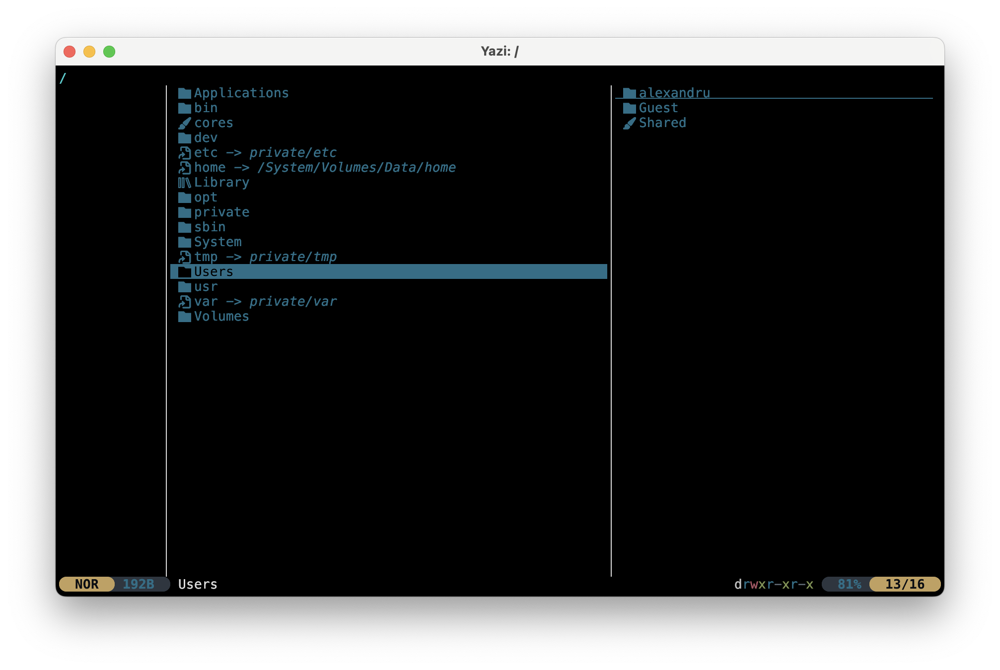

# 02. Gestionarea fișierelor

În primul laborator ați învățat cum să navigați în Sway și să rulați primele comenzi în terminal. Acum este momentul să
lucrați cu **fișiere** și **directoare**. Tot ce păstrați pe un computer (documente, filme, programe, setări) este un
fișier, stocat undeva într-un arbore mare de directoare. În acest laborator veți învăța cum să **vă orientați** în acest
arbore, cum să **denumiți** orice fișier cu o **cale** și cum să creați, să copiați, să mutați și să ștergeți fișiere,
mai întâi cu comenzi și apoi cu **Yazi**, un manager de fișiere care rulează în terminal.

Ideea cea mai importantă a acestui laborator este **calea**. Acordați-i timpul necesar: fiecare comandă care lucrează cu
fișiere, atât în acest laborator, cât și în toate cele următoare, primește căi.

## Obiective {/* #objectives */}

- Să înțelegeți cum sunt organizate fișierele și directoarele în Linux: un singur arbore, pornind de la `/`
- Să scrieți căi **absolute** și **relative** și să știți ce înseamnă `.`, `..` și `~`
- Să calculați calea absolută pornind de la directorul curent și o cale relativă
- Să citiți **pagina de manual** a unei comenzi și să îi înțelegeți secțiunea `SYNOPSIS`
- Să navigați folosind comenzile `pwd`, `cd`, `ls` și `tree` și să tastați mai puțin cu **completarea automată folosind tasta TAB**
- Să găsiți fișiere oriunde într-un arbore de directoare folosind comanda `find`
- Să citiți fișiere text folosind comenzile `cat` și `nano` și să aflați tipul oricărui fișier cu comanda `file`
- Să creați, copiați, mutați, redenumiți și ștergeți fișiere și directoare folosind comenzile `mkdir`, `touch`, `nano`, `cp`, `mv`, `rm`
  și `rmdir`
- Să lucrați cu nume care conțin spații și alte caractere speciale
- Să instalați și să folosiți **Yazi** pentru a gestiona fișierele cu câteva taste, inclusiv cu tab-uri

## Resurse {/* #resources */}

1. *[Razvan Deaconescu, Razvan Rughinis, Mihai Carabas, Alexandru Radovici, Utilizarea Sistemelor
de Operare, Printech 2021](https://github.com/systems-cs-pub-ro/carte-uso/releases/download/uso-ed1-2021/uso.pdf)*
   - Capitolul 2 - *Utilizarea sistemului de fișiere*, secțiunile 2.1.2, 2.1.3, 2.3.1, 2.3.2, 2.3.4 și 2.3.5
2. *Brian Ward, How LINUX Works, 3rd Edition, No Starch Press, 2021*
   - Capitolul 2 - *Basic Commands and Directory Hierarchy*, secțiunile 2.3, 2.4, 2.5.3, 2.5.5, 2.5.6, 2.12, 2.13 și 2.19
3. *[Yazi - Ghid de pornire rapidă](https://yazi-rs.github.io/docs/quick-start)*
4. *[Yazi - Instalare](https://yazi-rs.github.io/docs/installation)*
5. Slide-urile cursului: [02. Gestionarea fișierelor](/docs/lectures/02)
6. Paginile de manual: `man ls`, `man cp`, `man mv`, `man rm`, `man mkdir`, `man tree`, `man find`, `man file`

## Arborele sistemului de fișiere {/* #the-file-system-tree */}

În Windows, fiecare unitate de stocare are propriul arbore: `C:\`, `D:\` și așa mai departe. În Linux există **un singur
arbore**, care pornește dintr-un singur director numit **rădăcină** (*root*), notat `/`. Totul se află undeva sub acesta:
programele, setările, celelalte discuri și propriile voastre fișiere.

```
/
├── bin/          programe (ls, cp, mv, ...)
├── etc/          setările sistemului
├── home/         fișierele utilizatorilor
│   └── student/  directorul vostru de utilizator, reprezentat de către ~
│       ├── Downloads/
│       ├── Movies/
│       └── watchlist.txt
├── tmp/          fișiere temporare, toti utilizatorii pot scrie aici
└── usr/          software instalate
```

Fișierele voastre se află în **directorul utilizatorului** (*home*), `/home/student` (folosiți numele vostru de utilizator în
locul numelui `student`). De obicei, puteți scrie **numai** în directorul utilizatorului și în `/tmp`.

:::tip

În Linux, numele **țin cont de majuscule și minuscule**: `Movies`, `movies` și `MOVIES` sunt trei nume diferite. Windows și
macOS (cu setările implicite) nu țin cont de majuscule și minuscule, Linux da.

:::

### Fișiere ascunse {/* #hidden-files */}

Un fișier sau un director al cărui nume începe cu `.` este **ascuns**: `ls`, `tree` și managerii de fișiere nu îl
afișează, decât dacă le cereți acest lucru. Nu este nimic secret în legătură cu fișierele ascunse, Linux le ascunde doar
pentru a păstra listele scurte. Majoritatea dintre ele păstrează **setările** programelor, în directorul utilizatorului:

```
/home/student
├── .bashrc       setările shell-ului (fișier ascuns)
├── .config/      setările celor mai multe programe: Sway, Yazi, ... (director ascuns)
├── .local/       datele programelor, de exemplu coșul de gunoi (director ascuns)
├── Downloads/
└── Movies/
```

* `ls -a` (**a**ll) afișează și fișierele ascunse, la fel și `find`, fără nicio opțiune.
* Pentru a ascunde un fișier, redenumiți-l astfel încât numele său să înceapă cu `.`: `mv notes.txt .notes.txt`. Pentru
  a-l afișa din nou, redenumiți-l înapoi: `mv .notes.txt notes.txt`.

:::caution

Nu ștergeți fișierele ascunse din directorul utilizatorului dacă nu știți ce sunt: puteți pierde setările
programelor voastre.

:::

## Căi {/* #paths */}

O **cale** îi indică sistemului de operare **unde** se află un fișier sau un director. Este lista de directoare prin
care treceți, separate de `/`, iar la sfârșit numele fișierului.

### Directorul curent {/* #the-current-directory */}

Fiecare terminal (și fiecare program care rulează) are **un singur director curent**: directorul în care „se află” în
acest moment. Când deschideți un terminal nou, directorul curent este directorul utilizatorului. Promptul îl afișează (`~`
înseamnă directorul utilizatorului):

```shell-session
[student@fedora ~]$ pwd
/home/student
```

:::info
`pwd` (*print working directory*) afișează directorul curent ca o cale absolută.
:::

### Căi absolute {/* #absolute-paths */}

O **cale absolută** începe cu `/`. Este adresa **completă** a unui fișier, de la rădăcină până la fișier, așa că
funcționează la fel indiferent unde vă aflați:

```
/home/student/Movies/the_odyssey.mkv
/etc/hosts
/tmp
```

Gândiți-vă la adresa poștală completă a unei persoane: țară, oraș, stradă, număr, nume. Oricine o poate folosi.

### Căi relative {/* #relative-paths */}

O **cale relativă** **nu** începe cu `/`. Ea pornește din **directorul curent**. Dacă vă aflați în
`/home/student`, atunci:

```
Movies/the_odyssey.mkv      înseamnă   /home/student/Movies/the_odyssey.mkv
watchlist.txt               înseamnă   /home/student/watchlist.txt
```

O cale relativă este mai scurtă, dar **depinde de locul în care vă aflați**: aceeași cale relativă indică un alt fișier
atunci când vă aflați într-un alt director. Gândiți-vă la indicații precum „a doua ușă pe stânga”: acestea sunt corecte
doar din locul în care vă aflați.

### `.` și `..` {/* #-and- */}

Fiecare director are două intrări ascunse:

| Nume | Înseamnă |
|-|-|
| `.` | directorul **însuși** (directorul curent) |
| `..` | directorul **părinte**, cu un nivel mai sus |

Acestea pot fi folosite oriunde într-o cale, iar `..` poate fi repetat pentru a urca mai multe niveluri. Dacă vă aflați în
`/home/student/Movies`:

```
/
└── home
    ├── student
    │   ├── Movies            <-- .      (sunteți aici)
    │   │   └── the_odyssey.mkv
    │   ├── Downloads
    │   │   └── supergirl.mp4
    │   └── watchlist.txt
    └── bob
        └── notes.txt
```

| Cale relativă | Parcurs | Cale absolută |
|-|-|-|
| `./the_odyssey.mkv` | rămâneți în `Movies`, deschideți fișierul | `/home/student/Movies/the_odyssey.mkv` |
| `../watchlist.txt` | urcați la `student`, deschideți fișierul | `/home/student/watchlist.txt` |
| `../Downloads/supergirl.mp4` | urcați la `student`, coborâți în `Downloads` | `/home/student/Downloads/supergirl.mp4` |
| `../../bob/notes.txt` | urcați la `student`, urcați la `home`, coborâți în `bob` | `/home/bob/notes.txt` |

:::tip

Rădăcina nu are părinte: `/..` este tot `/`.

:::

### De la relativ la absolut {/* #from-relative-to-absolute */}

Iată cum transformă sistemul de operare o cale relativă într-una absolută:

1. **unește** directorul curent, un `/` și calea relativă;
2. de la stânga la dreapta, **elimină** fiecare `.`;
3. de la stânga la dreapta, fiecare `..` **se elimină pe sine și directorul care mai rămâne înaintea sa**.

De exemplu, din `/home/student/Movies` calea `../Downloads/./../../bob/notes.txt` devine:

```
/home/student/Movies/../Downloads/./../../bob/notes.txt      1. unește
/home/student/Movies/../Downloads/../../bob/notes.txt        2. renunță la .
/home/student/Downloads/../../bob/notes.txt                  3. Movies/.. se anulează reciproc
/home/student/../bob/notes.txt                               3. Downloads/.. se anulează reciproc
/home/bob/notes.txt                                          3. student/.. se anulează reciproc
```

:::caution

Un `..` nu își anulează întotdeauna vecinul: el elimină ultimul director **care mai rămâne** înaintea sa. În exemplul
de mai sus, ultimul `..` a eliminat `student`, care se afla departe de el în calea inițială.

:::

Puteți verifica calculul cu comanda `realpath`, care afișează calea absolută a oricărei căi:

```shell-session
[student@fedora Movies]$ realpath ../Downloads/./../../bob/notes.txt
/home/bob/notes.txt
```

### Directorul utilizatorului: `~` {/* #the-home-directory- */}

În terminal, `~` este înlocuit cu calea directorului utilizatorului, astfel încât `~/Movies` înseamnă
`/home/student/Movies`, din orice director. Căile care încep cu `~` se comportă ca niște căi absolute.

:::info

`~` este o facilitate a shell-ului (programul care citește comenzile voastre). Nu funcționează în toate programele: de
exemplu, Windows și majoritatea aplicațiilor grafice nu îl înțeleg.

:::

### Fiecare fișier este o cale {/* #every-file-is-a-path */}

Când o comandă așteaptă un **fișier** sau un **director**, îi puteți da **orice cale** către acesta: un nume, o cale
relativă, o cale absolută sau o cale cu `~`. Din `/home/student/Movies`, toate aceste comenzi afișează același fișier:

```shell-session
$ cat ../watchlist.txt
$ cat /home/student/watchlist.txt
$ cat ~/watchlist.txt
$ cat ../../student/Downloads/../watchlist.txt
```

:::tip
Puteți combina, de asemenea, căi relative și absolute în aceeași comandă: `cp ../watchlist.txt /tmp/`.
:::

## Citirea manualului {/* #reading-the-manual */}

Fiecare comandă are o **pagină de manual**: `man ls`, `man cp` și așa mai departe. Derulați cu tastele săgeți și
<kbd>Space</kbd>, săriți la începutul sau la sfârșitul paginii cu <kbd>g</kbd> și <kbd>G</kbd>, vedeți toate
tastele cu <kbd>h</kbd> și ieșiți cu <kbd>q</kbd>.

O pagină de manual are mai multe părți: `NAME` (ce face comanda, într-un singur rând), `SYNOPSIS` (cum se apelează),
`DESCRIPTION` (ce face și **toate opțiunile sale**, una după alta) și, la final, `SEE ALSO` (comenzi
înrudite). Cea mai utilă parte a unei pagini de manual este `SYNOPSIS`: aceasta arată cum se apelează comanda.

```
SYNOPSIS
       cp [OPTION]... SOURCE DEST
       cp [OPTION]... SOURCE... DIRECTORY
```

| Notație | Înțeles |
|-|-|
| `[ ]` | opțional: poate fi prezent sau nu |
| `...` | se poate repeta: pot exista mai multe dintre acestea |
| `SOURCE`, `DEST`, `FILE`, `DIRECTORY` | o **cale** (relativă sau absolută) |
| `-r` | o opțiune scurtă: o liniuță și o singură literă |
| `--recursive` | o opțiune lungă: două liniuțe și un cuvânt complet, adesea echivalentă cu una scurtă |

### Căutarea într-o pagină de manual {/* #searching-in-a-manual-page */}

O pagină de manual este lungă: `man ls` are peste 200 de rânduri. Nu o citiți de la început, **căutați** în ea:

| Tastă | Ce face |
|-|-|
| <kbd>/</kbd> `word` <kbd>Enter</kbd> | Caută **înainte** după `word` și sare la prima linie care îl conține |
| <kbd>n</kbd> | Sare la **următoarea** potrivire |
| <kbd>N</kbd> | Sare la potrivirea **anterioară** |
| <kbd>?</kbd> `word` <kbd>Enter</kbd> | Caută **înapoi**, spre începutul paginii |

Când căutați, `man` **evidențiază** fiecare potrivire de pe ecran. Căutarea ține cont de majuscule și minuscule: `/Size`
nu găsește `size`.

De exemplu, să presupunem că doriți ca `ls` să afișeze fișierele în ordine **inversă**, dar nu cunoașteți opțiunea:

1. Rulați `man ls`.
2. Tastați <kbd>/</kbd>, apoi `reverse` și apăsați <kbd>Enter</kbd>. Pagina sare la prima linie care conține
   `reverse`:

   ```
          -r, --reverse
                 reverse order while sorting
   ```

3. Asta căutați: opțiunea este `-r` (sau cea lungă, `--reverse`). Dacă prima potrivire nu este ceea ce vă trebuie,
   apăsați <kbd>n</kbd> până când o găsiți.
4. Apăsați <kbd>q</kbd> și încercați: `ls -r`.

Cum să căutați eficient:

* **Căutați ceea ce doriți să faceți**, nu opțiunea, deoarece încă nu o cunoașteți: `size`, `hidden`, `reverse`,
  `directories`, `sort`, `time`. Manualul este în engleză, așa că căutați cuvinte în engleză.
* **Încercați alte cuvinte** dacă nu găsiți nimic: `size`, apoi `human`, apoi `bytes`.
* **Citiți rândurile din jurul** fiecărei potriviri, un cuvânt poate apărea în mai multe opțiuni. Apăsați <kbd>n</kbd>
  pentru a trece la următoarea.
* **Săriți la o opțiune pe care o cunoașteți deja**: în manual, o opțiune se află la începutul liniei, după câteva
  spații. Pentru a sări la descrierea lui `-l`, căutați `^ *-l`: `^` înseamnă „începutul liniei”, iar ` *` înseamnă
  „orice număr de spații”. Dacă căutați doar `-l`, căutarea se oprește și în fiecare loc în care `-l` este doar
  menționat.

:::caution

Citiți întotdeauna manualul **înainte** de a căuta online sau de a întreba o inteligență artificială. Manualul de pe
computerul vostru este scris pentru **versiunea instalată** pe computerul vostru. Un răspuns găsit online ar putea fi pentru
o altă versiune sau pur și simplu greșit.

:::

:::tip

Majoritatea comenzilor afișează, de asemenea, un scurt rezumat al opțiunilor lor cu `--help`, de exemplu `ls --help`.

:::

## Completarea folosind tasta <kbd>TAB</kbd> {/* #tab-completion */}

Nu este necesar să tastați numele complete ale fișierelor, directoarelor și comenzilor. Tastați primele litere și apăsați
tasta <kbd>Tab</kbd>:

* dacă doar **un singur** nume începe cu acele litere, shell-ul scrie restul în locul vostru;
* dacă **mai multe** nume încep cu ele, nu se întâmplă nimic: apăsați <kbd>Tab</kbd> a **doua** oară pentru a le vedea
  pe toate, tastați încă una sau două litere și apăsați <kbd>Tab</kbd> din nou.

| Tastați | Apăsați | Shell-ul |
|-|-|-|
| `cd Mo` | <kbd>Tab</kbd> | o completează astfel `cd Movies/` (doar `Movies` începe cu `Mo`) |
| `cat wa` | <kbd>Tab</kbd> | o completează astfel `cat watchlist.txt` |
| `ls /etc/host` | <kbd>Tab</kbd> <kbd>Tab</kbd> | afișează toate numele care încep cu `host`, de exemplu `host.conf  hosts` |
| `ls /etc/she` | <kbd>Tab</kbd> | o completează astfel `ls /etc/shells` |
| `whoa` | <kbd>Tab</kbd> | completează **comanda** la `whoami` |
| `ls --recu` | <kbd>Tab</kbd> | o completează **opțiunea** astfel `ls --recursive` |

Completarea funcționează pentru fiecare parte a unei căi: `cd /us`<kbd>Tab</kbd>`sh`<kbd>Tab</kbd>`do`<kbd>Tab</kbd> devine
`cd /usr/share/doc/`.

:::tip

Folosiți <kbd>Tab</kbd> mereu: este mai rapid și nu face greșeli de tastare. Dacă <kbd>Tab</kbd> nu completează nimic,
chiar și atunci când îl apăsați de două ori, înseamnă că **niciun nume** nu începe cu ceea ce ați tastat: calea este
greșită.

:::
## Navigare {/* #navigation */}

| Comandă | Ce face |
|-|-|
| `pwd` | Afișează calea completă a directorului în care vă aflați („print working directory”) |
| `cat <file>` | Afișează pe ecran întregul conținut al unui fișier |
| `cd <directory>` | Schimbă directorul curent |
| `cd` sau `cd ~` | Merge în directorul utilizatorului |
| `cd -` | Merge în directorul anterior (unde vă aflați înainte de ultima comandă `cd`) |
| `ls` | Listează directorul curent |
| `ls <path>` | dacă `<path>` este un director, listează conținutul directorului / dacă `<path>` este un fișier, listează detaliile fișierului |
| `ls -a` | Listează și fișierele ascunse (numele care încep cu `.`) |
| `ls -l` | Listare în format detaliat: tip, permisiuni, proprietar, dimensiune, data ultimei modificări |
| `tree` | Listează un director și **tot ce se află în el**, sub formă de arbore |
| `tree -L <number of levels>` | Listează doar până la adâncimea de `<number of levels>` niveluri |

În rezultatul comenzii `ls -l`, prima literă indică **tipul**: `d` pentru un director, `-` pentru un fișier obișnuit. Pe
Fedora, permisiunile se termină cu `.`: aceasta arată că fișierul are o etichetă SELinux, o puteți ignora deocamdată.
Prima linie, `total`, reprezintă spațiul ocupat de fișierele listate, în blocuri de 1 KB.

```shell-session
$ ls -l
total 32
drwxr-xr-x. 2 student student  4096 Sep 20 18:02 Downloads
drwxr-xr-x. 2 student student  4096 Sep 26 21:15 Movies
-rw-r--r--. 1 student student 21504 Sep 28 21:40 watchlist.txt
```

:::info
`tree` nu este întotdeauna instalat. Pe Fedora instalați-l cu `sudo dnf install tree`, iar pe Ubuntu cu
`sudo apt install tree`.
:::

### Exemple {/* #examples */}

Exemplele folosesc acest director al utilizatorului. Promptul afișează numele directorului curent (`~` este directorul utilizatorului):

```
/home/student
├── .bashrc
├── Downloads
│   └── supergirl.mp4
├── Movies
│   └── the_odyssey.mkv
└── watchlist.txt
```

#### `pwd` {/* #pwd */}

```shell-session
[student@fedora ~]$ pwd
/home/student
[student@fedora ~]$ cd Movies
[student@fedora Movies]$ pwd
/home/student/Movies
```

`pwd` a afișat calea absolută a directorului curent: mai întâi directorul utilizatorului, apoi, după `cd Movies`, directorul
`Movies` din interiorul acestuia. Promptul afișează doar ultima parte a căii (`~`, apoi `Movies`).

#### `cd` {/* #cd */}

```shell-session
[student@fedora ~]$ cd Movies
[student@fedora Movies]$ cd ../Downloads
[student@fedora Downloads]$ cd /etc
[student@fedora etc]$ cd -
/home/student/Downloads
[student@fedora Downloads]$ cd
[student@fedora ~]$
```

* `cd Movies` a intrat în `Movies`, folosind o cale relativă (pornind din `~`).
* `cd ../Downloads` a urcat în `/home/student`, apoi a coborât în `Downloads`.
* `cd /etc` a mers în `/etc`, folosind o cale absolută.
* `cd -` a mers în directorul anterior (`/etc`, unde ne aflam înainte de ultima comandă `cd`) și i-a afișat calea.
* `cd` fără argumente a revenit în directorul utilizatorului.

#### Directorul anterior: `cd -` {/* #the-previous-directory-cd-- */}

Shell-ul reține directorul în care vă aflați **înainte** de ultima comandă `cd`. `cd -` merge acolo și îi afișează calea:

```shell-session
[student@fedora ~]$ cd /etc
[student@fedora etc]$ cd ~/Movies
[student@fedora Movies]$ cd -
/etc
[student@fedora etc]$
```

:::caution
`cd -` **nu** este echivalent cu un buton „Înapoi”. Butonul „Înapoi” al unui browser reține fiecare pagină pe care ați vizitat-o, iar
o nouă apăsare vă duce cu încă un pas în trecut. Shell-ul reține un **singur** director, iar `cd -` este el însuși un
`cd`, așa că înlocuiește acel director cu cel pe care tocmai l-ați părăsit. O nouă folosire vă duce **înainte**, de unde
ați venit.
:::

De exemplu, cu trei directoare:

```shell-session
[student@fedora ~]$ cd /etc
[student@fedora etc]$ cd /tmp
[student@fedora tmp]$ cd ~/Movies
[student@fedora Movies]$ cd -
/tmp
[student@fedora tmp]$ cd -
/home/student/Movies
[student@fedora Movies]$ cd -
/tmp
```

* După `cd /etc`, `cd /tmp` și `cd ~/Movies`, directorul anterior este `/tmp`. `/etc` este deja uitat.
* Prima comandă `cd -` a dus în `/tmp`, iar directorul anterior a devenit `Movies`.
* A doua comandă `cd -` **nu** a revenit în `/etc`. A dus în `Movies`, iar directorul anterior a redevenit `/tmp`.
* De acum înainte, `cd -` doar comută între `/tmp` și `Movies`, ca butonul „canalul anterior” al unei telecomenzi TV.

:::caution
Nu confundați nici `cd -` cu `cd ..`:

| Comandă | Duce la | Apăsată de două ori |
|---------|---------|---------------|
| `cd -` | directorul în care vă aflați înainte de ultima comandă `cd` | ajungeți înapoi de unde ați plecat |
| `cd ..` | părintele directorului curent, cu un nivel mai sus în arbore | ajungeți cu două niveluri mai sus |
| butonul „Înapoi” al unui browser | pagina anterioară, apoi cea dinaintea ei și așa mai departe | shell-ul nu are o astfel de comandă |
:::

:::tip

`cd -` este foarte util când lucrați în două directoare în același timp, de exemplu pentru a copia fișiere dintr-unul în celălalt.

:::

#### `ls` {/* #ls */}

```shell-session
[student@fedora ~]$ ls
Downloads  Movies  watchlist.txt
[student@fedora ~]$ ls Movies
the_odyssey.mkv
[student@fedora ~]$ ls -a
.  ..  .bashrc  Downloads  Movies  watchlist.txt
[student@fedora ~]$ ls -l
total 32
drwxr-xr-x. 2 student student  4096 Sep 20 18:02 Downloads
drwxr-xr-x. 2 student student  4096 Sep 26 21:15 Movies
-rw-r--r--. 1 student student 21504 Sep 28 21:40 watchlist.txt
[student@fedora ~]$ ls -l watchlist.txt
-rw-r--r--. 1 student student 21504 Sep 28 21:40 watchlist.txt
```

* `ls` a listat directorul curent. **Nu** arată ce se află în interiorul lui `Movies`.
* `ls Movies` a listat directorul `Movies`, fără a schimba directorul curent.
* `ls -a` a listat și intrările ascunse: `.bashrc`, precum și `.` și `..`, care există în fiecare director.
* `ls -l` a listat câte o intrare pe linie: tipul (`d` director, `-` fișier), permisiunile, proprietarul, dimensiunea în octeți, data modificării și numele.
* `ls -l watchlist.txt` a afișat detaliile unui singur fișier.

#### `tree` {/* #tree */}

```shell-session
[student@fedora ~]$ tree
.
├── Downloads
│   └── supergirl.mp4
├── Movies
│   └── the_odyssey.mkv
└── watchlist.txt

3 directories, 3 files
[student@fedora ~]$ tree -L 1
.
├── Downloads
├── Movies
└── watchlist.txt

3 directories, 1 file
```

* `tree` a afișat directorul curent și **tot ce se află în interiorul lui**, apoi a numărat directoarele și fișierele.
  Numărul include și directorul din care a pornit, `.`, așa că sunt **3** directoare.
* `tree -L 1` s-a oprit după primul nivel, ca `ls`.

## Găsirea fișierelor: `find` {/* #finding-files-find */}

`ls` și `tree` vă arată ce se află într-un director. Când știți **numele** unui fișier, dar nu știți **unde** se află,
utilizați `find`. Acesta parcurge un director și tot ce se află în interiorul acestuia și afișează calea fiecărei
intrări care corespunde criteriilor cerute.

```
find [directory]... [filter]...
```

| Comandă | Ce face |
|-|-|
| `find` | Afișează toate fișierele și directoarele de sub directorul curent |
| `find <directory>` | Afișează tot ce se află în interiorul `<directory>`, inclusiv subdirectoarele |
| `find <directory> -name '<name>'` | Doar intrările al căror nume este exact `<name>` |
| `find <directory> -name '*.txt'` | Doar intrările al căror nume se termină cu `.txt` (`*` înseamnă „orice caractere”) |
| `find <directory> -type f` | Doar fișierele |
| `find <directory> -type d` | Doar directoarele |

:::tip
Filtrele pot fi combinate, de exemplu: `find ~ -type f -name '*.txt'` găsește doar **fișierele** al căror nume se termină cu `.txt`.
:::

:::caution

Puneți întotdeauna numele de după `-name` între ghilimele (`'*.txt'`). Fără ghilimele, shell-ul ar putea înlocui `*.txt` cu
numele fișierelor din directorul curent înainte ca `find` să înceapă.

:::

### Exemple {/* #examples-1 */}

Folosind același director al utilizatorului ca în [exemplele de navigare](#examples):

```shell-session
[student@fedora ~]$ find Movies
Movies
Movies/the_odyssey.mkv
[student@fedora ~]$ find . -name '*.mp4'
./Downloads/supergirl.mp4
[student@fedora ~]$ find ~ -name '*.mp4'
/home/student/Downloads/supergirl.mp4
[student@fedora ~]$ cd Movies
[student@fedora Movies]$ find .. -name watchlist.txt
../watchlist.txt
[student@fedora Movies]$ find .. -type d
..
../Downloads
../Movies
```

* `find Movies` a afișat directorul însuși și tot ce se află în interiorul acestuia.
* `find . -name '*.mp4'` a căutat în directorul curent (`.`) și în tot ce se află sub acesta și a găsit un fișier.
* `find ~ -name '*.mp4'` a găsit același fișier, dar a afișat o cale **absolută**: `find` construiește fiecare cale pornind de la
  directorul pe care i-l dați. Un punct de pornire relativ dă căi relative, un punct de pornire absolut dă căi absolute.
* Din `Movies`, `find .. -name watchlist.txt` a căutat în directorul părinte și a afișat `../watchlist.txt`, o cale
  relativă care funcționează din `Movies`.
* `find .. -type d` a afișat doar directoarele din `..`, inclusiv `..` însuși.

:::tip

`find` găsește și fișierele **ascunse**, fără nicio opțiune. Ordinea rezultatelor poate fi diferită pe
computerul vostru.

:::

:::info

Când `find` caută într-un director pe care nu aveți dreptul să îl citiți (de exemplu în `/etc`), afișează
`Permission denied` pentru acesta și continuă. Puteți ignora aceste mesaje.

:::

## Vizualizarea fișierelor text: `cat` și `nano` {/* #viewing-text-files-cat-and-nano */}

Majoritatea fișierelor din Linux, în special setările din `/etc`, sunt **fișiere text**: le puteți citi și modifica
cu un editor de text. Există două moduri simple de a vedea ce conține un fișier text: `cat` și `nano`.

### `cat` {/* #cat */}

`cat` afișează în terminal întregul conținut al unuia sau mai multor fișiere, după care promptul revine:

```shell-session
[student@fedora ~]$ cat /etc/machine-id
4c8e1f0a9d2b4e7f8a6c3b5d1e0f2a9c
[student@fedora ~]$ cat watchlist.txt
The Odyssey
Project Hail Mary
[student@fedora ~]$ cat /etc/machine-id watchlist.txt
4c8e1f0a9d2b4e7f8a6c3b5d1e0f2a9c
The Odyssey
Project Hail Mary
[student@fedora ~]$ cat notes.txt
[student@fedora ~]$
```

* `cat /etc/machine-id` a afișat conținutul fișierului: un număr care diferă la fiecare instalare de
  Linux, pe o singură linie.
* `cat watchlist.txt` a afișat un fișier din directorul curent, folosind o cale relativă.
* În cazul mai multor fișiere, `cat` le-a afișat unul după altul, fără nimic între ele.
* `notes.txt` este gol, așa că `cat` nu a afișat nimic.

:::tip
`cat` este perfect pentru fișiere **scurte**. În cazul unui fișier lung, începutul dispare de pe ecran: derulați înapoi cu
<kbd>Shift</kbd>+<kbd>Page Up</kbd> sau deschideți fișierul cu `nano` în schimb.
:::

:::caution

Folosiți `cat` doar pentru fișiere **text**. Un program sau o imagine (de exemplu `cat /usr/bin/ls`) afișează simboluri
ciudate și poate strica terminalul. Dacă se întâmplă acest lucru, tastați `reset` și apăsați <kbd>Enter</kbd> (chiar dacă
nu vedeți ce tastați) sau închideți terminalul și deschideți altul nou.

:::

### `nano` {/* #nano */}

`nano` este editorul de text din [Gestionarea fișierelor](#managing-files), dar îl puteți folosi și doar pentru a **citi**
un fișier. Acesta afișează fișierul câte un ecran o dată și este comod pentru fișierele lungi:

```shell-session
[student@fedora ~]$ nano /etc/os-release
```

| Tastă | Acțiune |
|-|-|
| tastele săgeți, <kbd>Page Up</kbd>, <kbd>Page Down</kbd> | Derulează prin fișier |
| <kbd>Ctrl</kbd>+<kbd>W</kbd> | Caută un cuvânt |
| <kbd>Ctrl</kbd>+<kbd>X</kbd> | Ieșire (dacă ați modificat ceva, răspundeți `N` pentru a ieși fără a salva) |

Pentru a vă asigura că nu modificați fișierul din greșeală, deschideți-l în **modul de vizualizare**, în care `nano` nu
vă lasă să tastați: `nano -v /etc/os-release`.

:::info

Puteți deschide fișierele de sistem din `/etc` cu `nano` și le puteți citi, dar nu le puteți salva: `nano` afișează
`Permission denied`. Ieșiți fără a salva.

:::

### `cat` sau `nano`? {/* #cat-or-nano */}

| Utilizați | Când |
|-|-|
| `cat` | Fișierul este scurt și doriți să îl vedeți dintr-odată, în terminal |
| `nano` | Fișierul este lung, doriți să îl derulați sau să căutați în el, sau doriți să îl modificați |
| `nano -v` | Preferați interfața lui nano, dar doriți modul doar pentru citire, ca să nu puteți modifica nimic din greșeală |

### Ce tip de fișier: `file` {/* #what-kind-of-file-file */}

Extensia (`.txt`, `.jpg`, `.mkv`) este doar **o parte a numelui**: Linux nu are nevoie de ea și poate fi înșelătoare.
`file` se uită **în interiorul** unui fișier și vă spune ce este acesta cu adevărat (dacă `file` lipsește, instalați-l cu
`sudo dnf install file`):

```shell-session
[student@fedora ~]$ file watchlist.txt notes.txt Movies /etc/hosts
watchlist.txt: ASCII text
notes.txt:     empty
Movies:        directory
/etc/hosts:    ASCII text
[student@fedora ~]$ file /usr/bin/bash
/usr/bin/bash: ELF 64-bit LSB pie executable, x86-64, version 1 (SYSV), dynamically linked, ...
[student@fedora ~]$ cp /etc/hosts photo.jpg
[student@fedora ~]$ file photo.jpg
photo.jpg: ASCII text
```

* `watchlist.txt` și `/etc/hosts` sunt fișiere **text**: le puteți citi cu `cat` sau `nano`.
* `notes.txt` este **gol**, iar `Movies` este un **director**.
* `/usr/bin/bash` este un **executabil ELF**, un program: nu îl afișați cu `cat` (rezultatul de mai sus este prescurtat).
* `photo.jpg` are nume de imagine, dar `file` arată că este text: extensia nu schimbă ceea ce se află
  în interior.

:::tip

Nu sunteți siguri dacă puteți afișa un fișier cu `cat`? Rulați mai întâi `file`: dacă răspunsul conține `text`, puteți.

:::
## Gestionarea fișierelor {/* #managing-files */}

| Comandă | Ce face |
|-|-|
| `mkdir <directory>` | Creează un director |
| `mkdir -p <path>` | Creează un director și toți părinții care lipsesc (fără eroare dacă există deja) |
| `touch <file>` | Creează un fișier gol sau actualizează data „ultimei modificări” a unui fișier existent |
| `nano <file>` | Deschide un editor de text, fișierul este creat când salvați (<kbd>Ctrl</kbd>+<kbd>O</kbd> salvează, <kbd>Ctrl</kbd>+<kbd>X</kbd> iese) |
| `cp <source> <destination>` | Copiază un fișier |
| `cp <source>... <directory>` | Copiază unul sau mai multe fișiere într-un director |
| `cp -r <directory> <destination>` | Copiază un director și tot ce se află în el |
| `mv <source> <destination>` | Mută sau **redenumește** un fișier sau un director |
| `mv <source>... <directory>` | Mută unul sau mai multe fișiere sau directoare într-un director |
| `rmdir <directory>` | Șterge un director **gol** |
| `rm <file>` | Șterge un fișier |
| `rm -r <directory>` | Șterge un director și **tot** ce se află în el |

:::info

Nu există o comandă separată pentru redenumire: redenumirea înseamnă pur și simplu mutarea unui fișier sub un nou nume în același director. De exemplu, `mv movie.mkv project_hail_mary.mkv` redenumește `movie.mkv` în `project_hail_mary.mkv`.

:::

:::caution

Când îi dați lui `cp` sau `mv` **mai multe** surse, ultimul parametru trebuie să fie un **director** care există deja.

:::

:::danger

În terminal **nu există coș de gunoi**: `rm` șterge fișierele **definitiv**, iar `rm -r` șterge un întreg director cu
tot ce se află în el. Citiți comanda de două ori înainte de a apăsa <kbd>Enter</kbd> și **niciodată** nu rulați `rm -r` cu o
cale pe care nu o înțelegeți pe deplin.

:::

### Nume cu spații și caractere speciale {/* #names-with-spaces-and-special-characters */}

Shell-ul împarte o comandă în **cuvinte** la fiecare spațiu. Un nume care conține un spațiu devine **doi** parametri:

```shell-session
[student@fedora ~]$ touch shopping list.txt
[student@fedora ~]$ ls
Downloads  list.txt  Movies  shopping  watchlist.txt
```

`touch` a primit două nume, `shopping` și `list.txt`, și a creat două fișiere. Pentru a da un nume cu spații ca **un singur**
parametru, puneți-l între **ghilimele** sau puneți un `\` înaintea fiecărui spațiu:

```shell-session
[student@fedora ~]$ rm shopping list.txt
[student@fedora ~]$ touch "shopping list.txt"
[student@fedora ~]$ ls -l shopping\ list.txt
-rw-r--r--. 1 student student 0 Sep 29 10:12 'shopping list.txt'
[student@fedora ~]$ rm 'shopping list.txt'
```

* `rm shopping list.txt` a șters cele două fișiere create din greșeală.
* `"shopping list.txt"`, `'shopping list.txt'` și `shopping\ list.txt` sunt **același** nume. Completarea cu <kbd>Tab</kbd> adaugă
  automat `\`.
* `ls` afișează numele între ghilimele, astfel încât să vedeți că spațiul face parte din nume.

Și alte caractere au o semnificație pentru shell: `*`, `?`, `$`, `!`, `&`, `;`, `|`, `<`, `>`, `(`, `)`, `#`,
`'`, `"` și `\`. Puneți numele care le conțin între ghilimele **simple**, de exemplu `touch 'rock & roll.txt'`
(între ghilimele duble, `$` și `!` au în continuare o semnificație specială). Pentru un nume care conține `'`,
folosiți ghilimele duble: `touch "it's mine.txt"`.

Un nume care începe cu `-` pare a fi o **opțiune**:

```shell-session
[student@fedora ~]$ touch -list.txt
touch: invalid option -- 'l'
Try 'touch --help' for more information.
[student@fedora ~]$ touch ./-list.txt
[student@fedora ~]$ rm ./-list.txt
```

:::note
Ghilimelele nu ar ajuta aici, deoarece numele tot începe cu `-`. Folosirea `./-list.txt` clarifică faptul că este vorba de
o **cale**. Calea `./-list.txt` este echivalentă cu `-list.txt`, ambele indică același fișier, doar că
prima nu începe cu `-` și comanda nu o consideră o opțiune.
:::

:::tip

Denumiți-vă propriile fișiere folosind doar litere, cifre, `.`, `_` și `-` (dar nu la început): `shopping_list.txt` în loc de
`shopping list.txt`. Sunt mult mai ușor de folosit în terminal.

:::

### Exemple {/* #examples-2 */}

Exemplele se succed unul după altul, pornind din același director al utilizatorului ca în [Navigare](#navigation).

#### `mkdir` {/* #mkdir */}

```shell-session
[student@fedora ~]$ mkdir Series
[student@fedora ~]$ mkdir Series
mkdir: cannot create directory 'Series': File exists
[student@fedora ~]$ mkdir Series/2025/comedy
mkdir: cannot create directory 'Series/2025/comedy': No such file or directory
[student@fedora ~]$ mkdir -p Series/2025/comedy
```

* Primul `mkdir Series` a creat directorul gol `/home/student/Series`.
* Al doilea a eșuat: directorul există deja.
* `mkdir Series/2025/comedy` a eșuat, deoarece `Series/2025` nu există încă, iar `mkdir` creează doar ultimul
  director din cale.
* `mkdir -p` a creat `2025` și apoi `comedy` în interiorul lui. Cu `-p`, nu este o eroare dacă un director există deja.

#### `touch` {/* #touch */}

```shell-session
[student@fedora ~]$ touch notes.txt
[student@fedora ~]$ ls -l notes.txt
-rw-r--r--. 1 student student 0 Oct  1 10:15 notes.txt
[student@fedora ~]$ touch watchlist.txt
[student@fedora ~]$ ls -l watchlist.txt
-rw-r--r--. 1 student student 21504 Oct  1 10:16 watchlist.txt
```

* `touch notes.txt` a creat un fișier nou, **gol**: dimensiunea acestuia este `0`.
* `touch watchlist.txt` nu a modificat fișierul, care exista deja. A schimbat doar data acestuia la ora
  curentă.

#### `nano` {/* #nano-1 */}

```shell-session
[student@fedora ~]$ nano notes.txt
```

`nano` a deschis `notes.txt` într-un editor de text, în terminal. Tastați un text, salvați-l cu
<kbd>Ctrl</kbd>+<kbd>O</kbd> și <kbd>Enter</kbd> și ieșiți cu <kbd>Ctrl</kbd>+<kbd>X</kbd>. Dacă fișierul nu
exista, `nano` îl creează când salvați. Partea de jos a ecranului afișează tastele: `^` înseamnă <kbd>Ctrl</kbd>.

#### `cp` {/* #cp */}

```shell-session
[student@fedora ~]$ cp watchlist.txt Series/
[student@fedora ~]$ cp watchlist.txt backup.txt
[student@fedora ~]$ cp Downloads/supergirl.mp4 Movies/the_odyssey.mkv Series/
[student@fedora ~]$ cp Movies Movies_backup
cp: -r not specified; omitting directory 'Movies'
[student@fedora ~]$ cp -r Movies Movies_backup
```

* `cp watchlist.txt Series/` a copiat fișierul în directorul `Series`, cu același nume: `Series/watchlist.txt`.
* `cp watchlist.txt backup.txt` a făcut o copie cu **alt nume**, în același director.
* Cu **mai multe** surse, `cp` le-a copiat pe toate în ultimul parametru, directorul `Series`.
* `cp Movies Movies_backup` a refuzat să copieze un director.
* `cp -r` a copiat directorul și tot ce se află în el: `Movies_backup/the_odyssey.mkv`.

:::caution

Dacă directorul destinație **există deja**, `cp -r Movies Movies_backup` copiază `Movies` **în interiorul** lui, ca
`Movies_backup/Movies`. Rulați aceeași comandă de două ori și uitați-vă la rezultat cu `tree`.

:::

#### `mv` {/* #mv */}

```shell-session
[student@fedora ~]$ mv backup.txt old_watchlist.txt
[student@fedora ~]$ mv old_watchlist.txt Series/
[student@fedora ~]$ mv notes.txt Series/notes_2025.txt
[student@fedora ~]$ mv Series/watchlist.txt Series/supergirl.mp4 Downloads/
```

* `mv backup.txt old_watchlist.txt` a **redenumit** fișierul: același director, nume nou.
* `mv old_watchlist.txt Series/` a **mutat** fișierul în `Series`, cu același nume.
* `mv notes.txt Series/notes_2025.txt` a mutat fișierul și l-a redenumit, într-o singură comandă.
* Cu mai multe surse, `mv` le-a mutat pe toate în ultimul parametru, directorul `Downloads`. Un fișier care există deja
  acolo cu același nume este înlocuit, fără nicio întrebare.

#### `rmdir` {/* #rmdir */}

```shell-session
[student@fedora ~]$ rmdir Series/2025/comedy
[student@fedora ~]$ rmdir Series
rmdir: failed to remove 'Series': Directory not empty
```

* `rmdir Series/2025/comedy` a șters directorul gol `comedy`.
* `rmdir Series` a eșuat: `Series` încă conține fișiere și directorul `2025`.

#### `rm` {/* #rm */}

```shell-session
[student@fedora ~]$ rm Series/notes_2025.txt
[student@fedora ~]$ rm Movies_backup
rm: cannot remove 'Movies_backup': Is a directory
[student@fedora ~]$ rm -r Movies_backup
```

* `rm Series/notes_2025.txt` a șters fișierul, **definitiv**.
* `rm Movies_backup` a refuzat să șteargă un director.
* `rm -r Movies_backup` a șters directorul și tot ce se află în el.

## Yazi {/* #yazi */}

**Yazi** este un manager de fișiere care rulează **în terminal**. Afișează directoarele în trei coloane (directorul
părinte, directorul curent și o previzualizare) și îndeplinește funcțiile comenzilor `cd`, `ls`, `mkdir`, `touch`, `cp`,
`mv` și `rm` cu câteva taste. Este rapid și funcționează bine cu Sway, deoarece nu aveți niciodată nevoie de mouse.



### Instalarea Yazi pe Fedora 44 {/* #installing-yazi-on-fedora-44 */}

Yazi nu se află în repository-ul oficial Fedora. Este disponibil prin **COPR**, un serviciu în care utilizatorii Fedora
compilează pachete suplimentare. Activați depozitul COPR al Yazi și instalați pachetul:

```bash
sudo dnf copr enable lihaohong/yazi
sudo dnf install yazi
```

`dnf` vă cere să confirmați de două ori: o dată pentru a activa repository-ul, o dată pentru a instala pachetele. Instalează
și câteva utilitare opționale pe care Yazi le folosește pentru previzualizări. Verificați dacă funcționează:

```bash
yazi --version
```

:::caution

Depozitele COPR sunt **neoficiale**: sunt create de utilizatori Fedora, nu de proiectul Fedora. Depozitul COPR al Yazi
este cel menționat pe [pagina oficială de instalare a Yazi](https://yazi-rs.github.io/docs/installation).

:::

:::tip

Dacă `dnf` afișează `No such command: copr`, instalați mai întâi plugin-ul cu `sudo dnf install dnf5-plugins`, apoi
rulați din nou comenzile.

Dacă depozitul COPR nu conține încă un pachet pentru versiunea voastra de Fedora, puteți compila Yazi singuri cu ajutorul
managerului de pachete al limbajului Rust, `cargo` (durează câteva minute):

```bash
sudo dnf install cargo
cargo install --force yazi-build
```

:::

### Un terminal mai bun pentru Yazi: Ghostty {/* #a-better-terminal-for-yazi-ghostty */}

Yazi funcționează în orice terminal, inclusiv în `foot`, terminalul implicit din Sway. Arată mai bine într-un terminal
modern, cum ar fi **[Ghostty](https://ghostty.org)**: Ghostty vine cu pictogramele pe care Yazi le folosește pentru
fișiere și directoare deja incluse, iar Yazi poate afișa în el **previzualizări ale imaginilor**. Instalarea lui este
opțională, dar recomandată.

Nici Ghostty nu se află în depozitele oficiale Fedora. Instalați-l din depozitul COPR, cel menționat pe
[pagina oficială de instalare a Ghostty](https://ghostty.org/docs/install/binary):

```bash
sudo dnf copr enable scottames/ghostty
sudo dnf install ghostty
```

Porniți-l din lansatorul de aplicații (<kbd>$mod</kbd> + <kbd>d</kbd>, tastați `ghostty`) sau rulând `ghostty` într-un
terminal, apoi rulați `yazi` în el.

:::tip

Pentru a deschide Ghostty în loc de `foot` cu <kbd>$mod</kbd> + <kbd>Enter</kbd>, editați fișierul de configurare Sway
`~/.config/sway/config` (vedeți [Modificarea Sway](/docs/labs/01#modding-sway) din laboratorul 01): înlocuiți `foot`
cu `ghostty` în linia `set $term foot` (sau în linia `bindsym $mod+Return exec foot`), apoi reîncărcați configurația
cu <kbd>$mod</kbd> + <kbd>Shift</kbd> + <kbd>c</kbd>.

:::

### Utilizarea Yazi {/* #using-yazi */}

Porniți-l cu `yazi` sau cu un director: `yazi ~/Downloads`. Ieșiți cu <kbd>q</kbd>. Apăsați <kbd>F1</kbd> sau
<kbd>~</kbd> pentru ajutor, care listează toate tastele.

| Tastă | Acțiune | Echivalent |
|-|-|-|
| <kbd>↑</kbd> <kbd>↓</kbd> (sau <kbd>k</kbd> <kbd>j</kbd>) | Alegeți un fișier | |
| <kbd>←</kbd> (sau <kbd>h</kbd>) | Mergeți în directorul părinte | `cd ..` |
| <kbd>→</kbd> (sau <kbd>l</kbd>) | Deschideți directorul sau fișierul | `cd` |
| <kbd>.</kbd> | Afișați / ascundeți fișierele/directoarele ascunse | `ls -a` |
| <kbd>Space</kbd> | Selectați un fișier, pentru mai multe fișiere | |
| <kbd>a</kbd> | Creați un fișier; un nume care se termină cu `/` creează un director | `touch`, `mkdir` |
| <kbd>r</kbd> | Redenumiți | `mv` |
| <kbd>y</kbd> apoi <kbd>p</kbd> | Copiați (*yank*), apoi lipiți | `cp` |
| <kbd>x</kbd> apoi <kbd>p</kbd> | Tăiați, apoi lipiți | `mv` |
| <kbd>d</kbd> | Mutați în coșul de gunoi | |
| <kbd>D</kbd> | Ștergeți definitiv | `rm` |
| <kbd>q</kbd> | Ieșiți | |

:::info

Tastele <kbd>h</kbd> <kbd>j</kbd> <kbd>k</kbd> <kbd>l</kbd> sunt aceleași ca în Sway și în `vi` (vedeți [Combinațiile de taste implicite](/docs/labs/01#default-keybindings) din laboratorul 01).

:::

:::caution

<kbd>d</kbd> mută fișierele în **coșul de gunoi** (`~/.local/share/Trash`), deci pot fi restaurate. <kbd>D</kbd> le
șterge **definitiv**, ca `rm`.

:::

### Tab-uri {/* #tabs */}

Yazi poate menține **mai multe directoare deschise**, câte unul în fiecare **tab**. Fiecare tab are propriul director
curent, astfel încât tab-urile fac ușoară copierea și mutarea între două directoare.

| Tastă | Acțiune |
|-|-|
| <kbd>t</kbd> apoi <kbd>t</kbd> | Deschideți un tab nou, în directorul curent |
| <kbd>1</kbd> ... <kbd>9</kbd> | Mergeți la tab-ul 1 ... 9 |
| <kbd>[</kbd> <kbd>]</kbd> | Mergeți la tab-ul anterior / următor |
| <kbd>Ctrl</kbd>+<kbd>c</kbd> | Închideți tab-ul curent |

Pentru a copia un fișier din `~/Downloads` în `~/Movies`: deschideți `~/Downloads` în tab-ul 1, deschideți un tab nou cu
<kbd>t</kbd> <kbd>t</kbd> și mergeți în `~/Movies` în tab-ul 2. Reveniți în tab-ul 1 (<kbd>1</kbd>), alegeți fișierul
și apăsați <kbd>y</kbd>, mergeți în tab-ul 2 (<kbd>2</kbd>) și apăsați <kbd>p</kbd>. Folosiți <kbd>x</kbd> în loc de
<kbd>y</kbd> pentru a-l muta.

## Depanare {/* #troubleshooting */}

| Problemă | Soluție |
|-|-|
| `No such file or directory` | Calea este greșită. Verificați directorul curent cu `pwd`, apoi verificați calea cu `ls` sau `realpath`. Nu uitați că numele disting între majuscule și minuscule |
| `cd` afișează `Not a directory` | Calea indică un fișier, nu un director |
| `rmdir` afișează `Directory not empty` | `rmdir` șterge doar directoarele goale. Ștergeți mai întâi ce se află în el sau folosiți `rm -r` (cu atenție) |
| `cp` afișează `-r not specified; omitting directory` | Adăugați `-r` pentru a copia un director |
| `mv` sau `cp` cu mai multe fișiere afișează `target ... is not a directory` | Ultimul parametru trebuie să fie un director existent |
| Un nume cu spații a devenit mai multe fișiere | Puneți numele între ghilimele: `touch "shopping list.txt"` |
| `invalid option` pentru un fișier al cărui nume începe cu `-` | Folosiți o cale care nu începe cu `-`: `./-list.txt` |
| `Permission denied` | Încercați să scrieți în afara directorului utilizatorului (și a `/tmp`) |
| `yazi: command not found` | Yazi nu este instalat, vedeți [Instalarea Yazi pe Fedora 44](#installing-yazi-on-fedora-44) |
| Yazi afișează simboluri ciudate în loc de pictograme | Fontul terminalului nu are pictograme. Totul funcționează în continuare; pentru pictograme, folosiți [Ghostty](#a-better-terminal-for-yazi-ghostty) |
## Exerciții {/* #exercises */}

Exercițiile devin din ce în ce mai dificile pe măsură ce avansați:

* [Primii pași](#first-steps) (exercițiile 1 - 34) parcurg o dată **tot** conținutul acestui laborator, cu exerciții ușoare;
* [Mai departe](#going-further) (exercițiile 35 - 53) conține exerciții mai dificile;
* [Provocări](#challenges) (exercițiile 54 - 62) conține cele mai dificile exerciții.

Exercițiile sunt, de asemenea, marcate pentru cele două tipuri de laborator:

* 🌱 **de bază** (1 oră - **AC**): faceți doar exercițiile marcate cu 🌱 (exercițiile 1 - 34);
* 🌳 **complet** (2 ore - **CD**): faceți toate exercițiile, atât cele marcate cu 🌱, cât și cele marcate cu 🌳, cu excepția
  celor marcate cu 🏠;
* 🏠 **acasă**: cele mai dificile exerciții, de rezolvat acasă, după laborator.

Faceți exercițiile **în ordine**: fiecare folosește fișierele lăsate de cele dinainte.

Unele exerciții vă cer lucruri pe care laboratorul nu vi le arată, de exemplu o opțiune care nu se regăsește în tabelele
de mai sus. Găsiți-o în **pagina de manual** a comenzii (`man <command>`), așa cum este explicat în
[Căutarea într-o pagină de manual](#searching-in-a-manual-page): căutați cuvinte care descriu ceea ce vă trebuie.

Păstrați **două terminale unul lângă altul** în Sway: unul în care rulați comenzile și unul în care verificați rezultatul
cu `tree ~/lab02`, `ls` sau `pwd` după **fiecare** exercițiu. În căile de mai jos, înlocuiți `student` cu numele vostru de
utilizator (rulați `whoami` ca să îl aflați).

:::tip

Dacă o comandă afișează `No such file or directory`, calea este greșită: corectați-o și rulați din nou comanda.

:::

:::danger

Unele exerciții folosesc fișiere reale ale sistemului de operare, aflate în afara directorului utilizatorului. Puteți
**citi** majoritatea lor, dar nu le puteți modifica: ele aparțin administratorului (`root`). Nu folosiți niciodată `sudo`
în aceste exerciții. Fără el, nu puteți strica nimic; cu el, o greșeală de tastare în `/etc` poate împiedica pornirea
calculatorului.

:::

### Primii pași {/* #first-steps */}

1. 🌱 **Arborele de exersare**:
   1. Rulați aceste comenzi ca să creați directoarele și fișierele folosite în exerciții (copiați-le din browser cu
      <kbd>Ctrl</kbd>+<kbd>C</kbd> și lipiți-le în terminal cu <kbd>Ctrl</kbd>+<kbd>Shift</kbd>+<kbd>V</kbd>):

      ```bash
      mkdir -p ~/lab02/Photos ~/lab02/Games/2026/puzzles ~/lab02/Recipes
      touch ~/lab02/books.txt ~/lab02/.secret
      touch ~/lab02/Photos/cat.jpg ~/lab02/Photos/dog.jpg
      touch ~/lab02/Games/chess.txt ~/lab02/Games/2026/puzzles/sudoku.txt
      ```

   2. Instalați `tree` cu `sudo dnf install tree`, dacă lipsește.
   3. Rulați `tree ~/lab02`.

   **Verificare:** vedeți acest arbore (ordinea liniilor poate fi puțin diferită). Păstrați-l deschis în al doilea
   terminal, veți avea nevoie de el la fiecare exercițiu.

   ```
   /home/student/lab02
   ├── books.txt
   ├── Games
   │   ├── 2026
   │   │   └── puzzles
   │   │       └── sudoku.txt
   │   └── chess.txt
   ├── Photos
   │   ├── cat.jpg
   │   └── dog.jpg
   └── Recipes
   ```

   <small>→ [Arborele sistemului de fișiere](#the-file-system-tree) · [Navigare](#navigation)</small>
2. 🌱 **Unde sunt**: Mergeți în directorul `Games` folosind o cale **absolută**, apoi în `puzzles` folosind o cale
   **relativă**, apoi înapoi în `~/lab02` cu o **singură** comandă `cd` care folosește doar `..`. Afișați directorul
   curent după fiecare pas.

   **Verificare:** ajungeți în `/home/student/lab02`. <small>→ [Directorul curent](#the-current-directory) · [Căi absolute](#absolute-paths)</small>
3. 🌱 **Căi absolute**: Din directorul utilizatorului, afișați detaliile lui `cat.jpg`, ale lui `sudoku.txt` și ale
   directorului `Recipes` **însuși** (nu ale conținutului său) cu o **singură** comandă `ls` și căi **absolute**. Căutați
   în `man ls` opțiunea care listează directorul însuși (🔍 căutați `contents`).

   **Verificare:** obțineți exact trei linii, iar cea a lui `Recipes` începe cu `d`. <small>→ [Căi absolute](#absolute-paths) · [Citirea manualului](#reading-the-manual)</small>
4. 🌱 **Căi relative**: Faceți același lucru din `~/lab02`, de data aceasta cu căi **relative**. Apoi, din
   `~/lab02/Games`, listați conținutul lui `Photos` și al lui `Recipes` cu o **singură** comandă `ls` și căi relative.

   **Verificare:** ultima comandă afișează cele două poze și un director `Recipes` gol. <small>→ [Căi relative](#relative-paths)</small>
5. 🌱 **În sus și în jos**: Din `~/lab02/Games/2026/puzzles`, afișați detaliile lui `books.txt` și ale lui `dog.jpg` cu o
   **singură** comandă `ls` și căi relative. Apoi mergeți în `Photos` cu o **singură** comandă `cd`, iar de acolo înapoi
   în `puzzles` cu o altă **singură** comandă `cd`, ambele cu căi relative.

   **Verificare:** ajungeți în `/home/student/lab02/Games/2026/puzzles`. <small>→ [`.` și `..`](#-and-)</small>
6. 🌱 **Același fișier, multe căi**: Din `~/lab02/Games/2026`, afișați detaliile lui `books.txt` cu **cinci** căi
   diferite: una absolută, una cu `~`, una relativă doar cu `..`, una relativă care trece prin `Photos` și una relativă
   care trece **atât** prin `Photos`, cât și prin `Recipes`.

   **Verificare:** toate cele cinci comenzi afișează aceeași linie. <small>→ [Fiecare fișier este o cale](#every-file-is-a-path)</small>
7. 🌱 **Plimbare**: Din directorul utilizatorului, mergeți în `~/lab02/Games/2026/puzzles` cu o **singură** comandă `cd`
   și o cale absolută, apoi în `~/lab02/Recipes` cu o **singură** comandă `cd` și o cale relativă. Reveniți în `puzzles`
   cu `cd -`, apoi în directorul utilizatorului cu cea mai scurtă comandă posibilă.

   **Verificare:** `cd -` afișează `/home/student/lab02/Games/2026/puzzles`, iar la final ajungeți în `/home/student`. <small>→ [Navigare](#navigation)</small>
8. 🌱 **Dus-întors**: Mergeți în `/etc`, apoi în `~/lab02/Recipes`. Folosind doar `cd -`, săriți de două ori între ele,
   dus și întors. Apoi, din `Recipes`, listați `/etc`; săriți în `/etc` cu `cd -` și, de acolo, listați `Recipes` cu o
   cale relativă.

   **Verificare:** fiecare `cd -` afișează directorul în care a mers, iar ultimul `pwd` afișează `/etc`. <small>→ [Directorul anterior: `cd -`](#the-previous-directory-cd--)</small>
9. 🌱 **Listare**: Cu o **singură** comandă `ls`, listați `~/lab02` astfel încât să vedeți fișierul ascuns, să puteți
   deosebi fișierele de directoare și să citiți dimensiunile în `K` / `M` (căutați în `man ls`, 🔍 căutați `sizes`
   și citiți fiecare potrivire).

   **Verificare:** ați găsit `.secret` și trei directoare. <small>→ [Navigare](#navigation) · [Citirea manualului](#reading-the-manual)</small>
10. 🌱 **ls cu un director**: Din directorul utilizatorului, listați `~/lab02/Photos`, `~/lab02/Games/2026/puzzles` și `/`
    cu o **singură** comandă `ls`, **fără** să schimbați directorul curent.

    **Verificare:** rezultatul are trei părți, câte una pentru fiecare director, iar `pwd` afișează în continuare directorul utilizatorului. <small>→ [Fiecare fișier este o cale](#every-file-is-a-path)</small>
11. 🌱 **Prima privire cu tree**: Afișați arborele lui `~/lab02` doar pe **un** nivel, apoi întregul arbore cu un `/`
    după numele fiecărui director (căutați în `man tree`, 🔍 căutați `Append`).

    **Verificare:** prima comandă afișează `Games`, `Photos` și `Recipes`, dar nu și `chess.txt`; în a doua, fiecare
    director se termină cu `/`. <small>→ [Navigare](#navigation) · [Citirea manualului](#reading-the-manual)</small>
12. 🌱 **Tastați mai puțin**: Apăsați <kbd>Tab</kbd> după ce tastați **cel mult trei litere** din fiecare nume:
    * mergeți în `/usr/share/doc`;
    * de acolo, afișați detaliile lui `~/lab02/Games/2026/puzzles/sudoku.txt`;
    * aflați ce nume din `/etc` încep cu `pass`, fără să rulați nicio comandă.

    **Verificare:** `pwd` afișează `/usr/share/doc`, `ls -l` afișează `sudoku.txt`, iar <kbd>Tab</kbd> <kbd>Tab</kbd>
    afișează `passwd` și `passwd-`. <small>→ [Completarea cu TAB](#tab-completion)</small>
13. 🌱 **Căutare după nume**: Găsiți `sudoku.txt` de două ori: o dată căutând din `~/lab02` cu un punct de pornire
    relativ, o dată din directorul utilizatorului cu un punct de pornire absolut.

    **Verificare:** prima comandă afișează `./Games/2026/puzzles/sudoku.txt`, iar a doua
    `/home/student/lab02/Games/2026/puzzles/sudoku.txt`. <small>→ [Găsirea fișierelor](#finding-files-find)</small>
14. 🌱 **Căutare după extensie**: Cu o **singură** comandă `find`, găsiți toate pozele (`.jpg`) din `~/lab02`. Apoi toate
    fișierele `.txt`.

    **Verificare:** obțineți `cat.jpg` și `dog.jpg`, apoi `books.txt`, `chess.txt` și `sudoku.txt`. <small>→ [Găsirea fișierelor](#finding-files-find)</small>
15. 🌱 **Fișiere sau directoare**: Găsiți doar directoarele din `~/lab02`, apoi doar fișierele.

    **Verificare:** directoarele sunt `.`, `Games`, `2026`, `puzzles`, `Photos` și `Recipes`; printre fișiere se află și
    fișierul ascuns `.secret`. <small>→ [Găsirea fișierelor](#finding-files-find)</small>
16. 🌱 **Folosiți ce ați găsit**: Din `~/lab02/Recipes`, găsiți `chess.txt` căutând din `..`, apoi copiați-l în `/tmp`
    folosind calea afișată de `find`.

    **Verificare:** `ls /tmp` afișează `chess.txt`. <small>→ [Găsirea fișierelor](#finding-files-find) · [Fiecare fișier este o cale](#every-file-is-a-path)</small>
17. 🌱 **Ce Linux**: Afișați conținutul lui `/etc/os-release` cu `cat`, cu **numărul** fiecărei linii în fața ei
    (căutați în `man cat`, 🔍 căutați `number`). Apoi deschideți-l în `nano` în modul de vizualizare și căutați `VERSION`
    cu <kbd>Ctrl</kbd>+<kbd>W</kbd>.

    **Verificare:** liniile `NAME=` și `VERSION_ID=` arată `Fedora` și `44`, iar fiecare linie începe cu numărul ei. <small>→ [Vizualizarea fișierelor text](#viewing-text-files-cat-and-nano) · [Citirea manualului](#reading-the-manual)</small>
18. 🌱 **Identitatea calculatorului**: Afișați conținutul lui `/etc/machine-id`, numărul care identifică această
    instalare de Linux. Apoi rulați `hostnamectl`, care afișează informații despre calculator.

    **Verificare:** linia `Machine ID` din `hostnamectl` arată același număr ca fișierul. <small>→ [Vizualizarea fișierelor text](#viewing-text-files-cat-and-nano)</small>
19. 🌱 **Utilizatorii**: Afișați `/etc/passwd`, lista utilizatorilor sistemului, și găsiți linia utilizatorului vostru (ea
    începe cu numele vostru de utilizator). Copiați fișierul în `/tmp/users.txt` și modificați copia cu `nano`.

    **Verificare:** `ls -l /etc/passwd /tmp/users.txt` arată că doar copia a fost modificată (uitați-vă la date). <small>→ [Vizualizarea fișierelor text](#viewing-text-files-cat-and-nano) · [Gestionarea fișierelor](#managing-files)</small>
20. 🌱 **Shell-urile**: Afișați `/etc/shells`, lista shell-urilor instalate. Apoi afișați detaliile lui
    `/usr/bin/bash`, shell-ul care rulează în terminalul vostru

    **Verificare:** `/usr/bin/bash` se află în listă, iar `ls -l` arată un fișier (prima literă `-`) de aproximativ 1 MB. <small>→ [Vizualizarea fișierelor text](#viewing-text-files-cat-and-nano) · [Fiecare fișier este o cale](#every-file-is-a-path)</small>
21. 🌱 **Programele sunt fișiere**: Afișați detaliile programului `ls` însuși, `/usr/bin/ls`. Apoi găsiți toate
    programele din `/usr/bin` al căror nume începe cu `mk`.

    **Verificare:** `mkdir` este unul dintre ele. <small>→ [Găsirea fișierelor](#finding-files-find)</small>
22. 🌱 **Ce fișier este acesta**: Cu o **singură** comandă `file`, aflați tipul lui `/etc/hosts`, `/usr/bin/ls`,
    `/boot` și `~/lab02/Photos/cat.jpg`.

    **Verificare:** `/etc/hosts` este text, `/usr/bin/ls` este un executabil `ELF`, `/boot` este un director, iar
    `cat.jpg` este `empty`, chiar dacă numele lui se termină cu `.jpg`. <small>→ [Ce tip de fișier](#what-kind-of-file-file)</small>
23. 🌱 **Creați fișiere**: Creați un fișier **gol** `groceries.txt` și un fișier `plan.txt` care conține două linii de
    text. Apoi creați `soup.txt`, `pizza.txt` și `cake.txt` în `Recipes` cu o **singură** comandă, fără să intrați în
    `Recipes`.

    **Verificare:** `ls -l` arată dimensiunea `0` pentru `groceries.txt`, dar nu și pentru `plan.txt`; `Recipes` conține cele trei fișiere noi. <small>→ [Gestionarea fișierelor](#managing-files)</small>
24. 🌱 **Creați directoare**: Creați `Albums/2024/summer` și `Albums/2025/winter` cu o **singură** comandă.

    **Verificare:** `tree` afișează ambele directoare. <small>→ [Gestionarea fișierelor](#managing-files)</small>
25. 🌱 **Copiați fișiere**: Copiați `books.txt` în `Albums`. Copiați `cat.jpg` și `dog.jpg` din `Photos` în `Games` cu o
    **singură** comandă și faceți-l pe `cp` să afișeze numele fiecărui fișier pe care îl copiază (căutați în
    `man cp`, 🔍 căutați `explain`). Copiați `dog.jpg` în `Albums/2025/winter` sub numele `snow_dog.jpg`.
    La final, copiați `books.txt` în `Albums` **încă o dată**, dar faceți-l pe `cp` să **vă întrebe** înainte să
    suprascrie fișierul care există deja acolo (🔍 căutați `overwrite`) și răspundeți `n`.

    **Verificare:** `cp` a afișat o linie de forma `'Photos/cat.jpg' -> 'Games/cat.jpg'` pentru fiecare poză; cele două
    poze se află atât în `Photos`, cât și în `Games`, iar `snow_dog.jpg` se află în `winter`; ultima comandă `cp` a întrebat
    `cp: overwrite 'Albums/books.txt'?`. <small>→ [Gestionarea fișierelor](#managing-files) · [Citirea manualului](#reading-the-manual)</small>
26. 🌱 **Copiați un director**: Copiați întregul director `Games` în `/tmp/Games_backup`. Apoi rulați **exact aceeași**
    comandă a doua oară și aflați unde a ajuns a doua copie. Ștergeți **doar** a doua copie.

    **Verificare:** `tree /tmp/Games_backup` afișează aceleași fișiere ca `tree ~/lab02/Games`, și nimic în plus. <small>→ [Gestionarea fișierelor](#managing-files)</small>
27. 🌱 **Redenumiți și mutați**: Redenumiți `groceries.txt` în `shopping.txt` și mutați-l în `Recipes` cu o **singură**
    comandă `mv`. Mutați `plan.txt` și `books.txt` în `Albums` cu o **singură** comandă.

    **Verificare:** `Recipes` conține `shopping.txt`; `Albums` conține `books.txt` și `plan.txt`; niciun fișier `.txt` nu
    a mai rămas direct în `~/lab02`. <small>→ [Gestionarea fișierelor](#managing-files)</small>
28. 🌱 **Ștergeți**: Ștergeți `/tmp/Games_backup/chess.txt`. Mutați `sudoku.txt` din `puzzles` un nivel mai sus, în
    `Games/2026`, apoi ștergeți directorul gol `puzzles`. Apoi ștergeți `Albums/2024` și
    tot ce se află în `Albums/2025` folosind **doar** `rmdir` și `rm` (fără `-r`). Faceți-l pe `rm` să **vă întrebe**
    înainte să șteargă fiecare fișier (căutați în `man rm`, 🔍 căutați `prompt`).

    **Verificare:** `rm` a întrebat `remove regular empty file ...?` înainte de fiecare fișier; `Albums` conține doar
    `books.txt` și `plan.txt`, iar `Games/2026` conține doar `sudoku.txt`. <small>→ [Gestionarea fișierelor](#managing-files) · [Citirea manualului](#reading-the-manual)</small>
29. 🌱 **Spații în nume**: În `~/lab02/Recipes`, creați directorul `Shopping Lists` și, în el, fișierele
    `week 1.txt` și `week 2.txt` cu o **singură** comandă. Copiați `week 1.txt` în `/tmp` și redenumiți `week 2.txt` în
    `last week.txt`. La final, ștergeți întregul director `Shopping Lists`.

    **Verificare:** `ls /tmp` afișează `'week 1.txt'`; înainte de ultimul pas, `Shopping Lists` conține `week 1.txt` și
    `last week.txt`, iar după el `Recipes` nu mai conține `Shopping Lists`. <small>→ [Nume cu spații și caractere speciale](#names-with-spaces-and-special-characters)</small>
30. 🌱 **Instalați Yazi**: Instalați Yazi.

    **Verificare:** `yazi --version` afișează un număr de versiune. <small>→ [Instalarea Yazi pe Fedora 44](#installing-yazi-on-fedora-44)</small>
31. 🌱 **Uitați-vă în jur**: Deschideți `~/lab02` în Yazi. Coborâți în `Albums` și urcați înapoi în `~/lab02`, mai întâi
    cu tastele săgeată, apoi fără ele. Faceți să apară fișierul ascuns, apoi ascundeți-l din nou.

    **Verificare:** `.secret` apare și dispare. <small>→ [Utilizarea Yazi](#using-yazi)</small>
32. 🌱 **Creați și redenumiți**: Doar cu Yazi, în `~/lab02`, creați un fișier `menu.txt` și un director gol `Drafts`.
    Redenumiți `menu.txt` în `dinner.txt` și redenumiți `soup.txt` din `Recipes` în `tomato_soup.txt`.

    **Verificare:** `tree` afișează `dinner.txt`, `Drafts` și `Recipes/tomato_soup.txt`. <small>→ [Utilizarea Yazi](#using-yazi)</small>
33. 🌱 **Copiați și mutați**: Doar cu Yazi, copiați `dinner.txt` în `Recipes`. Mutați `dog.jpg` din `Photos` în `Drafts`.

    **Verificare:** `dinner.txt` se află atât în `~/lab02`, cât și în `Recipes`; `dog.jpg` se află în `Drafts` și nu mai
    este în `Photos`. <small>→ [Utilizarea Yazi](#using-yazi)</small>
34. 🌱 **Taburi**: Doar cu Yazi, deschideți `Albums`, `Recipes` și `Drafts` în trei taburi diferite. Fără să părăsiți
    vreunul dintre cele trei directoare:
    * copiați `plan.txt` în `Recipes`;
    * mutați `shopping.txt` în `Albums`.

    **Verificare:** `plan.txt` se află atât în `Albums`, cât și în `Recipes`; `shopping.txt` se află în `Albums` și nu mai este în `Recipes`. <small>→ [Tab-uri](#tabs)</small>
### Mai departe {/* #going-further */}

35. 🌳 **Calculați**: Mergeți în `~/lab02/Games`. Creați fișierul `~/lab02/answers.txt` cu `nano`, **fără să ieșiți** din
    `Games`. Scrieți în el calea absolută a fiecăreia dintre aceste căi relative:
    * `../Photos/cat.jpg`
    * `./2026/../chess.txt`
    * `../../lab02/Recipes/.`
    * `2026/../../Albums/books.txt`
    * `../Games/2026/../../Photos/./cat.jpg`
    * `../../../../..`

    **Verificare:** `realpath` afișează aceleași căi absolute ca cele pe care le-ați scris. <small>→ [De la relativ la absolut](#from-relative-to-absolute)</small>
36. 🌳 **Deasupra rădăcinii**: Mergeți în `/` și încercați să urcați și mai sus. Aflați, cu `realpath` și `ls`, unde duce
    `/../../..`. Din `/`, ajungeți în `~/lab02` cu o cale relativă care începe cu `../..`.

    **Verificare:** `pwd` afișează `/` oricât de des ați încerca să urcați, iar ultimul `cd` funcționează. <small>→ [`.` și `..`](#-and-)</small>
37. 🌳 **Acasă de oriunde**: Listați `~/lab02` din `/usr/bin`, din `/tmp` și din `/usr/share/doc`, de fiecare dată cu o
    cale **relativă**. Scrieți în `answers.txt` de câte `..` ați avut nevoie de fiecare dată. Apoi lăsați `realpath` să
    calculeze, pentru fiecare dintre cele trei directoare, calea relativă de la el la `~/lab02` (uitați-vă în `man realpath`,
    🔍 căutați `relative`).

    **Verificare:** cele trei comenzi afișează aceleași fișiere, iar `realpath` afișează aceleași căi relative ca ale voastre. <small>→ [Directorul utilizatorului: `~`](#the-home-directory-) · [Citirea manualului](#reading-the-manual)</small>
38. 🌳 **Reparați calea**: Fiecare dintre aceste comenzi eșuează. Aflați de ce și reparați-o:
    * `ls ~/lab02/games/2026`
    * `cd ~/lab02/Games/chess.txt`
    * `ls ~/lab2`
    * `ls ~/lab02/Photos/cat.jpg/`
    * `cd ../lab02/Games` (rulați-o din `~/lab02/Photos`)

    **Verificare:** comenzile nu afișează nicio eroare. <small>→ [Depanare](#troubleshooting)</small>
39. 🌳 **Mai mult tree**: Afișați arborele lui `~/lab02` (căutați opțiunile în `man tree`):
    * doar directoarele, dar și pe cele ascunse (🔍 căutați `only` și `hidden`);
    * cu fișierele ascunse, pe două niveluri;
    * cu dimensiunea fiecărui fișier, în `K` / `M`, și cu directoarele listate **înaintea** fișierelor (🔍 căutați
      `human` și `before`).

    Apoi afișați doar directoarele din `/usr`, pe două niveluri.

    **Verificare:** doar a doua comandă afișează `.secret`; în a treia, fiecare nume are în fața lui dimensiunea între
    paranteze drepte, de exemplu `[4.0K]`, iar în fiecare director subdirectoarele apar primele. <small>→ [Navigare](#navigation) · [Citirea manualului](#reading-the-manual)</small>
40. 🌳 **Nu prea adânc**: Găsiți fișierele `.txt` din `~/lab02` aflate la cel mult **două** niveluri adâncime (uitați-vă în
    `man find`, 🔍 căutați `levels`). Apoi găsiți toate fișierele **goale** din `~/lab02` (🔍 căutați `empty`).

    **Verificare:** apar `chess.txt` și fișierele din `Albums` și `Recipes`, dar nu și `sudoku.txt`; printre fișierele
    goale se află `chess.txt` și `cat.jpg`, dar nu și `plan.txt`. <small>→ [Găsirea fișierelor](#finding-files-find) · [Citirea manualului](#reading-the-manual)</small>
41. 🌳 **Undeva în sistem**: Găsiți fișierul numit `hosts` din `/etc` și toate fișierele al căror nume începe cu
    `passwd` din `/etc`. Ignorați mesajele `Permission denied`. Apoi găsiți, în `/usr/share/doc`, fișierele numite
    `readme`, scrise cu **orice** combinație de litere mari și mici: `README`, `Readme`, ... (uitați-vă în `man find`,
    🔍 căutați `insensitive`).

    **Verificare:** rezultatele includ `/etc/hosts` și `/etc/passwd`, iar ultima comandă găsește multe fișiere numite
    `README`. <small>→ [Găsirea fișierelor](#finding-files-find) · [Citirea manualului](#reading-the-manual)</small>
42. 🌳 **Setările managerului de pachete**: Găsiți, undeva în `/etc`, fișierul numit `dnf.conf` (setările lui `dnf`,
    programul care instalează pachete). Afișați-l folosind calea pe care a afișat-o `find`.

    **Verificare:** fișierul este `/etc/dnf/dnf.conf` și are o linie `[main]`. <small>→ [Găsirea fișierelor](#finding-files-find) · [Vizualizarea fișierelor text](#viewing-text-files-cat-and-nano)</small>
43. 🌳 **Numele calculatoarelor**: Afișați `/etc/hosts`, fișierul care dă nume adreselor de rețea, și găsiți linia cu
    `localhost`. Apoi deschideți-l cu `nano -v` și căutați `localhost` cu <kbd>Ctrl</kbd>+<kbd>W</kbd>.

    **Verificare:** linia începe cu `127.0.0.1`, adresa propriului calculator. <small>→ [Vizualizarea fișierelor text](#viewing-text-files-cat-and-nano)</small>
44. 🌳 **Nucleul**: Găsiți fișierele nucleului în `/boot` (numele lor încep cu `vmlinuz`), apoi afișați-le detaliile, cu
    dimensiunile în `M` (uitați-vă în `man ls`, 🔍 căutați `sizes`).

    **Verificare:** găsiți cel puțin un fișier `vmlinuz-...`, de câțiva MB. <small>→ [Găsirea fișierelor](#finding-files-find) · [Navigare](#navigation) · [Citirea manualului](#reading-the-manual)</small>
45. 🌳 **Jurnale**: Listați detaliile lui `/var/log`, directorul în care sistemul își păstrează jurnalele, cu fișierele
    modificate **cel mai recent** primele (uitați-vă în `man ls`, 🔍 căutați `newest`). Încercați să afișați câteva dintre
    fișierele text de acolo (verificați-le mai întâi cu `file`): găsiți unul pe care aveți voie să îl citiți și unul pe
    care nu aveți voie.

    **Verificare:** datele merg de la cea mai nouă la cea mai veche, iar pentru unul dintre fișiere primiți `Permission denied`. <small>→ [Vizualizarea fișierelor text](#viewing-text-files-cat-and-nano) · [Citirea manualului](#reading-the-manual)</small>
46. 🌳 **Priviți, nu atingeți**: Încercați să creați `/etc/test.txt`, să salvați `/etc/hosts` din `nano` după ce adăugați
    o literă (ieșiți **fără** să salvați după eroare) și să ștergeți `/etc/hosts` (dacă `rm` întreabă
    `remove write-protected regular file?`, răspundeți `y`).

    **Verificare:** fiecare încercare afișează `Permission denied`, iar `/etc/hosts` rămâne neschimbat. <small>→ [Depanare](#troubleshooting)</small>
47. 🌳 **Plimbare prin sistem**: Din `/usr/share/doc`, mergeți în `/etc` cu cea mai **scurtă** cale relativă, apoi în
    `/var/log` cu o altă cale relativă și înapoi în `/usr/share/doc` cu o a treia. Săriți în `/var/log` cu
    `cd -`.

    **Verificare:** după fiecare `cd`, `pwd` afișează directorul în care ați vrut să ajungeți. <small>→ [Căi relative](#relative-paths) · [Directorul anterior: `cd -`](#the-previous-directory-cd--)</small>
48. 🌳 **Extensia minte**: Copiați `/usr/bin/ls` în `/tmp/song.mp3` și `/etc/hosts` în `/tmp/program` și aflați ce sunt
    ele de fapt. Apoi rulați `/tmp/song.mp3 ~/lab02`. La final, ștergeți ambele copii.

    **Verificare:** `song.mp3` este un executabil `ELF`, iar `program` este text; `/tmp/song.mp3 ~/lab02` listează
    `~/lab02`, exact ca `ls ~/lab02`. <small>→ [Ce tip de fișier](#what-kind-of-file-file)</small>
49. 🌳 **Căi peste tot**: Din `~/lab02/Games/2026`, fără să schimbați directorul curent, copiați `cat.jpg` din `Photos`
    în `Recipes` folosind **doar căi relative**. Ștergeți copia, apoi copiați-l din nou folosind **doar căi
    absolute**. Copiați-l a treia oară, cu căi relative, astfel încât `cp` să întrebe înainte de a-l suprascrie, și
    răspundeți `y`.

    **Verificare:** `Recipes` conține `cat.jpg`, iar al treilea `cp` a întrebat `cp: overwrite '../../Recipes/cat.jpg'?`. <small>→ [Fiecare fișier este o cale](#every-file-is-a-path) · [Citirea manualului](#reading-the-manual)</small>
50. 🌳 **Ștergeți un director**: Ștergeți `/tmp/Games_backup` cu tot conținutul lui printr-o **singură** comandă și
    faceți-l pe `rm` să afișeze tot ce șterge (uitați-vă în `man rm`, 🔍 căutați `explain`).

    **Verificare:** ultima linie afișată de `rm` este `removed directory '/tmp/Games_backup'`, iar `ls /tmp` nu îl mai
    afișează. <small>→ [Gestionarea fișierelor](#managing-files) · [Citirea manualului](#reading-the-manual)</small>
51. 🌳 **Nume ciudate**: În `/tmp`, creați fișierele `rock & roll.txt`, `price $5.txt`, `it's here.txt` și
    `-help.txt`. Verificați numele cu `ls -l`, apoi ștergeți cele patru fișiere, cu câte un `rm` pentru fiecare.

    **Verificare:** `ls -l /tmp` afișează cele patru nume exact ca mai sus, iar la final niciunul dintre ele. <small>→ [Nume cu spații și caractere speciale](#names-with-spaces-and-special-characters)</small>
52. 🌳 **Mai multe fișiere**: Doar cu Yazi, copiați ambele imagini din `Games` în `Albums` cu o **singură** lipire. Apoi
    mutați `tomato_soup.txt`, `pizza.txt` și `cake.txt` din `Recipes` în `Drafts` cu o **singură** lipire, și mutați
    `pizza.txt` și `cake.txt` înapoi în `Recipes` cu încă o **singură** lipire.

    **Verificare:** `Albums` conține `cat.jpg` și `dog.jpg`; `Drafts` conține `dog.jpg` și `tomato_soup.txt`; `Recipes`
    conține `pizza.txt` și `cake.txt`. <small>→ [Utilizarea Yazi](#using-yazi)</small>
53. 🌳 **Coș de gunoi sau ștergere**: Doar cu Yazi, trimiteți `dinner.txt` (cel din `~/lab02`) la coșul de gunoi și
    ștergeți definitiv `Drafts`. Apoi, din terminal, găsiți `dinner.txt` în coșul de gunoi și mutați-l înapoi în `~/lab02`.

    **Verificare:** `dinner.txt` este din nou în `~/lab02`, iar `Drafts` nu mai există. <small>→ [Utilizarea Yazi](#using-yazi)</small>

### Provocări {/* #challenges */}

54. 🏠 **Căi înșelătoare**: Din `~/lab02/Photos`, calculați unde duce `../Games/2026/./../../Photos/../Recipes` și scrieți
    fiecare pas al calculului în `answers.txt`. Mergeți acolo cu un **singur** `cd`. Apoi întoarceți-vă în `Photos` cu o
    cale care conține **exact două** `..`.

    **Verificare:** sunteți din nou în `/home/student/lab02/Photos`. <small>→ [De la relativ la absolut](#from-relative-to-absolute)</small>
55. 🏠 **Reorganizați**: Folosind terminalul pentru jumătate din muncă și Yazi pentru cealaltă jumătate, modificați
    `~/lab02` astfel încât `tree ~/lab02` să afișeze exact acest arbore (ștergeți tot ce nu se află în el):

    ```
    /home/student/lab02
    ├── Games
    │   ├── 2026
    │   │   └── sudoku.txt
    │   ├── cat.jpg
    │   ├── chess.txt
    │   └── dog.jpg
    ├── Notes
    │   ├── books.txt
    │   └── plan.txt
    └── Recipes
        ├── desserts
        │   └── cake.txt
        └── pizza.txt
    ```

    Încercați să folosiți cât mai **puține** comenzi și scrieți numărul lor în `answers.txt` înainte de a-l șterge.

    **Verificare:** comparați `tree ~/lab02` al vostru cu arborele de mai sus, linie cu linie (ordinea liniilor nu contează). <small>→ [Gestionarea fișierelor](#managing-files) · [Utilizarea Yazi](#using-yazi)</small>

:::info
Exercițiile 56 - 62 pornesc de la arborele din exercițiul 55: faceți-le doar după ce `tree ~/lab02` afișează
exact acel arbore.
:::

56. 🏠 **Exact cinci**: Din `~/lab02/Recipes/desserts`, scrieți o cale relativă către `sudoku.txt` care conține
    **exact cinci** `..` și niciun `.`. Folosiți-o cu `ls -l`.

    **Verificare:** `ls -l` afișează `sudoku.txt`, iar `realpath` pentru calea voastră afișează `/home/student/lab02/Games/2026/sudoku.txt`. <small>→ [De la relativ la absolut](#from-relative-to-absolute)</small>
57. 🏠 **Cea mai scurtă cale**: Găsiți cea mai **scurtă** cale relativă de la `/usr/share/doc` la `~/lab02/Notes` și cea
    mai scurtă de la `~/lab02/Notes` înapoi la `/usr/share/doc`. Folosiți-le pe fiecare cu un singur `cd`, apoi săriți
    între cele două directoare încă de două ori doar cu `cd -`.

    **Verificare:** după fiecare `cd`, `pwd` afișează directorul în care ați vrut să ajungeți. <small>→ [Căi relative](#relative-paths)</small>
58. 🏠 **Curățați o cale**: Scrieți cea mai **scurtă** cale absolută echivalentă cu
    `/home/../../../home/student/lab02/./Notes/../Games/2026/../../Recipes/desserts/..`, întâi pe hârtie, apoi verificați-o.

    **Verificare:** `realpath` afișează calea pe care ați scris-o. <small>→ [De la relativ la absolut](#from-relative-to-absolute)</small>
59. 🏠 **Schimb**: Interschimbați numele lui `Notes/books.txt` și `Notes/plan.txt` folosind **doar** `mv`.

    **Verificare:** `ls -l ~/lab02/Notes` arată că `books.txt` are acum dimensiunea pe care o avea înainte `plan.txt`, iar
    `plan.txt` este gol. <small>→ [Gestionarea fișierelor](#managing-files)</small>
60. 🏠 **Oglindă**: Creați în `/tmp/mirror` aceeași structură de **directoare** ca `~/lab02` (doar directoarele, fără
    fișiere), cu o **singură** comandă `mkdir` care afișează fiecare director pe care îl creează (uitați-vă în `man mkdir`,
    🔍 căutați `message`).

    **Verificare:** `mkdir` a afișat o linie `created directory` pentru fiecare director, iar arborii lui `/tmp/mirror`
    și `~/lab02` au aceleași directoare. <small>→ [Gestionarea fișierelor](#managing-files) · [Citirea manualului](#reading-the-manual)</small>
61. 🏠 **De departe**: Mergeți în `/tmp`. Cu o **singură** comandă `mv` și **doar căi relative**, mutați `chess.txt`
    și `cat.jpg` din `Games` în `Recipes/desserts`. Apoi mutați-le înapoi cu un singur `mv`, de data aceasta din
    `~/lab02/Notes`.

    **Verificare:** după primul `mv`, `desserts` conține trei fișiere; după al doilea, `tree ~/lab02` afișează din nou
    arborele din exercițiul 55 (cu numele din exercițiul 59). <small>→ [Fiecare fișier este o cale](#every-file-is-a-path)</small>
62. 🏠 **Copie de rezervă cu tab-uri**: Doar cu Yazi, creați directorul `~/lab02/Backup`, apoi copiați în el directoarele
    `Games`, `Notes` și `Recipes` folosind **două** tab-uri și o **singură** lipire. La final, ștergeți definitiv `Backup`.

    **Verificare:** înainte de a-l șterge, `tree ~/lab02/Backup` afișează cele trei directoare cu toate fișierele lor. <small>→ [Tab-uri](#tabs) · [Utilizarea Yazi](#using-yazi)</small>

## Întrebări de recapitulare {/* #wrap-up-questions */}

Folosiți **ultimele 5 minute** ale laboratorului pentru a răspunde la aceste întrebări împreună cu colegii și cu
asistentul. Pentru ultimele două nu există răspunsuri greșite.

1. Care este diferența dintre o cale **absolută** și una **relativă**? Cum le puteți deosebi dintr-o privire?
2. Ce înseamnă `.`, `..` și `~`?
3. De ce nu mai funcționează o cale relativă atunci când schimbați directorul curent?
4. Cum transformă sistemul de operare o cale relativă într-una absolută?
5. Ce înseamnă `[ ]` și `...` în secțiunea `SYNOPSIS` a unei pagini de manual?
6. De ce trebuie ca ultimul parametru din `cp a b c` să fie un director?
7. Care este diferența dintre `rm` în terminal și <kbd>d</kbd> în Yazi?
8. Când ați folosi terminalul și când Yazi?
9. Care a fost calea cel mai greu de calculat astăzi?

## Extra {/* #extra */}

1. **Fișiere ascunse**: Rulați `ls -a ~`. Majoritatea fișierelor și directoarelor ascunse sunt setări ale programelor
   voastre. Găsiți directorul în care Yazi păstrează coșul de gunoi. <small>→ [Utilizarea Yazi](#using-yazi)</small>
2. **Întregul arbore**: Rulați `tree -L 1 /` și comparați-l cu arborele din [Arborele sistemului de fișiere](#the-file-system-tree).
   Găsiți în `/etc` fișierul care spune ce Linux este acesta și afișați-l (indiciu: numele lui se termină cu `release`). <small>→ [Arborele sistemului de fișiere](#the-file-system-tree)</small>
3. **Ajutor în Yazi**: Apăsați <kbd>F1</kbd> în Yazi și găsiți tasta care filtrează după nume fișierele din directorul curent.
   <small>→ [Utilizarea Yazi](#using-yazi)</small>
4. **Ghostty**: Instalați Ghostty, deschideți `~/lab02/Photos` cu Yazi în el și comparați-l cu Yazi din `foot`. Apoi
   faceți din Ghostty terminalul care se deschide cu <kbd>$mod</kbd> + <kbd>Enter</kbd>. <small>→ [Un terminal mai bun pentru Yazi: Ghostty](#a-better-terminal-for-yazi-ghostty)</small>
